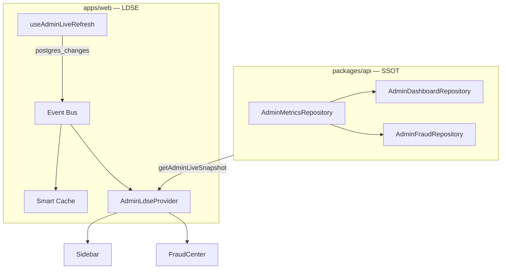

# LDSE — Audit de synchronisation (Phase 1)

> Date : 28 juin 2026 · Périmètre : monorepo SONAFRIK (focus admin + patterns globaux)

## Problème racine identifié (fraude admin)

| Surface | Ancienne source | Définition | Incohérence |
|---|---|---|---|
| Sidebar badge | `getNavBadges()` | `stream_sessions` + `fraud_flags != '{}'` all-time | 386 |
| Dashboard KPI | `getDashboardKpis()` | Identique all-time | Aligné sidebar |
| Cockpit alertes | `getCockpitData()` | **Même filtre + `started_at >= début mois`** | Valeur différente |
| Page fraude total | `listFraudIncidentsPage()` count séparé | All-time | Pouvait diverger |
| Liste filtrée | Filtres client + localStorage `hidden` | Sous-ensemble UI | 0 affiché ≠ total DB |

**Correction SSOT** : `AdminMetricsRepository.getFraudMetrics()` — seule source des comptages fraude.

## Requêtes dupliquées (admin)

| Métrique | Fichiers concernés (avant) | Statut |
|---|---|---|
| Fraude all-time | `admin.dashboard.repository`, `admin.fraud.repository`, sidebar layout | ✅ Unifié via `AdminMetricsRepository` |
| Fraude mois | Cockpit seul | ✅ `flaggedThisMonth` explicite |
| Fraude jour | `getFraudSupervisionStats` requête dédiée | ✅ `flaggedToday` via metrics |
| Catalog pending | `getNavBadges`, `getDashboardKpis`, `getCockpitData` | ✅ Unifié via `AdminMetricsRepository` + LDSE |
| Withdrawals pending | Idem | ✅ Unifié via LDSE snapshot |
| Rights claims pending | Idem | ✅ Unifié via LDSE snapshot |
| Users count | Dashboard + Cockpit + Live Control | ✅ Cockpit merge LDSE live |

## Appels Supabase directs côté React (hors LDSE)

| Zone | Fichier | Usage | Risque |
|---|---|---|---|
| Admin Realtime | `useAdminLiveRefresh.ts` | Abonnements postgres_changes | ✅ Centralisé |
| Admin hooks | `useAdminService.ts`, `usePayoutService.ts` | Factory service | ⚠️ Doit passer actions serveur pour SSOT |
| Identity session | `getAdminSessionContext.ts` | Profil admin | OK (auth) |
| Listener | `useStreaming.ts`, réactions live | Realtime écoutes | ⏳ Module à migrer LDSE |
| Wallet | `walletServiceContext.tsx` | Paiements | ⏳ Critique — migrer post-beta |
| Notifications | `useNotificationsService.ts` | Liste notifs | ⏳ Migrer |
| Social | `useSocial.ts`, likes/follows | Mutations | ⏳ Optimistic UI LDSE |

## Caches incohérents

- Next.js RSC `force-dynamic` admin : chaque `router.refresh()` recharge layout + pages — badges parfois stale entre refresh et Realtime.
- localStorage fraude (`fraudIncidentStore`) : masque des incidents sans impacter compteurs SSOT (comportement voulu UI, documenté).
- Aucun cache partagé client avant LDSE.

## Realtime existant

- `useAdminLiveRefresh` : 11 tables, debounce 300 ms, fallback polling 60 s.
- Pas d'Event Bus avant LDSE — refresh global RSC uniquement.

## Cartographie modules

## Modules compatibles LDSE (v1.1)

- ✅ Admin layout (snapshot + provider)
- ✅ Sidebar badges
- ✅ Fraude (metrics + refresh liste)
- ✅ Cockpit dashboard (merge live LDSE)
- ✅ Catalog center (moderation metrics)
- ✅ Withdrawals (publishAdminLdseEvent)
- ✅ Notifications (cloche + liste)
- ✅ Realtime admin (event mapping)

## Modules restant à migrer

- Creator OS (catalog, analytics)
- Listener OS (streaming, library)
- Wallet / royalties dashboards
- Notifications bell
- Recherche
- Profil identity
