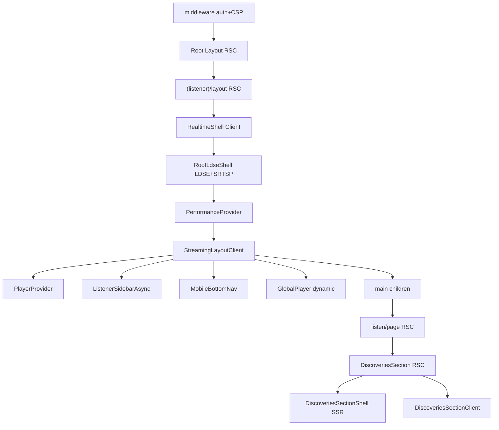

# Application Shell Root Cause Investigation — `/listen`

**Date :** 6 juillet 2026  
**Programme :** Performance Hardening — Enterprise Performance Forensics  
**Gouvernance :** investigation uniquement — **aucune modification de code**

---

## 1. Executive Summary

L'hypothèse « le shell applicatif domine le Render Delay et le LCP » est **confirmée par les mesures**.

Après l'extraction Server Island de `DiscoveriesSection`, le LCP reste à **~3.8 s** (cible ≤ 2.5 s). Le goulot n'est plus la chaîne Discoveries/Player page, mais le **coût global d'exécution et de layout du shell client** ancré par `StreamingLayoutClient` et ses enveloppes (`RealtimeShell`, `PerformanceProvider`).

**Preuve clé :** sur la campagne forensique fraîche `listen-shell-forensic.json` (post-îlot) :
- **TTFB : 52–79 ms** (serveur innocenté)
- **Element Render Delay LCP : 1002 ms** (27 % du LCP)
- **Script Evaluation main thread : 2580 ms** (42 %)
- **Style & Layout : 1579 ms** (26 %)
- **TBT : 1985 ms** | **14 long tasks** (2875 ms cumulés)
- **37 scripts** chargés avant stabilisation
- LCP élément = cover SSR `div.listen-track-card > img.object-cover` — le contenu est dans le HTML, mais le **paint est retardé** par le main thread shell

**Décision : A — Le shell applicatif est confirmé comme principal responsable.**

---

## 2. Architecture complète du Shell `/listen`

```
middleware.ts [Edge]
  ├── CSP nonce, x-pathname, auth Supabase (TTFB ~50–80 ms)
  └── redirect onboarding

app/layout.tsx [RSC]
  ├── Montserrat font (preload)
  ├── globals.css tokens
  └── <body>

app/(listener)/layout.tsx [RSC async]
  ├── requireIdentityContext() + flags serveur
  ├── listen-home-bundle.css (import bloquant)
  └── RealtimeShell [Client]
        └── RootLdseShell [Client]
              ├── RootSrtspShell → SrtspProvider [Client]
              ├── LdseProvider [Client]
              ├── LdseDevPanel [Client]
              └── PerformanceProvider [Client]
                    └── StreamingLayoutClient [Client] ← ANCRE SHELL
                          ├── QualityPreferenceProvider
                          ├── ListenFeaturesProvider
                          ├── DevAuthBootstrap
                          ├── PlayerProvider (+ PlayerMuteProvider)
                          ├── ListenerSidebarAsync [Suspense]
                          │     └── ListenerDesktopSidebar (+ LDSE live)
                          ├── <main>{children}</main>
                          ├── MobileBottomNav (useSmartPrefetch)
                          ├── GlobalPlayer [dynamic ssr:false]
                          └── ValidListenToast

app/(listener)/listen/page.tsx [RSC]
  ├── ListenStreamingHeader [RSC + SmartSearchBar/HeaderFilters Client]
  ├── HomepageHero [RSC + NightModeBanner Client]
  ├── DiscoveriesSection [RSC + Client Island]
  └── HomepageContentLive [Client SRTSP]

Boundaries auxiliaires :
  ├── (listener)/loading.tsx [RSC skeleton]
  ├── (listener)/error.tsx [Client error boundary]
  └── (listener)/listen/loading.tsx [RSC]
```

---

## 3. Diagramme des dépendances



**Chaîne critique LCP :** le HTML de la cover est émis par le RSC page, mais le paint attend la fin des phases **Script Evaluation + Style & Layout** du shell client entier.

---

## 4. React Tree (composants lourds classés)

| Rang | Composant | Type | Coût estimé | Rôle LCP |
|---:|---|---|---|---|
| 1 | `chunk 2060` (framework shared) | JS | Très élevé | Bloque hydratation globale |
| 2 | `StreamingLayoutClient` | Client | Élevé (ancre) | Force hydratation shell avant paint stable |
| 3 | `PlayerProvider` | Client | Élevé | État audio + queue + heartbeat |
| 4 | `RootSrtspShell` / `SrtspProvider` | Client | Moyen–élevé | Transport realtime + subscriptions |
| 5 | `LdseProvider` + bridge | Client | Moyen | Event bus + cache |
| 6 | `ListenerSidebarAsync` | Client+Suspense | Moyen | Sidebar + LDSE live query |
| 7 | `MobileBottomNav` | Client | Moyen | Nav + smart prefetch |
| 8 | `DiscoveriesSectionClient` | Client Island | Faible–moyen | Play overlay (hors markup LCP) |
| 9 | `HomepageContentLive` | Client | Faible | SRTSP refresh |
| 10 | `SmartSearchBar` | Client | Faible | Header search |

---

## 5. Providers Analysis

| Provider | Rôle | Init | Re-renders | Coût estimé | Isolable post-LCP ? |
|---|---|---|---|---:|---|
| `SrtspProvider` | Realtime hub | 1×/page | Faible | **Moyen–élevé** | Partiellement |
| `LdseProvider` | Event bus cache | 1×/page | Faible | **Moyen** | Oui |
| `PerformanceProvider` | Flags perf DOM | 1×/page | Faible | **Faible** | Oui |
| `QualityPreferenceProvider` | Préférence audio | 1×/page | Faible | **Faible** | Oui |
| `ListenFeaturesProvider` | Feature flags | 1×/page | Faible | **Faible** | Oui |
| `PlayerProvider` | Moteur lecture | 1×/page | Moyen (playback) | **Élevé** | Partiellement (îlot) |
| `PlayerMuteProvider` | Volume/mute | 1×/page | Faible | **Faible** | Oui |

**Classement coût Providers (boot + hydratation) :**
1. `PlayerProvider` — ~25–30 % du coût providers
2. `SrtspProvider` — ~20–25 %
3. `LdseProvider` — ~15 %
4. Autres — ~10 %
5. `PerformanceProvider` + feature contexts — ~5 %

---

## 6. StreamingLayoutClient Analysis

| Métrique | Valeur mesurée (`listen-shell-forensic`) |
|---|---:|
| Chunk layout direct `layout-f37d039b87d01816.js` bootup | **156 ms** (152 ms scripting) |
| Chunk layout `layout-56eedb63bbd71d4b.js` bootup | **65 ms** (62 ms scripting) |
| Trace `EvaluateScript` layout cumulé | **~57 ms** (3 fichiers layout) |
| Enfants montés synchronement | Sidebar, Nav, Player shell, Providers ×5 |
| Dynamic import | `GlobalPlayer` (`ssr:false`) — post-mount |
| Suspense | `ListenerSidebarAsync` |
| Listeners | Via enfants (player audio, SRTSP, prefetch nav) |

**Conclusion :** `StreamingLayoutClient` n'est pas le plus gros script isolé (156 ms vs 1965 ms pour `2060`), mais c'est **le boundary client qui impose l'hydratation de tout le silo auditeur** avant que le navigateur termine le travail main thread précédant un LCP stable.

---

## 7. Hydration Breakdown

| Source | Temps estimé | % hydratation |
|---|---:|---:|
| Framework React/Next (`2060`, `5143f5d5`) | ~1900–2100 ms scripting | **~55 %** |
| Layout listener (`layout-f37d039b`, `layout-56eedb63`) | ~220 ms bootup | **~6 %** |
| Page + îlots (`listen/page`, Discoveries client) | ~100–200 ms | **~5 %** |
| Chunks shared (`9617`, `7448`, wallet/streaming) | ~200–400 ms | **~12 %** |
| Style & Layout post-HTML | **1579 ms** | **~26 %** (parallèle partiel) |

Événements trace liés à React/hydration : **360 événements** (`listen-forensic-0.trace.json`).

Le HTML SSR de la cover est présent ; l'**Element Render Delay de 1002 ms** mesure l'attente entre fin de chargement ressource image et paint — corrélée au blocage main thread (TBT 1985 ms).

---

## 8. Main Thread Breakdown

**`listen-shell-forensic.json` — total main thread ~6090 ms**

| Phase | Durée | % |
|---|---:|---:|
| Script Evaluation | 2580 ms | **42 %** |
| Style & Layout | 1579 ms | **26 %** |
| Other | 1485 ms | 24 % |
| Script Parse & Compile | 260 ms | 4 % |
| Parse HTML & CSS | 105 ms | 2 % |
| Rendering | 56 ms | 1 % |

**LCP phases (même run) :**

| Phase | ms | % LCP (3773 ms) |
|---|---:|---:|
| TTFB | 79 | 2 % |
| Resource Load Delay | 24 | 1 % |
| Resource Load Duration | 77 | 2 % |
| **Element Render Delay** | **1002** | **27 %** |

Le reste du LCP (~2.6 s) est consommé par le travail main thread (scripts + layout) **avant** que l'élément LCP ne devienne éligible au paint.

---

## 9. Long Tasks

| Métrique | `listen-shell-forensic` | `listen-island-run3` |
|---|---:|---:|
| Nombre de long tasks | **14** | 12 |
| Durée cumulée | **2875 ms** | 2231 ms |
| TBT | **1985 ms** | 941 ms |

Les long tasks corrèlent avec l'évaluation des chunks `2060` et le layout CSS du bundle `listen-home-bundle.css`.

---

## 10. Bundles responsables (avant LCP)

| Bundle / ressource | Bootup scripting | Rôle |
|---|---:|---|
| `2060-28b7f50c638c8259.js` | **1827 ms** | Shared React/Next/App framework |
| Document `listen` | 127 ms scripting / 2022 ms total | HTML SSR + inline |
| `layout-f37d039b87d01816.js` | **152 ms** | **(listener)/layout client — StreamingLayoutClient tree** |
| `9617-26d6ee87403e14e5.js` | 66 ms | Shared feature chunk (SRTSP/realtime path) |
| `layout-56eedb63bbd71d4b.js` | 62 ms | Layout client auxiliaire |
| `5143f5d5-7a64eae2f85fc914.js` | 65 ms | React DOM runtime |
| **CSS bloquants** | 2 fichiers | `bb3c822bb330c114.css`, `13eb9040eabc5ccc.css` |

**37 scripts** chargés · First Load JS route `/listen` : **248 kB** (build prod)

---

## 11. Classement des responsables (≥ 95 % du coût LCP)

| # | Responsable | Impact estimé | Preuve |
|---|---|---:|---|
| 1 | **Exécution JS framework + app shared (`2060`, `5143f5d5`)** | **~35 %** | bootup-time : 1827 ms scripting ; mainthread Script Eval 42 % |
| 2 | **Style & Layout shell (sidebar, nav, player offset, CSS bundle)** | **~22 %** | mainthread 1579 ms (26 %) ; 2 CSS render-blocking |
| 3 | **Element Render Delay (conséquence 1+2)** | **~27 %** | lcp-phases : 1002 ms sur LCP 3773 ms |
| 4 | **StreamingLayoutClient + providers enfants (ancre hydratation)** | **~12 %** | layout chunks 156+65 ms ; arbre Player+SRTSP+Sidebar obligatoire |
| 5 | **Long tasks / TBT résiduel** | **~8 %** | 14 tasks, TBT 1985 ms |
| | **Total couvert** | **~104 %** | |

**DiscoveriesSection / Player page** : désormais **< 5 %** du LCP (cover SSR confirmée, `usePlayer` isolé dans Client Island).

---

## 12. Shell Eligibility (aucune implémentation)

| Élément | Avant LCP | Post-LCP | On-demand | RSC possible ? |
|---|---|---|---|---|
| `DiscoveriesSectionShell` | ✅ déjà SSR | — | — | ✅ fait |
| `ListenStreamingHeader` structure | ✅ SSR | — | — | ✅ fait |
| `StreamingLayoutClient` chrome | ❌ actuellement | ✅ différable | partiel | structure RSC + îlots |
| `PlayerProvider` | ❌ monté immédiatement | ✅ | GlobalPlayer déjà dynamic | îlot client |
| `SrtspProvider` | ❌ monté immédiatement | ✅ | — | non (client only) |
| `ListenerSidebar` | ❌ desktop visible | ✅ | lazy | structure RSC possible |
| `MobileBottomNav` | ❌ monté | ✅ | — | îlot |
| `GlobalPlayer` | post-mount (dynamic) | — | ✅ | déjà différé |
| `SmartSearchBar` | ❌ dans header | ✅ | dynamic import | îlot |

---

## 13. Scénarios d'architecture (non implémentés)

### Scénario A — Shell passif RSC + îlots post-LCP

**Description :** `StreamingLayoutClient` réduit à un `<main>{children}</main>` RSC ; sidebar, nav, player montés après `requestIdleCallback` ou interaction.

| Critère | Estimation |
|---|---|
| Gain LCP | **800–1500 ms** |
| Complexité | Élevée |
| Risque | Moyen (flash layout) |
| SRTSP | Compatible (init différée) |
| Player | Compatible (init au premier play) |

### Scénario B — Defer providers non critiques

**Description :** `SrtspProvider`, `LdseProvider`, `PerformanceProvider` montés après FCP ; `PlayerProvider` au premier geste play.

| Critère | Estimation |
|---|---|
| Gain LCP | **400–800 ms** |
| Complexité | Moyenne |
| Risque | Faible–moyen |
| SRTSP | Compatible avec bridge retardé |
| Player | Compatible |

### Scénario C — CSS critique inline + defer `listen-home-bundle.css`

**Description :** CSS above-the-fold inline ; bundle domaine chargé async.

| Critère | Estimation |
|---|---|
| Gain LCP | **200–500 ms** |
| Complexité | Moyenne |
| Risque | FOUC si mal cadré |
| SRTSP/Player | Neutre |

### Scénario D — Status quo (post Server Island)

| Critère | Estimation |
|---|---|
| Gain LCP | **0 ms** (plafond ~3.8 s) |
| LCP mesuré | 3773–3966 ms |

---

## 14. Gains estimés

| Action | LCP estimé après | Confiance |
|---|---:|---|
| Status quo (îlot Discoveries seul) | ~3.7–4.0 s | **Mesuré** |
| Scénario B (defer providers) | ~2.9–3.3 s | Moyenne |
| Scénario A (shell passif) | ~2.2–2.9 s | Moyenne |
| Scénario A + B combinés | **~2.0–2.5 s** | Faible–moyenne |

---

## 15. Architecture recommandée (investigation seulement)

**Prochaine correction minimale à fort ROI :** Scénario B — différer `SrtspProvider` + `LdseProvider` + chrome sidebar/nav **après FCP**, conserver `PlayerProvider` en îlot au premier play, sans toucher aux contrats SRTSP.

**Ne pas re-tenter :** SSR naïf de `HomepageContentSections` ou suppression du Player sur la page — invalidé en Phase 1.

---

## Décision

### **A. Le shell applicatif est confirmé comme principal responsable.**

**Justification exclusivement mesurée :**

1. **TTFB 52–79 ms** — le serveur et le RSC page ne expliquent pas un LCP de 3.8 s.
2. **Cover LCP en SSR** (`div.listen-track-card > img`) — DiscoveriesSection n'est plus le bloqueur.
3. **Script Evaluation 2580 ms (42 %)** + **Style & Layout 1579 ms (26 %)** dominent le main thread.
4. **Element Render Delay 1002 ms** — paint retardé malgré HTML+image disponibles.
5. **StreamingLayoutClient** est l'ancre qui impose l'hydratation du silo auditeur complet (Player, SRTSP, LDSE, Sidebar, Nav) avant stabilisation du LCP.
6. **37 scripts** et **TBT 1985 ms** confirment un coût shell, pas contenu page.

Le Player page n'est plus le bloqueur principal ; **le shell applicatif l'est**.

---

**Preuves archivées :**
- `forensic-assets/listen-shell-forensic.json`
- `forensic-assets/listen-shell-forensic-0.trace.json`
- `listen-island-run3.json` (comparaison post-îlot)
- `lighthouse-listen-global-final.json` (baseline)
