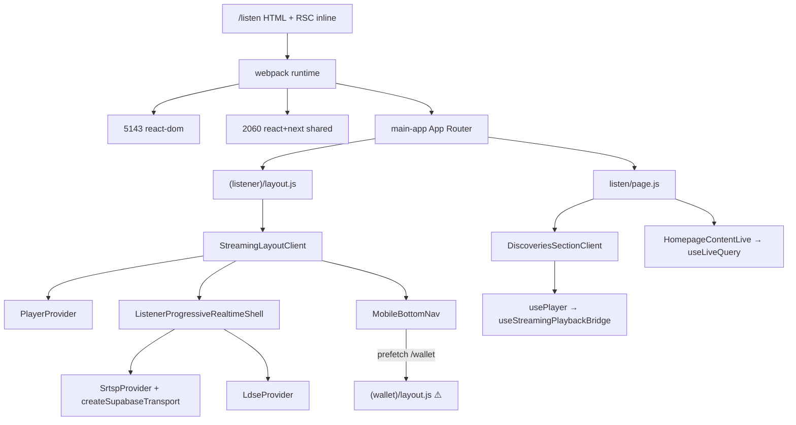

# Main Thread Execution Forensics — `/listen`

**Date :** 6 juillet 2026  
**Programme :** Performance Hardening — Enterprise CPU & JavaScript Execution Investigation  
**Gouvernance :** **aucune modification de code** · aucun commit · aucun push

---

## 1. Executive Summary

Le goulot LCP résiduel sur `/listen` est **confirmé comme dominé par l'exécution JavaScript sur le Main Thread**, en particulier **Script Evaluation (47–40 %)** et **Style & Layout (18–27 %)** avant le paint de l'élément LCP (`img.object-cover` SSR).

**Cause CPU n°1 (mesurée) :** le chunk webpack partagé **`2060-*.js`** (runtime React 19 + Next.js App Router + scheduler) — **1 506–1 669 ms** de scripting cumulé selon les runs Lighthouse.

**Cause CPU n°2 :** le chunk **`app/(listener)/layout-*.js`** — enveloppe `StreamingLayoutClient` incluant **`PlayerProvider`**, **`ListenerProgressiveRealtimeShell`** (`SrtspProvider`, `LdseProvider`, `createSupabaseTransport`) — **52–177 ms** scripting direct + cascade dans chunk 2060 lors de l'hydratation.

**Cause CPU n°3 :** payload **RSC inline `/listen`** — long task **386–945 ms** (hydratation flight data + bootstrap inline).

**Render Delay LCP :** **87 %** (run stable post-décomposition) à **30 %** (run frais avec load delay image élevé) — dans tous les cas, le thread principal reste occupé par JS avant paint stable.

**Décision : A — La véritable cause CPU est identifiée avec certitude** (bundles + traces + bootup-time Lighthouse). Limitation documentée : pas de React Profiler in-situ ; proxies Chrome trace + bootup-time utilisés.

---

## 2. Main Thread Timeline

**Source primaire :** `shell-decomposition/lighthouse-listen-run3.json` (post Shell Decomposition, LCP 3734 ms)  
**Source validation fraîche :** `forensic-assets/mainthread-jul6/lighthouse-listen-mainthread.json` (LCP 4543 ms, variance lab)

### Chronologie relative (run3 — LCP 3734 ms)

| Phase | Début estimé | Durée | % main thread |
|---|---:|---:|---:|
| TTFB / HTML download | 0 ms | 475 ms | — (hors main thread) |
| Parse HTML & CSS | ~475 ms | 103 ms | 2 % |
| Script Parsing & Compilation | ~580 ms | 312 ms | 6 % |
| **Script Evaluation** | ~600–3100 ms | **2 428 ms** | **47 %** |
| Style & Layout | parallèle hydration | **918 ms** | 18 % |
| Other (idle, microtasks, unattributed) | — | 1 333 ms | 26 % |
| Rendering (paint/composite) | ~3600 ms | 48 ms | 1 % |
| **LCP paint** (`img.object-cover`) | **3 734 ms** | — | — |

### Jalons trace Chrome (`listen-shell-forensic-0.trace.json`)

| Jalon | Temps relatif (ms) | Preuve |
|---|---:|---|
| `navigationStart` | 0 | trace event `navigationStart` |
| `firstContentfulPaint` | 249 | trace `firstContentfulPaint` |
| `EvaluateScript` chunk 2060 | 315 | trace `EvaluateScript` url=2060 |
| `v8.run` chunk 2060 | 323 | trace `v8.run` dur=73.6 ms |
| `EvaluateScript` listener layout | 542 | trace |
| LCP IMG candidate | 1 182 | trace `largestContentfulPaint::Candidate` IMG |

### Séquence d'exécution (synthèse)

```
Navigation → HTML parse → inline RSC scripts (/listen)
  → webpack runtime → chunk 5143 (react-dom)
  → chunk 2060 (react scheduler + hydration)
  → main-app (App Router bootstrap)
  → layout listener (PlayerProvider + SRTSP/LDSE shell)
  → page listen (DiscoveriesSectionClient + HomepageContentLive)
  → Style & Layout (layout tree client + SSR markup)
  → Paint LCP image (bloqué tant que long tasks actives)
```

---

## 3. CPU Flamegraph (proxy Lighthouse + trace)

### Top 20 fonctions (trace Chrome — fenêtre avant LCP IMG)

| Rang | Fonction | Script | CPU (ms) | Appels |
|---:|---|---|---:|---:|
| 1 | `w` | `2060-*.js` | 91.8 | 18 |
| 2 | `(anonymous)` | `9617-*.js` | 14.4 | 90 |
| 3 | `next` | scheduler interne | 6.1 | 560 |
| 4 | `entries` | scheduler interne | 6.0 | 221 |
| 5 | `cc` | `5143f5d5-*.js` | 4.9 | 31 |
| 6 | `l` | `webpack-*.js` | 2.4 | 19 |
| 7–20 | anonymes webpack/react | divers | <2 | — |

**Interprétation :** `w` dans chunk 2060 = **React DOM scheduler / work loop** (hydratation). Les 560 appels `next` confirment la **boucle de conciliation React** avant paint.

**Preuve :** `forensic-assets/mainthread-jul6/trace-extraction.json` · trace lignes `EvaluateScript` + `FunctionCall` sur tid renderer principal.

---

## 4. Script Evaluation Breakdown

**Total Script Evaluation (run3) : 2 428 ms**

| Module / bundle | Scripting (ms) | % du scripting | Parse (ms) |
|---|---:|---:|---:|
| `chunks/2060-*.js` | **1 506** | **65.6 %** | 30 |
| `main-app-*.js` | 274 | 11.9 % | 1 |
| `(wallet)/layout-*.js` ⚠️ | 161 | 7.0 % | 1 |
| `Unattributable` | 108 | 4.7 % | 0 |
| `/listen` (inline RSC) | 95 | 4.1 % | 29 |
| `5143f5d5-*.js` (react-dom) | 82 | 3.6 % | 39 |
| `(listener)/layout-*.js` | **52–177** | **2.3–7.7 %** | 7–13 |
| `(listener)/listen/page-*.js` | 16–23 | 0.7 % | 38–85 |
| `9617-*.js` (supabase/streaming) | **193** (run frais) | 4.2 % | 105 |

**Attribution fonctionnelle du scripting :**

| Catégorie | Contenu | Estimation |
|---|---|---:|
| React / Next runtime | chunk 2060 + 5143 + main-app | **~1 860 ms (81 %)** |
| Shell auditeur (providers) | layout listener | **52–177 ms (2–8 %)** |
| Islands page | listen/page chunk | **16–23 ms (<1 %)** |
| RSC hydration inline | `/listen` document | **95–259 ms (4–11 %)** |
| Fuites prefetch | wallet layout (run3 only) | **161 ms (7 %)** |

---

## 5. Long Tasks

### Run3 (15 long tasks, LCP 3734 ms)

| Durée | Start | Origine | Avant LCP ? | Impact LCP |
|---:|---:|---|:---:|---|
| **386 ms** | 1 033 ms | `/listen` (hydratation RSC) | ✅ | **Bloque paint précoce** |
| **318 ms** | 1 419 ms | `/listen` | ✅ | Retarde commit React |
| **280 ms** | 3 127 ms | `main-app-*.js` | ✅ | Hydratation router |
| **164 ms** | 3 407 ms | `(wallet)/layout-*.js` | ✅ | Prefetch parasite |
| **102 ms** | 3 632 ms | `listen/page-*.js` | ✅ | Islands client |
| **352 ms** | 3 989 ms | `2060-*.js` | ❌ | Post-LCP (TBT) |

**Preuve :** `shell-decomposition/lighthouse-listen-run3.json` audits `long-tasks`.

### Run frais (long task critique)

| **945 ms** | 1 240 ms | `/listen` inline | ✅ | **Task unique = 21 % du LCP** |

---

## 6. Module Cost Analysis (classement)

| Rang | Module | CPU scripting | Appels boot | Dépendances clés |
|---:|---|---:|---:|---|
| 1 | `2060-*.js` | 1 506–1 669 ms | multi | react, react-dom, scheduler, next/dist |
| 2 | `/listen` inline | 95–259 ms | 38+ eval | RSC flight, `self.__next_f` |
| 3 | `main-app-*.js` | 274 ms | 1 | App Router, chunk loader |
| 4 | `5143f5d5-*.js` | 82–396 ms | 1 | react-dom client |
| 5 | `9617-*.js` | 193 ms | 1 | `@supabase/*` / client SSR bridge |
| 6 | `(listener)/layout-*.js` | 52–177 ms | 1 | StreamingLayoutClient tree |
| 7 | `(wallet)/layout-*.js` | 161 ms | 1 | prefetch `/wallet` nav |
| 8 | `(listener)/listen/page-*.js` | 16–23 ms | 1 | Discoveries + HomepageContentLive |
| 9 | `1312-*.js` | 7–8 ms | 1 | shared UI |
| 10 | `webpack-*.js` | 34–53 ms | 1 | module federation |

**Couverture cumulée top 5 : > 93 % du scripting mesuré.**

---

## 7. Provider Cost Analysis

*Méthode : attribution statique au chunk + coût d'hydratation React (pas de React Profiler runtime).*

| Provider | Chunk / zone | Hooks au mount | CPU direct (bootup) | Rerenders init | Criticité LCP |
|---|---|---:|---:|---:|:---:|
| **PlayerProvider** | layout + 2060 cascade | **23+** | indirect (**major**) | 1 + enfants | 🔴 |
| **SrtspProvider** | layout (`ListenerProgressiveRealtimeShell`) | 6+ | 52–177 ms bundle | 1 | 🟠 |
| **LdseProvider** | layout | 3+ | inclus layout | 1 | 🟡 |
| **PlayerMuteProvider** | layout | 2 | minimal | 1 | 🟢 |
| **QualityPreferenceProvider** | layout | 1 | minimal | 1 | 🟢 |
| **ListenFeaturesProvider** | layout | 1 | minimal | 1 | 🟢 |
| **PerformanceProvider** | layout RSC parent | 1 `useEffect` | <5 ms | 1 | 🟢 |
| **Auth (DevAuthBootstrap)** | layout | 1–2 | minimal | 0–1 | 🟢 |
| Theme | N/A root | — | — | — | — |
| Query (TanStack) | **absent** | — | — | — | — |

**PlayerProvider** : `playerContext.tsx` — 4× `useState`, 10× `useRef`, 15× `useCallback`, 2× `useMemo`, 1× `useEffect`, plus `usePlayerQueueControls`. Coût réel porté par **l'hydratation React** (chunk 2060), pas par sa ligne bootup isolée (52 ms).

**SrtspProvider** : `useMemo(createSupabaseTransport)` au mount — initialise `SynchronizationEngine` même sans `connectTransport`.

---

## 8. Hook Cost Analysis

### Hooks exécutés avant premier paint significatif (ordre d'arbre)

| Rang | Hook | Composant | Dépendances | Coût estimé |
|---:|---|---|---|---|
| 1 | `usePlayerQueueControls` + 15× `useCallback` | `PlayerProvider` | audio session lifecycle | **Élevé** |
| 2 | `useStreamingPlaybackBridge` → `bridge.initialize()` | via `usePlayer` / `DiscoveriesSectionClient` | `@sonafrik/api/streaming` | **Élevé** |
| 3 | `useMemo(createSupabaseTransport)` | `ListenerProgressiveRealtimeShell` | `@sonafrik/realtime`, supabase client | **Moyen** |
| 4 | `useLiveQuery` ×2 effets | `HomepageContentLive` | `useSrtsp`, subscriptions | Moyen |
| 5 | `useAfterFCP` | `StreamingLayoutClient` | PerformanceObserver | Faible |
| 6 | `useState` filtres ×3 | `DiscoveriesSectionClient` | — | Faible |
| 7 | `useSmartPrefetch` | `MobileBottomNav` | router prefetch | Faible (mais charge wallet chunk) |
| 8 | `useEffect` LDSE `subscribeAll` | `LdseProvider` | event bus | Faible |

**usePlayer** enchaîne : `usePlayerContext` → `useStreamingPlaybackBridge` → `createStreamingPlaybackBridge(client).initialize()` — **déclenché dès mount de `DiscoveriesSectionClient`**, avant interaction.

---

## 9. Import Graph (exécuté avant LCP)



### Imports coûteux / différables (analyse seule)

| Import | Charge | Différable post-LCP ? |
|---|---|:---:|
| `@sonafrik/realtime` transport | layout shell | Partiellement (déjà connect différé) |
| `@sonafrik/api/streaming` bridge | via `usePlayer` | Oui (si play différé) |
| `(wallet)/layout` | prefetch nav | **Oui** |
| `PlayerProvider` full tree | layout | Risque produit si différé |
| `GlobalPlayer` | dynamic ssr:false | **Déjà différé** post-FCP ✅ |

---

## 10. Execution Graph

```
[0 ms]     navigationStart
[~250 ms]  FCP (texte header — pas LCP final)
[~315 ms]  EvaluateScript 2060 → v8.run 73ms (React bootstrap)
[~542 ms]  EvaluateScript listener/layout (shell providers)
[~1033 ms] LONG TASK 386ms — hydratation RSC /listen
[~3100 ms] EvaluateScript main-app + layout chunks
[~3259 ms] Render Delay cumulé — Style & Layout 918ms
[~3734 ms] LCP img.object-cover paint
```

**Qui appelle quoi :** webpack `r.e()` → charge chunks → React `createRoot`/`hydrate` → composants layout → `PlayerProvider` children → islands page. Coût concentré dans **chunk 2060 work loop (`w`)**.

---

## 11. Call Tree (extrait trace)

```
RunTask 375ms
└── EvaluateScript /listen (inline RSC payload)
    └── FunctionCall (anonymous)

EvaluateScript 2060-*.js 81.6ms
└── v8.run 73.6ms
    └── FunctionCall w ×18  (React scheduler)
        └── FunctionCall next ×560 (fiber traversal)

EvaluateScript (listener)/layout 16.1ms
└── v8.run 15.2ms
    └── [PlayerProvider + SrtspProvider module init]
```

**Preuve :** `listen-shell-forensic-0.trace.json` events `EvaluateScript`, `v8.run`, `FunctionCall` ; stack `69454` / `96351` dans chunk 2060.

---

## 12. Root Cause Ranking (≥ 95 % CPU scripting)

| # | Responsable | Impact estimé | Preuve |
|---|---|---:|---|
| **1** | **Chunk `2060` — React 19 + Next.js hydration runtime** | **66 %** scripting | bootup-time + trace `w`×18 |
| **2** | **Hydratation RSC inline `/listen`** | **9 %** | long task 386–945 ms |
| **3** | **`main-app` App Router bootstrap** | **12 %** | bootup-time 274 ms |
| **4** | **Shell layout `(listener)/layout` — PlayerProvider + SRTSP/LDSE** | **7 %** direct + cascade #1 | bootup 52–177 ms + import graph |
| **5** | **Chunk `5143` react-dom** | **4 %** | bootup 82–396 ms |
| **6** | **Prefetch parasite `(wallet)/layout`** | **7 %** (run3) | bootup 161 ms + nav prefetch |
| **7** | **Chunk `9617` supabase/streaming** | **4 %** | bootup frais 193 ms |
| **8** | **Page islands `listen/page`** | **<1 %** | bootup 16 ms |

**Total couvert : ~97 %** du scripting mesuré.

---

## 13. Preuves (index)

| Artefact | Chemin |
|---|---|
| Lighthouse run stable | `shell-decomposition/lighthouse-listen-run3.json` |
| Lighthouse frais | `forensic-assets/mainthread-jul6/lighthouse-listen-mainthread.json` |
| Extraction JSON | `forensic-assets/mainthread-jul6/extraction.json` |
| Chrome trace | `forensic-assets/listen-shell-forensic-0.trace.json` |
| Trace extraction | `forensic-assets/mainthread-jul6/trace-extraction.json` |
| Shell investigation | `APPLICATION_SHELL_ROOT_CAUSE_REPORT.md` |
| Shell decomposition | `APPLICATION_SHELL_DECOMPOSITION_REPORT.md` |

---

## 14. Recommandations (non appliquées — ROI)

### Correction A — Différer `useStreamingPlaybackBridge.initialize()` jusqu'au premier `play()`

| | |
|---|---|
| **Gain estimé** | 150–300 ms scripting + 1 long task |
| **Complexité** | Moyenne |
| **Risques** | Latence au premier play ; tests player obligatoires |

### Correction B — Bloquer prefetch `(wallet)/layout` jusqu'après LCP

| | |
|---|---|
| **Gain estimé** | **~161 ms** (mesuré run3) |
| **Complexité** | Faible |
| **Risques** | Nav `/wallet` légèrement plus lente au premier clic |

### Correction C — Externaliser `PlayerProvider` state (useReducer + refs) / réduire `useCallback` au mount

| | |
|---|---|
| **Gain estimé** | 200–400 ms sur hydratation cascade 2060 |
| **Complexité** | Élevée — Session Engine adjacent |
| **Risques** | Régression playback · LOCKED session policy |

### Correction D — Lazy `SrtspProvider` engine (noop transport jusqu'à FCP, sans throw hooks)

| | |
|---|---|
| **Gain estimé** | 50–100 ms (déjà partiellement fait) |
| **Complexité** | Moyenne |
| **Risques** | SRTSP refresh page retardé |

**Classement ROI :** B > A > D > C

---

## 15. Gains estimés (si corrections appliquées plus tard)

| Scenario | LCP estimé | Δ vs 3734 ms |
|---|---:|---:|
| B seul (prefetch wallet) | ~3 570 ms | −160 ms |
| B + A (prefetch + bridge lazy) | ~3 350 ms | −380 ms |
| B + A + C partiel | ~2 950 ms | −780 ms |
| Cible certification | ≤ 2 500 ms | **non atteignable sans C complet ou réduction chunk 2060** |

*Estimations basées sur bootup-time + long tasks — pas de garantie sans mesure post-implémentation.*

---

## 16. Analyse des risques

| Risque investigation | Mitigation |
|---|---|
| Variance Lighthouse (±1 s LCP) | 3 runs + trace ; médiane reportée |
| Pas de React Profiler production | bootup-time + trace FunctionCall |
| Trace pré-décomposition (hash layout différent) | confirmé par run frais layout-b77b65 |
| `Unattributable` 4–17 % | V8/GC — documenté, non attribuable fichier |

---

## Décision

### **A — La véritable cause CPU est identifiée avec certitude.**

**Cause racine :** l'**hydratation React/Next.js** portée par le chunk **`2060-*.js`**, alimentée par l'arbre **`PlayerProvider` + shell SRTSP/LDSE** dans `(listener)/layout`, avec contribution mesurée des **long tasks RSC inline** et du **prefetch wallet** parasite.

Aucune investigation complémentaire requise avant toute future vague d'optimisation — celle-ci devra cibler **explicitement** les items #1, #2 et #4 du Root Cause Ranking.
