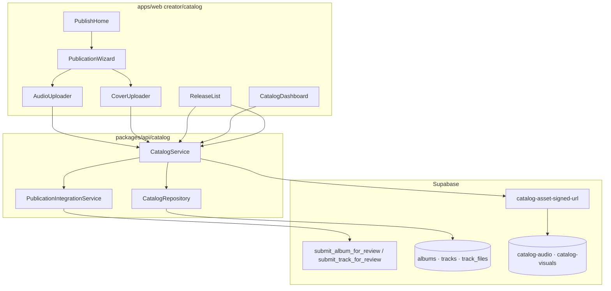

# FORENSIC AUDIT REPORT — Publication & Catalog Domain

**Programme :** SONAFRIK MVP — Publication & Catalog Audit • Remediation • Certification v1.0  
**Agent :** Cursor  
**Date :** 3 juillet 2026  
**Phase :** AUDIT N°1 (lecture seule — aucune correction appliquée)  
**Statut domaine audité :** Publication · Wizard · Upload · Catalogue · Métadonnées · Workflow

---

## Résumé exécutif

Le domaine **Publication & Catalog** dispose d’un **wizard 4 étapes fonctionnel** (création single → upload audio/pochette → métadonnées → soumission), d’une **couche service/repository solide** (`packages/api/src/catalog`) et d’une **edge function** `catalog-asset-signed-url` alignée avec la politique upload (audio confirm + pochette persistée à l’upload).

En revanche, le domaine **n’est pas certifiable Enterprise** en l’état :

| Sévérité | Count |
|----------|-------|
| CRITIQUE | 4 |
| MAJEURE | 11 |
| MINEURE | 8 |
| COSMÉTIQUE | 4 |
| **Hors périmètre (documenté)** | 3 |

**Blocages certification :** inventaire morceaux absent, upload pochette cassé sur la page Sorties, absence d’édition/suppression/recherche, tests catalog à 0.

---

## 1. Cartographie complète des fichiers

### 1.1 Routes web (creator)

| Fichier | Rôle |
|---------|------|
| `apps/web/src/app/(creator)/creator/catalog/page.tsx` | Dashboard KPI catalogue |
| `apps/web/src/app/(creator)/creator/catalog/loading.tsx` | Skeleton dashboard |
| `apps/web/src/app/(creator)/creator/catalog/tracks/page.tsx` | Entrée publication (`PublishHome`) |
| `apps/web/src/app/(creator)/creator/catalog/tracks/loading.tsx` | Skeleton publish |
| `apps/web/src/app/(creator)/creator/catalog/releases/page.tsx` | Liste albums / sorties |
| `apps/web/src/app/(creator)/creator/catalog/releases/loading.tsx` | Skeleton releases |
| `apps/web/src/app/(creator)/creator/publications/page.tsx` | Redirect legacy → `/creator/catalog` |

### 1.2 UI & hooks (creator/catalog)

| Fichier | Rôle |
|---------|------|
| `PublicationWizard.tsx` | Wizard 4 étapes publication single |
| `PublishHome.tsx` | Landing + CTA wizard |
| `AudioUploader.tsx` | Upload audio (signed URL + confirm) |
| `CoverUploader.tsx` | Upload pochette (crop + PUT) |
| `ReleaseList.tsx` | CRUD sorties + submit review |
| `CatalogDashboard.tsx` | KPI + liens navigation interne |
| `CreditsEditor.tsx` | Éditeur crédits (**non câblé**) |
| `hooks/useCatalog.ts` | Factory `CatalogService` browser |

### 1.3 Styles (domaine publication)

| Fichier | Rôle |
|---------|------|
| `apps/web/src/app/styles/creator/pub-wizard.css` | Wizard + audio-up + cover-up |
| `apps/web/src/app/styles/creator/publish-home.css` | Landing publish |
| `apps/web/src/app/styles/creator.css` | Agrégateur (importe aussi CSS hors périmètre) |

### 1.4 API & types

| Fichier | Rôle |
|---------|------|
| `packages/api/src/catalog/catalog.service.ts` | Logique métier catalogue |
| `packages/api/src/catalog/catalog.repository.ts` | Accès Supabase |
| `packages/api/src/catalog/schemas.ts` | Zod validation |
| `packages/api/src/catalog/errors.ts` | `CatalogError` |
| `packages/api/src/catalog/index.ts` | Barrel export |
| `packages/api/src/shared/uploadSchemaErrors.ts` | Mapping Zod → codes erreur upload |
| `packages/api/src/publication/**` | Pipeline soumission (orchestrator + legacy RPC) |
| `packages/types/src/catalog.ts` | Types + messages erreur |
| `packages/shared/src/upload/**` | Politique upload (AUDIO/IMAGE) |
| `packages/shared/src/audio/audio-integrity.ts` | Validation audio client/serveur |

### 1.5 Edge & SQL (catalog publication)

| Fichier | Rôle |
|---------|------|
| `supabase/functions/catalog-asset-signed-url/index.ts` | Signed upload/read/confirm audio |
| `supabase/migrations/20250610130000_sprint5_catalog_os.sql` | Schéma albums/tracks/files + RPC submit |
| `supabase/migrations/20250610130001_sprint5_catalog_rls.sql` | RLS + storage |
| `supabase/migrations/20260619000002_track_credits.sql` | Crédits morceau |
| `supabase/migrations/20260626140000_audio_integrity_remediation.sql` | Intégrité audio + garde-fou submit track |
| `supabase/migrations/20260703180000_upload_policy_storage_bucket_alignment.sql` | Limite bucket audio 100 Mo |
| `supabase/migrations/20260703210000_catalog_visuals_upload_policy_alignment.sql` | Limite bucket visuals 10 Mo |

### 1.6 Tests existants (liés)

| Fichier | Couverture |
|---------|------------|
| `packages/api/src/publication/*.test.ts` | Orchestrator / pipeline / integration |
| `packages/shared/src/audio/audio-integrity.test.ts` | Validation audio |
| `packages/api/src/creator/upload-schema.test.ts` | Schémas upload (resolver partagé) |
| **`packages/api/src/catalog/*.test.ts`** | **Aucun** |

### 1.7 Fichiers explicitement hors périmètre (non modifiables par ce programme)

- `apps/web/src/features/creator/dashboard/**` (Hero, CropEditorModal, DashboardCatalogueCard)
- `apps/web/src/features/creator/lib/creatorNavConfig.ts` (navigation)
- `apps/web/src/features/admin/**` (modération admin)
- `apps/web/src/features/listener/**` (auditeur)

---

## 2. Architecture runtime

**Flux wizard (happy path) :**

1. `createAlbum(single)` → crée album + track auto  
2. `requestAssetUploadUrl` → PUT storage → `confirmAssetUpload` (audio only)  
3. `updateTrack` + `setTrackCredits` + `updateAlbum(releaseDate)`  
4. `submitAlbum` → `PublicationIntegrationService` → RPC `submit_album_for_review`

**Écart architecture :** `submit_album_for_review` ne vérifie **pas** l’intégrité audio des morceaux enfants (contrairement à `submit_track_for_review` post-migration 20260626).

---

## 3. Workflows audités

### 3.1 Publication (wizard)

| Étape | Comportement | Verdict |
|-------|--------------|---------|
| 1 — Titre | `createAlbum` single + track auto | OK |
| 2 — Fichiers | Upload parallèle audio + cover via refs | OK si refs utilisés |
| 3 — Métadonnées | Genres, langue, crédits texte, date | Partiel (genre optionnel) |
| 4 — Soumission | `submitAlbum` | Risque si audio non confirmé |
| Succès | Message + `onComplete` → refresh PublishHome | OK |

### 3.2 Draft / Pending / Published / Failed

| Statut | UI creator | Backend |
|--------|------------|---------|
| `draft` | Badge ReleaseList, submit visible | OK |
| `pending_review` | Badge, submit masqué | OK |
| `published` | Badge | OK (review admin) |
| `rejected` | Motif affiché, re-submit | OK |
| `archived` | Label existe, pas de flow UI | Non exposé MVP |

### 3.3 Catalogue (inventaire)

| Capacité requise certification | État |
|----------------------------------|------|
| Liste morceaux | **Absent** (`/tracks` = PublishHome) |
| Cartes morceaux | **Absent** |
| Recherche | **Absent** |
| Filtres / tri | **Absent** |
| Pagination | Limit 50 repo, pas UI |
| Aperçu morceau | **Absent** |
| Édition morceau | **Absent** (hors wizard) |
| Suppression | **Absent** (API + UI) |
| Dépublier | **Absent** (admin only) |

### 3.4 Upload

| Asset | Client | Edge | Persist DB |
|-------|--------|------|------------|
| Audio | Validate + SHA256 + confirm | `confirm` action | `track_files` + integrity |
| Cover (wizard) | Crop + PUT via ref trigger | `upload` + `persistAsset` | `albums.cover_path` |
| Cover (ReleaseList) | Crop + preview | **Jamais déclenché** | **Non persisté** |

---

## 4. Anomalies détectées (détail)

### CRITIQUE

#### PUB-C1 — Upload pochette inopérant sur `ReleaseList`

**Fichier :** `ReleaseList.tsx` + `CoverUploader.tsx`  
**Cause :** `CoverUploader` n’upload que via `triggerUpload()` (ref impérative). `ReleaseList` monte le composant **sans ref** ni bouton « Enregistrer ». L’utilisateur peut recadrer en preview mais **aucun PUT** n’est exécuté.  
**Impact :** Pochette jamais enregistrée depuis la page Sorties ; soumission sans visuel.  
**Preuve :** `doUpload()` appelé uniquement dans `useImperativeHandle` ; `onSuccess` du ReleaseList ne peut jamais se déclencher.

#### PUB-C2 — Absence d’inventaire morceaux (régression produit)

**Fichiers :** `tracks/page.tsx`, `CatalogDashboard.tsx`  
**Cause :** Route `/creator/catalog/tracks` sert `PublishHome` uniquement. Composant `TrackList` supprimé (historique remediation workspace). Lien « Gérer mes morceaux » est **trompeur**.  
**Impact :** Impossible de lister, éditer, supprimer, rechercher ou filtrer les morceaux — **bloquant certification**.

#### PUB-C3 — `submit_album_for_review` sans garde-fou audio

**Fichiers :** SQL `submit_album_for_review`, `PublicationWizard.handlePublish`  
**Cause :** RPC album ne vérifie pas `track_files.integrity_status` sur les tracks de l’album. Le wizard appelle `submitAlbum`, pas `submitTrack`.  
**Impact :** Album soumis en `pending_review` sans audio validé si contournement étape 2 ou race upload.

#### PUB-C4 — Colonne SQL inexistante `cover_url` dans repository

**Fichier :** `catalog.repository.ts` (`getTracksFeaturingCreator`)  
**Cause :** `.select("id, cover_url")` — schéma DB = `cover_path`.  
**Impact :** Couvertures null sur apparitions crédit ; requête peut échouer selon PostgREST.

---

### MAJEURE

#### PUB-M1 — `ReleaseList` sans gestion d’erreurs create/submit

**Fichier :** `ReleaseList.tsx`  
**Cause :** `createRelease` / `submit` sans try/catch, sans feedback utilisateur.  
**Impact :** Échecs silencieux ; état UI incohérent.

#### PUB-M2 — Navigation interne catalogue incohérente

**Fichier :** `CatalogDashboard.tsx`  
**Cause :** CTA « Gérer mes morceaux » → page publication, pas inventaire.

#### PUB-M3 — Pas d’édition morceau post-publication

**Cause :** Aucune route/composant édition ; seul le wizard crée.  
**Impact :** Certification « Modifier métadonnées / remplacer fichier » impossible.

#### PUB-M4 — Pas de suppression morceau/album

**Cause :** `CatalogService` / repository n’exposent pas de soft-delete ; UI absente.  
**Impact :** Certification « Supprimer » impossible.

#### PUB-M5 — Recherche / filtres / tri absents

**Impact :** Exigence certification non couverte.

#### PUB-M6 — Copy revenus incorrecte (65 % vs 90 % CDC)

**Fichier :** `PublishHome.tsx` (`WHY_ITEMS`)  
**Impact :** Incohérence légale / produit ; confiance utilisateur.

#### PUB-M7 — Dépendance cross-domain `CropEditorModal`

**Fichier :** `CoverUploader.tsx` → `dashboard/components/CropEditorModal`  
**Impact :** Couplage creator/catalog ↔ dashboard ; violation isolation domaines.  
**Note programme :** Ne pas modifier dashboard ; documenter dette ; remédiation = extraire vers `shared/` ou dupliquer crop minimal catalog.

#### PUB-M8 — Erreurs submit génériques

**Fichier :** `catalog.service.ts` — `submitAlbum` catch → `publish_submit_failed` sans message RPC.  
**Impact :** UX debug impossible (ex. « Fichier audio principal requis »).

#### PUB-M9 — 0 tests unitaires catalog

**Impact :** Pas de filet régression Enterprise sur schemas/service.

#### PUB-M10 — Upload parallèle step 2 sans rollback

**Fichier :** `PublicationWizard.handleContinueStep2`  
**Cause :** `Promise.all` audio + cover ; si l’un échoue, l’autre peut être partiellement persisté.  
**Impact :** État incohérent album/track_files.

#### PUB-M11 — `console.debug` / `console.error` en production bundle

**Fichiers :** `AudioUploader.tsx`, `CoverUploader.tsx`  
**Impact :** Violation règle projet « 0 console en apps/ » ; fuite metadata upload en devtools.

---

### MINEURE

| ID | Anomalie | Fichier |
|----|----------|---------|
| PUB-m1 | `CreditsEditor` jamais importé | `CreditsEditor.tsx` |
| PUB-m2 | « Vérifications automatiques » simulées (timer) | `PublicationWizard.tsx` |
| PUB-m3 | Genre optionnel à l’étape 3 | `PublicationWizard.tsx` |
| PUB-m4 | Recommandation 3000×3000 non validée | `CoverUploader.tsx` |
| PUB-m5 | Pagination absente (limit 50 hardcodé repo) | `catalog.repository.ts` |
| PUB-m6 | Pas d’error boundary dédié catalog | routes |
| PUB-m7 | `console.error` dev dans `catalog.service.ts` | packages/api (acceptable service, à réduire) |
| PUB-m8 | Aperçu step 4 = emoji, pas vraie pochette | `PublicationWizard.tsx` |

---

### COSMÉTIQUE

| ID | Anomalie | Fichier |
|----|----------|---------|
| PUB-c1 | `rgba()` / `#fff` hardcodés CSS | `pub-wizard.css`, `publish-home.css` |
| PUB-c2 | Tips step 4 « 90 % revenus » vs PublishHome 65 % | `PublicationWizard.tsx` |
| PUB-c3 | Animations auto-verif purement décoratives | `PublicationWizard.tsx` |
| PUB-c4 | Progress wizard dense sur mobile <360px | `pub-wizard.css` |

---

## 5. Anomalies hors périmètre (ne pas corriger ici)

| ID | Anomalie | Domaine responsable |
|----|----------|---------------------|
| EXT-1 | Bloc « Coach SONAFRIK » dans `PublishHome.tsx` | Coach / UX (autre IA) |
| EXT-2 | `CropEditorModal` vit dans dashboard | Dashboard (autre IA) |
| EXT-3 | Titres header layout « Mon catalogue » via pathname | Navigation (autre IA) |

---

## 6. Console · Network · Storage · Supabase

| Zone | Observation |
|------|-------------|
| **Console** | `console.debug/error` uploaders ; pas d’erreur hydration catalog identifiée |
| **Network** | Upload = edge `catalog-asset-signed-url` + PUT storage ; confirm audio 2e appel |
| **Storage** | Buckets `catalog-audio` (100 Mo), `catalog-visuals` (10 Mo) alignés migrations 20260703 |
| **Supabase RLS** | Tables catalog avec RLS (migration sprint5) |
| **Dev bypass** | `fetchBypassMode` retourne `[]` REST → `createAlbum` échoue en local sans compte réel |
| **Auth edge** | `can_edit_creator` requis — mock UUID dev peut 403 si creator absent DB |

---

## 7. Accessibilité · Loading · Error states

| Élément | État |
|---------|------|
| Loading routes | `loading.tsx` présents sur 3 routes |
| Skeleton | Basique (pas aligné wizard steps) |
| `role="alert"` | Présent sur erreurs wizard/uploaders |
| Drop zones | `role="button"` + clavier Enter |
| Seek audio | `role="progressbar"` + flèches clavier |
| Error boundary | Global route groups only — pas catalog-specific |
| États vides | ReleaseList : pas de message si `albums.length === 0` |

---

## 8. Code mort & imports

| Élément | Statut |
|---------|--------|
| `CreditsEditor.tsx` | **Dead code** (0 imports) |
| `PublicationWizard.TipsPanel` | Utilisé step 4 only |
| `catalog.service.getTracksFeaturingCreator` | API exposée, **0 usage web catalog UI** |
| Mobile catalog (`apps/mobile/.../catalog`) | Parallèle, hors scope web certification |

---

## 9. Duplication & cohérence

- Crédits : wizard inline + `CreditsEditor` dupliquent la logique `setTrackCredits`
- Messages upload : centralisés `@sonafrik/types` + `uploadSchemaErrors` ✅
- Politique taille : `IMAGE_POLICY.maxLabel` wizard ✅ ; ReleaseList CoverUploader hérite policy ✅
- Publication pipeline : double chemin orchestrator/legacy — testé côté `publication/*.test.ts` ✅

---

## 10. Performance & React

- `useCatalogService` memoized ✅
- Wizard recharge genres à chaque entrée step 3 ✅
- `PublicationWizard` : timer auto-verif recréé à chaque step 3 (cosmétique)
- Upload SHA256 full file en mémoire — acceptable ≤100 Mo MVP
- Pas de hydration mismatch identifié (composants `"use client"`)

---

## 11. Matrice certification (état actuel)

| Critère certification | PASS |
|-----------------------|------|
| Workflow publication complet | ⚠️ Partiel |
| Catalogue stable | ❌ |
| Responsive complet | ⚠️ Partiel |
| Créer un morceau | ✅ (wizard) |
| Modifier | ❌ |
| Supprimer | ❌ |
| Rechercher / Filtrer | ❌ |
| Publier | ⚠️ (album RPC faible) |
| Remplacer fichier | ❌ |
| Modifier pochette (releases) | ❌ (PUB-C1) |
| Console clean | ❌ |
| Tests catalog | ❌ |

**Verdict audit N°1 :** **CERTIFICATION REFUSED** — 4 critiques, 11 majeures.

---

## 12. Fichiers audités (liste complète)

Voir section 1. Aucun fichier modifié durant cet audit.

---

*Prochaine étape programme : REMEDIATION N°1 (CRITIQUES uniquement) → `PUBLICATION_CATALOG_MASTER_REMEDIATION_PLAN.md`*
