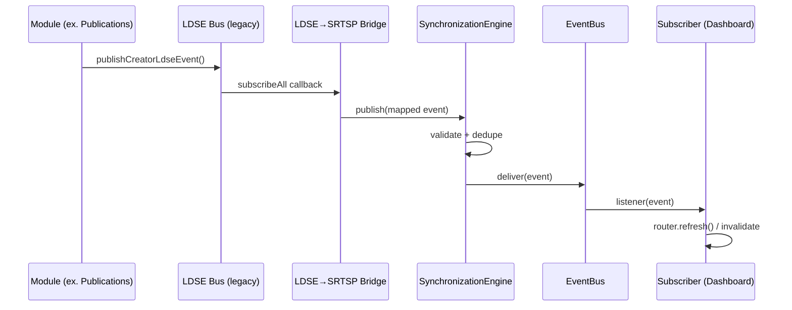
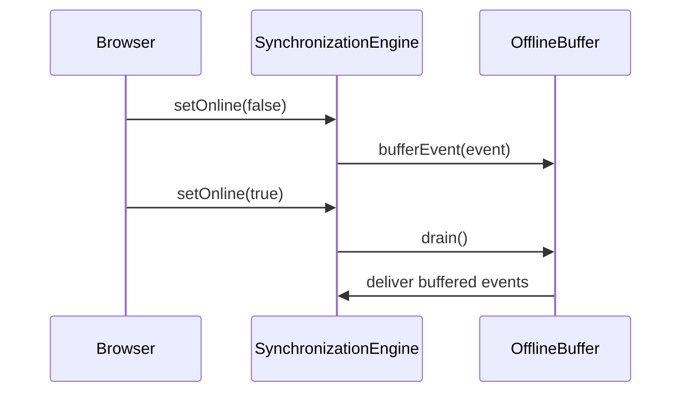
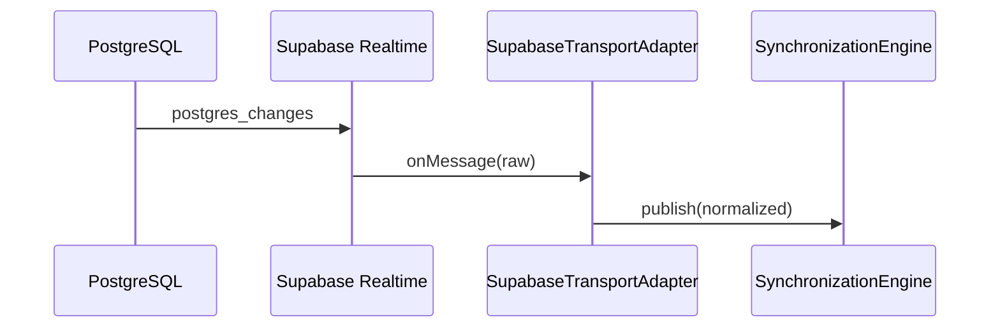

# SRTSP — Sequence Diagrams

## Publication → propagation

```mermaid
sequenceDiagram
  participant M as Module (ex. Publications)
  participant LDSE as LDSE Bus (legacy)
  participant Bridge as LDSE→SRTSP Bridge
  participant Engine as SynchronizationEngine
  participant Bus as EventBus
  participant Sub as Subscriber (Dashboard)

  M->>LDSE: publishCreatorLdseEvent()
  LDSE->>Bridge: subscribeAll callback
  Bridge->>Engine: publish(mapped event)
  Engine->>Engine: validate + dedupe
  Engine->>Bus: deliver(event)
  Bus->>Sub: listener(event)
  Sub->>Sub: router.refresh() / invalidate
```

## Offline → reconnexion

```mermaid
sequenceDiagram
  participant App as Browser
  participant Engine as SynchronizationEngine
  participant Offline as OfflineBuffer

  App->>Engine: setOnline(false)
  Engine->>Offline: bufferEvent(event)
  App->>Engine: setOnline(true)
  Engine->>Offline: drain()
  Offline->>Engine: deliver buffered events
```

## Transport futur (Supabase)

```mermaid
sequenceDiagram
  participant DB as PostgreSQL
  participant SR as Supabase Realtime
  participant Transport as SupabaseTransportAdapter
  participant Engine as SynchronizationEngine

  DB->>SR: postgres_changes
  SR->>Transport: onMessage(raw)
  Transport->>Engine: publish(normalized)
```
