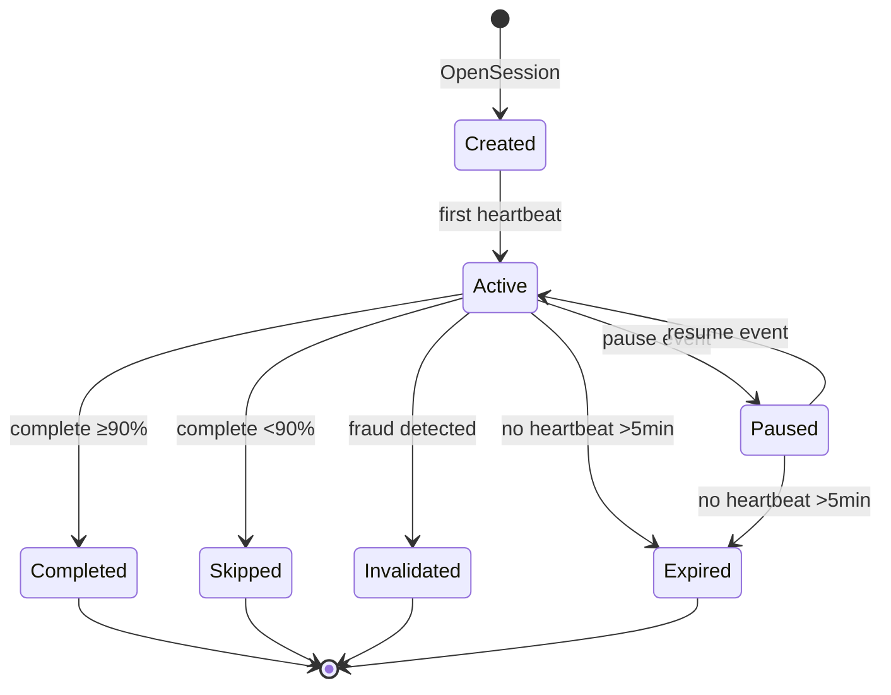

# Streaming Runtime — Architecture (AS-IS → TO-BE)

## AS-IS — flux actuel

```
WebPlayer / useStreaming
        ↓
StreamingService (monolithe)
        ↓
┌───────────────────┬────────────────────┐
│ Edge Functions    │ StreamingRepository │
│ stream-start      │ RPC direct          │
│ stream-progress   │ stream_sessions     │
│ stream-complete   │ stream_events       │
└───────────────────┴────────────────────┘
        ↓
Real Listen 90 % → is_valid_listen
        ↓
Royalty RPC (lecture directe stream_sessions)
```

**Problème :** pas de couche runtime testable ; logique Real Listen dupliquée edge + RPC.

---

## TO-BE — flux cible (post 2.8)

```
WebPlayer / useStreaming (inchangé)
        ↓
StreamingIntegrationService [flag]
        ↓
StreamingApplicationService
        ↓
StreamingRuntimeCoordinator
        ↓
┌─────────────┬─────────────┬──────────────┬─────────────┐
│ Session     │ Playback    │ Analytics    │ Anti-Fraud  │
│ Engine      │ Engine      │ Engine       │ Engine      │
└──────┬──────┴─────────────┴──────────────┴──────┬──────┘
       │                                          │
       └──────────────┬───────────────────────────┘
                      ↓ (valid listen only)
               Stream Ledger
                      ↓
            stream_ledger_entries
                      ↓
         [futur] Royalty Engine read
```

---

## Session State Machine (2.2)



---

## Pipeline Runtime (par opération)

### StartPlayback

```
verify-auth → resolve-track → check-permission → close-orphan-sessions
  → open-session → resolve-audio-file → sign-url → emit SessionOpened
```

### Heartbeat

```
load-session → antifraud-check → update-position → persist-heartbeat → emit HeartbeatRecorded
```

### Complete

```
load-session → compute-real-listen → antifraud-final → complete-session
  → [if valid] record-ledger → emit ListenCompleted
```

---

## Modèle de données proposé — Stream Ledger (2.6)

```sql
-- PROPOSITION — migration en 2.6 uniquement
CREATE TABLE stream_ledger_entries (
  id UUID PRIMARY KEY DEFAULT gen_random_uuid(),
  idempotency_key TEXT NOT NULL UNIQUE,
  session_id UUID NOT NULL REFERENCES stream_sessions(id),
  user_id UUID NOT NULL,
  track_id UUID NOT NULL,
  artist_id UUID NOT NULL,
  listen_percentage NUMERIC(5,2) NOT NULL,
  is_valid_listen BOOLEAN NOT NULL DEFAULT true,
  revenue_basis_gnf NUMERIC(18,2),  -- snapshot tarif au moment T
  recorded_at TIMESTAMPTZ NOT NULL DEFAULT now(),
  metadata JSONB DEFAULT '{}'
);
-- INSERT ONLY triggers + RLS
```

---

## Observabilité

| Métrique | Source |
|---|---|
| `streaming_sessions_active` | Session Engine |
| `streaming_valid_listens_total` | Ledger |
| `streaming_fraud_invalidations` | Anti-Fraud |
| `streaming_heartbeat_latency_p95` | Runtime telemetry |
| `streaming_runtime_rollbacks` | Integration service |

Pattern : `StreamingTelemetry` (mirror `PublicationTelemetry`).

---

## Compatibilité scale (millions d'écoutes)

| Composant | Stratégie MVP | Stratégie scale |
|---|---|---|
| `stream_sessions` | Index user_id, track_id | Partition par mois |
| `stream_events` | INSERT ONLY | Archivage froid >90j |
| `stream_ledger_entries` | UNIQUE idempotency | Partition + read replica analytics |
| Heartbeats | 10s interval | Edge régional (futur) |
| Analytics | LIMIT + fenêtre glissante | MV refresh 5min |

MVP-first : optimiser quand >100k écoutes/jour (CDC).
