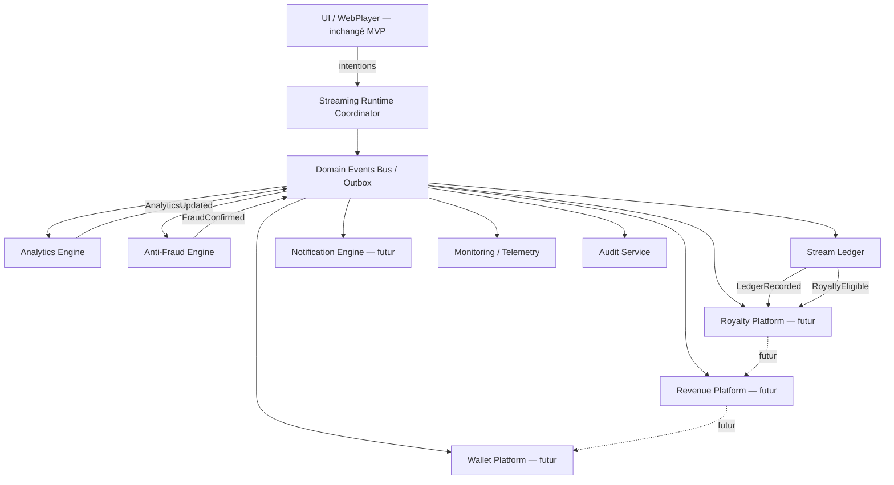
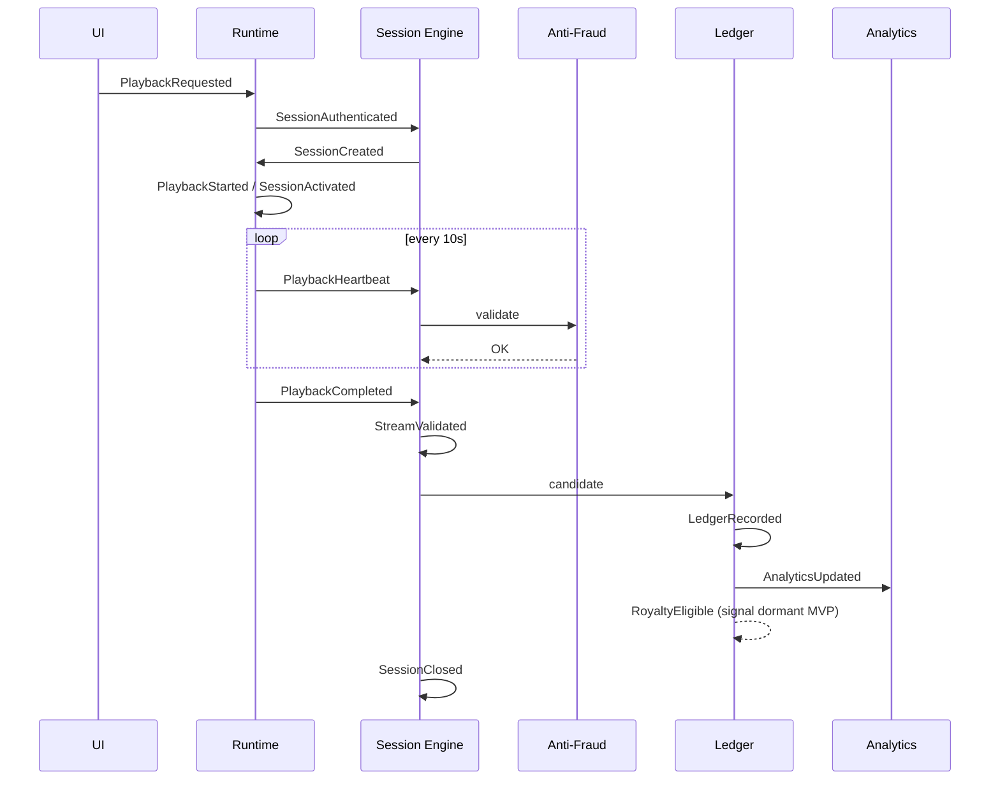
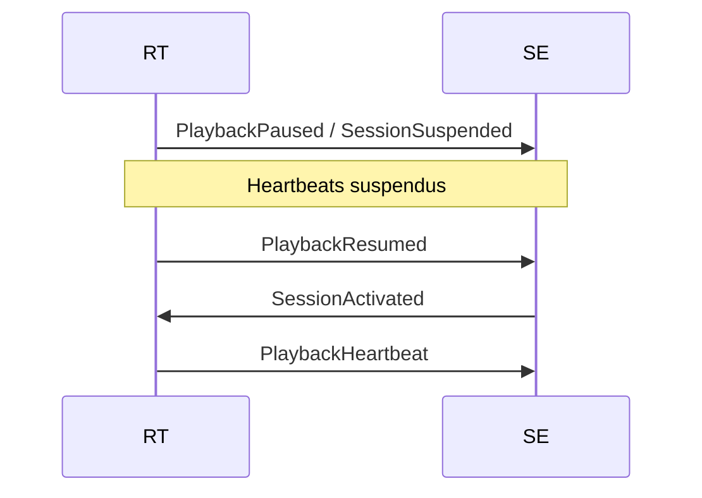
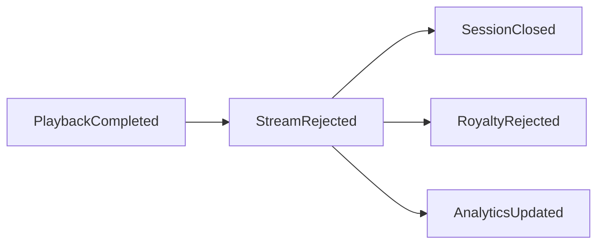
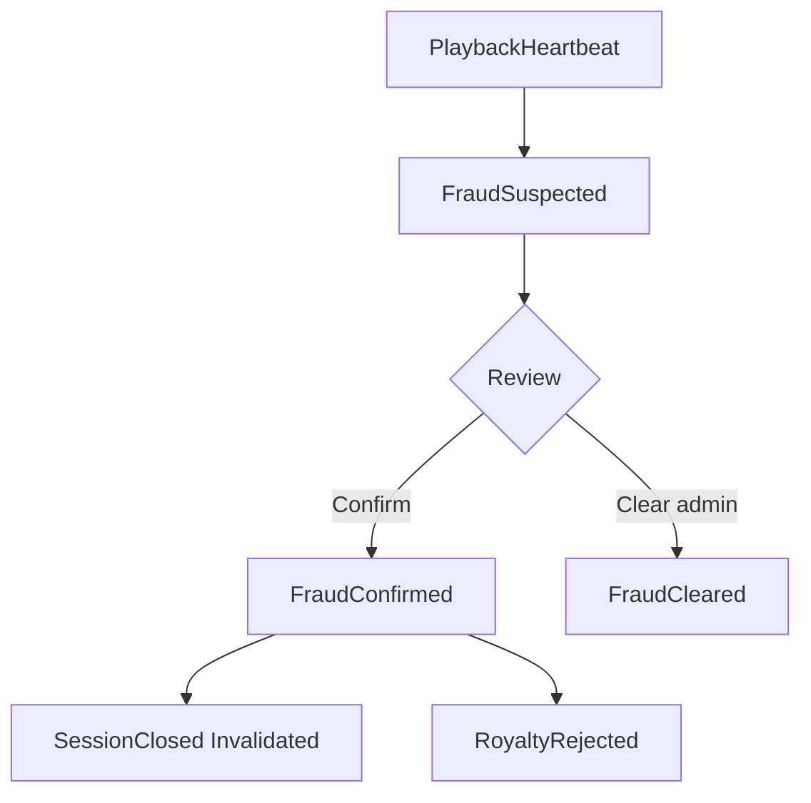
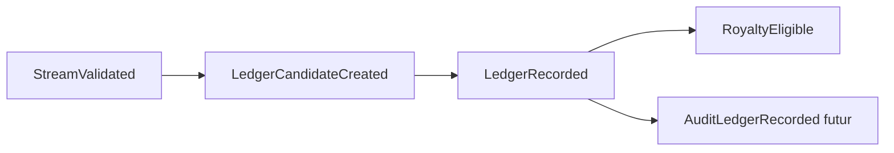
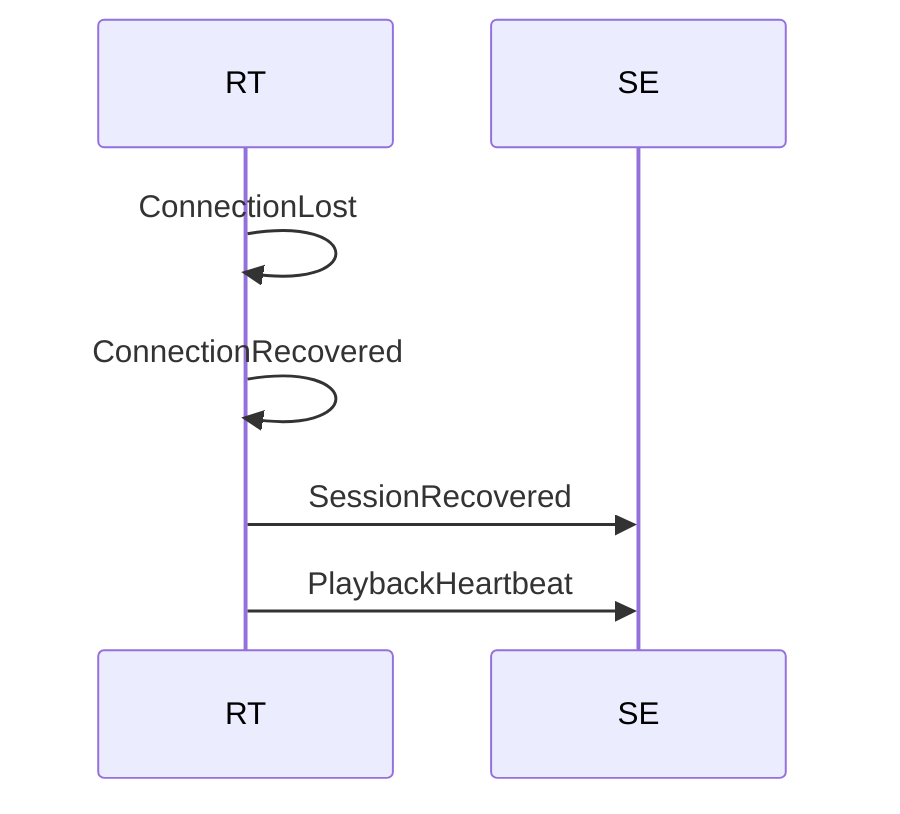

# DOMAIN_EVENTS — Streaming Runtime SONAFRIK

> **Enterprise Domain Events Specification**  
> Event Driven Architecture · Event Contracts · Streaming Runtime · Enterprise Documentation  
> **Version catalogue :** 2.1.0  
> **Date :** 2026-06-25  
> **Statut :** Officiel — SPRING 2  
> **Périmètre :** Documentation uniquement — aucun code, aucune modification applicative

**Référence unique** de tous les événements métier du Streaming Runtime. Tous les moteurs SONAFRIK **doivent** utiliser exclusivement ce catalogue pour communiquer.

**Documents liés :** `STATE_MACHINE.md` (v2.1.0) · `SEQUENCE_DIAGRAMS.md` (v1.1.0) · `SPRING_2_PROGRAM.md` · `FeatureFlags.md` · `DEPENDENCY_RULES.md` · ADR-002 · ADR-003

---

## Table des matières

1. [Présentation](#1-présentation)
2. [Principes fondamentaux](#2-principes-fondamentaux)
3. [Architecture Event Driven](#3-architecture-event-driven)
4. [Taxonomie officielle](#4-taxonomie-officielle)
5. [Catalogue officiel](#5-catalogue-officiel)
6. [Contrat de chaque événement](#6-contrat-de-chaque-événement)
7. [Flux d'événements](#7-flux-dévénements)
8. [Ordonnancement](#8-ordonnancement)
9. [Event Ownership](#9-event-ownership)
10. [Event Persistence Policy](#10-event-persistence-policy)
11. [Idempotence](#11-idempotence)
12. [Versioning](#12-versioning)
13. [Observability](#13-observability)
14. [Sécurité](#14-sécurité)
15. [Compatibilité MVP](#15-compatibilité-mvp)
16. [Glossaire](#16-glossaire)
17. [Annexes](#17-annexes)
18. [Cross-References documentaires](#18-cross-references-documentaires)

---

## 1. Présentation

### 1.1 Objectif

Définir **tous** les Domain Events officiels du Streaming Runtime : contrats, producteurs, consommateurs, payloads logiques, ordre, idempotence, criticité, persistance, impacts métier, garanties et observabilité.

### 1.2 Rôle

| Rôle | Description |
|---|---|
| **Contrat inter-moteurs** | Vocabulaire unique entre Runtime, Analytics, Anti-Fraud, Ledger, Royalties |
| **Source sémantique** | Complète `stream_events` technique (INSERT ONLY) sans la remplacer en MVP |
| **Audit trail métier** | Chaîne traçable écoute → validation → ledger → royalty signal |
| **Guide implémentation** | Permet codegen, tests contractuels, probes certification |

### 1.3 Périmètre

| IN | OUT |
|---|---|
| 38 Domain Events catalogue v2.0.0 | Intentions UI (`*Requested` — hors catalogue) |
| Contrats payload logiques | Schémas TypeScript / Zod (futur `packages/types`) |
| Ownership & idempotence | Implémentation bus / outbox |
| Signaux Wallet/Revenue (documentés, inactifs MVP) | Exécution paiements / retraits |
| Alignement `STATE_MACHINE.md` v2.0.0 | Modification edge functions existantes |

### 1.4 Principes Event Driven (résumé)

Le Runtime **émet des faits** ; les moteurs **réagissent**. Aucun moteur aval n'interroge directement le player React pour une décision financière.

### 1.5 Responsabilités

| Acteur | Responsabilité |
|---|---|
| **Runtime Coordinator** | Émet événements playback + orchestration |
| **Session Engine** | Émet événements session + streaming validation |
| **Anti-Fraud Engine** | Émet / consomme événements fraude |
| **Analytics Engine** | Consomme ; émet `AnalyticsUpdated` |
| **Stream Ledger** | Consomme `StreamValidated` ; émet ledger + royalty signals |
| **Royalty / Revenue / Wallet** | Consommateurs **futurs** — documentés, non activés MVP |

### 1.6 Source de vérité

**Règle absolue :** la validité financière d'une écoute est établie **uniquement** par la séquence :

`StreamValidated` → `LedgerRecorded` → `RoyaltyEligible`

Tout le reste (UI, position client, durée affichée) est **non probant**.

En cas de conflit :
- **Transitions d'état** → `STATE_MACHINE.md` prévaut
- **Sémantique événement** → `DOMAIN_EVENTS.md` prévaut

---

## 2. Principes fondamentaux

| # | Principe | Définition opérationnelle |
|---|---|---|
| P01 | **Event First** | Toute transition `STATE_MACHINE.md` §5 autorisée produit ≥1 Domain Event |
| P02 | **Single Source of Truth** | Un seul producteur autorisé par type d'événement (§9) |
| P03 | **Immutable Events** | Jamais UPDATE/DELETE sur événement émis ; correction = nouvel événement |
| P04 | **Append Only** | Persistance ledger + `stream_events` = INSERT ONLY |
| P05 | **Replay Safe** | Consommateurs tolèrent rejeu ; dédup via `eventId` / `idempotencyKey` |
| P06 | **Idempotent** | Événements financiers : même clé → même effet (no-op) |
| P07 | **Versioned** | `eventVersion` semver dans enveloppe ; breaking = MAJOR |
| P08 | **Backward Compatible** | Ajout champs optionnels = MINOR ; consommateurs tolérants |
| P09 | **Eventually Consistent** | Analytics / projections peuvent lag < 5 s post-événement |
| P10 | **Audit Friendly** | Événements critiques → trace `correlationId` + audit trail |

---

## 3. Architecture Event Driven



**Flux données :** UI ne consomme pas Domain Events. Moteurs **ne s'appellent pas** directement — ils publient / consomment via contrats §6.

---

## 4. Taxonomie officielle

| Catégorie | Préfixe | Nb events | Activation MVP |
|---|---|---|---|
| **Playback Events** | `Playback*` | 12 | Runtime interne + mirror legacy |
| **Session Events** | `Session*` | 7 | Runtime interne |
| **Streaming Events** | `Stream*` | 2 | Runtime + Analytics |
| **Analytics Events** | `Analytics*` | 1 | Actif (projections) |
| **Anti-Fraud Events** | `Fraud*` | 3 | Actif (scoring) |
| **Ledger Events** | `Ledger*` | 2 | Émis ; écriture flag-gated |
| **Royalty Events** | `Royalty*` | 2 | **Émis ; non consommé** |
| **Revenue Events** | `Revenue*` | 1 | **Réservé ; inactif** |
| **Wallet Events** | `Wallet*` · `Withdrawal*` | 2 | **Réservé ; inactif** |
| **Notification Events** | `Notification*` | 1 | **Réservé ; inactif** |
| **Monitoring Events** | `Monitoring*` | 2 | Telemetry |
| **Audit Events** | `Audit*` | 2 | Admin futur |

---

## 5. Catalogue officiel

### 5.1 Index alphabétique (38 événements)

`AnalyticsUpdated` · `AuditLedgerRecorded` · `AuditStreamValidated` · `ConnectionLost` · `ConnectionRecovered` · `FraudCleared` · `FraudConfirmed` · `FraudSuspected` · `LedgerCandidateCreated` · `LedgerRecorded` · `MonitoringHeartbeatLatency` · `MonitoringTransitionRejected` · `NotificationPlaybackFailed` · `PlaybackBuffering` · `PlaybackCancelled` · `PlaybackCompleted` · `PlaybackFailed` · `PlaybackHeartbeat` · `PlaybackPaused` · `PlaybackReady` · `PlaybackRequested` · `PlaybackResumed` · `PlaybackSeeked` · `PlaybackStarted` · `RevenueCalculated` · `RoyaltyEligible` · `RoyaltyRejected` · `SessionActivated` · `SessionAuthenticated` · `SessionClosed` · `SessionCreated` · `SessionExpired` · `SessionRecovered` · `SessionSuspended` · `SignedUrlIssued` · `StreamRejected` · `StreamValidated` · `WalletCreditPrepared` · `WithdrawalEligible`

### 5.2 Mapping STATE_MACHINE → Domain Event

| Transition STATE_MACHINE | Domain Event(s) |
|---|---|
| `PlayRequested` | `PlaybackRequested` |
| `PreparingSucceeded` → `Loading` | — (intention seulement) |
| `StartStreamSucceeded` | `SessionCreated`, `SignedUrlIssued` |
| `BufferFilled` | `PlaybackBuffering` ou skip si direct Playing |
| `PlaybackStarted` | `PlaybackStarted`, `SessionActivated` |
| `PauseRequested` | `PlaybackPaused`, `SessionSuspended` |
| `ResumeRequested` | `PlaybackResumed`, `SessionActivated` |
| `SeekCompleted` | `PlaybackSeeked` |
| Heartbeat cadence | `PlaybackHeartbeat` |
| `TrackEnded` | `PlaybackCompleted` |
| Complete ≥90 % | `StreamValidated`, `SessionClosed` |
| Complete <90 % | `StreamRejected`, `SessionClosed` |
| `FraudConfirmed` | `FraudConfirmed`, `RoyaltyRejected`, `SessionClosed` |
| `SessionExpired` | `SessionExpired`, `RoyaltyRejected` |
| `ConnectionLost` | `ConnectionLost` |
| `ConnectionRecovered` | `ConnectionRecovered`, `SessionRecovered` |

---

## 6. Contrat de chaque événement

### 6.0 Enveloppe standard (tous événements)

| Champ | Type logique | Obligatoire |
|---|---|---|
| `eventId` | UUID | Oui |
| `eventType` | string (nom catalogue) | Oui |
| `eventVersion` | semver (`1.0.0`) | Oui |
| `occurredAt` | ISO-8601 UTC | Oui |
| `correlationId` | UUID | Oui |
| `actorId` | UUID (user) | Oui |
| `sessionId` | UUID | Si session ouverte |
| `trackId` | UUID | Si applicable |
| `sequenceNumber` | int | Ordre par session |
| `idempotencyKey` | string | Si criticité ≥ Haute |

---

### 6.1 Playback Events

#### `PlaybackRequested`

| Attribut | Valeur |
|---|---|
| **Description** | Intention de lecture enregistrée par Application Service |
| **Objectif** | Tracer demande ; telemetry ; **pas** de valeur financière |
| **Producteur** | Streaming Application Service |
| **Consommateurs** | Monitoring |
| **Payload** | `trackId`, `platform`, `qualityKbps?`, `deviceId?`, `queueContext?` |
| **Préconditions** | État playback `Idle` \| `Completed` \| `Error` recoverable |
| **Postconditions** | Transition → `Preparing` |
| **Priorité** | Basse |
| **Criticité** | Basse |
| **Idempotence** | Non requise |
| **Version** | 1.0.0 |
| **Compatibilité** | N/A |
| **Retry** | N/A |
| **Rollback** | Aucun |
| **Persistance** | Outbox optionnelle ; non financier |
| **Feature Flag** | `streaming_runtime_enabled` (DRY RUN log only si PARTIAL) |

#### `PlaybackStarted`

| Attribut | Valeur |
|---|---|
| **Description** | Audio en lecture effective (`Playing`) |
| **Objectif** | Marquer début écoute auditable |
| **Producteur** | Playback Engine |
| **Consommateurs** | Session Engine, Analytics Engine, Monitoring |
| **Payload** | `sessionId`, `trackId`, `positionSeconds`, `durationSeconds`, `signedUrlExpiresAt` |
| **Préconditions** | `SessionCreated` ; buffer OK |
| **Postconditions** | État `Playing` ; événement technique `play` mirror |
| **Priorité** | Haute |
| **Criticité** | Haute |
| **Idempotence** | `playback-started:{sessionId}` |
| **Version** | 1.0.0 |
| **Retry** | Non |
| **Rollback** | Impossible — émettre `PlaybackCancelled` si abort |
| **Persistance** | Outbox + mirror `stream_events.play` |
| **Feature Flag** | `streaming_playback_engine_enabled` |

#### `PlaybackBuffering`

| Attribut | Valeur |
|---|---|
| **Description** | Stall ou chargement initial |
| **Objectif** | Monitoring qualité réseau |
| **Producteur** | Playback Engine |
| **Consommateurs** | Monitoring |
| **Payload** | `sessionId`, `reason` (`initial` \| `stall` \| `reconnect`) |
| **Préconditions** | `Loading` ou `Playing` |
| **Postconditions** | État `Buffering` |
| **Priorité** | Basse |
| **Criticité** | Basse |
| **Idempotence** | Non |
| **Persistance** | Telemetry only |
| **Feature Flag** | `streaming_playback_engine_enabled` |

#### `PlaybackReady`

| Attribut | Valeur |
|---|---|
| **Description** | Média prêt, lecture pas démarrée |
| **Producteur** | Playback Engine |
| **Consommateurs** | Monitoring |
| **Payload** | `sessionId`, `durationSeconds` |
| **Préconditions** | `BufferFilled` ; auto-play off |
| **Postconditions** | État `Ready` |
| **Criticité** | Moyenne |
| **Idempotence** | Non |
| **Feature Flag** | `streaming_playback_engine_enabled` |

#### `PlaybackPaused`

| Attribut | Valeur |
|---|---|
| **Description** | Lecture suspendue |
| **Producteur** | Session Engine |
| **Consommateurs** | Analytics, Monitoring |
| **Payload** | `sessionId`, `positionSeconds`, `totalListenedSeconds` |
| **Préconditions** | `Playing` → pause |
| **Postconditions** | `SessionSuspended` ; mirror `pause` |
| **Criticité** | Moyenne |
| **Idempotence** | `pause:{sessionId}:{positionSeconds}` |
| **Persistance** | Outbox + `stream_events` |
| **Feature Flag** | `streaming_session_engine_enabled` |

#### `PlaybackResumed`

| Attribut | Valeur |
|---|---|
| **Description** | Reprise après pause |
| **Producteur** | Session Engine |
| **Consommateurs** | Analytics, Monitoring |
| **Payload** | `sessionId`, `positionSeconds` |
| **Préconditions** | `SessionSuspended` |
| **Postconditions** | `SessionActivated` ; mirror `resume` |
| **Criticité** | Moyenne |
| **Idempotence** | `resume:{sessionId}:{occurredAt}` |
| **Feature Flag** | `streaming_session_engine_enabled` |

#### `PlaybackSeeked`

| Attribut | Valeur |
|---|---|
| **Description** | Position modifiée (seek programmatique MVP) |
| **Producteur** | Session Engine |
| **Consommateurs** | Anti-Fraud, Analytics |
| **Payload** | `sessionId`, `fromPositionSeconds`, `toPositionSeconds` |
| **Préconditions** | `Playing` ; seek autorisé STATE_MACHINE |
| **Postconditions** | mirror `seek` |
| **Criticité** | Moyenne |
| **Idempotence** | Non |
| **Feature Flag** | `streaming_session_engine_enabled` |

#### `PlaybackHeartbeat`

| Attribut | Valeur |
|---|---|
| **Description** | Progression périodique validée (10 s) |
| **Producteur** | Session Engine (post Anti-Fraud OK) |
| **Consommateurs** | Anti-Fraud, Analytics, Monitoring |
| **Payload** | `sessionId`, `positionSeconds`, `totalListenedSeconds`, `listenPercentage`, `sequenceNumber`, `fraudFlags?` |
| **Préconditions** | `Playing` ; session `Active`/`Heartbeat` |
| **Postconditions** | `last_heartbeat_at` MAJ |
| **Priorité** | Haute |
| **Criticité** | Haute |
| **Idempotence** | `heartbeat:{sessionId}:{sequenceNumber}` |
| **Retry** | 3× backoff si edge fail |
| **Persistance** | Outbox + `stream_events.heartbeat` |
| **Feature Flag** | `streaming_session_engine_enabled` |

#### `PlaybackCompleted`

| Attribut | Valeur |
|---|---|
| **Description** | Fin média côté client — déclenche complete serveur |
| **Producteur** | Playback Engine |
| **Consommateurs** | Session Engine, Monitoring |
| **Payload** | `sessionId`, `positionSeconds`, `totalDurationSeconds` |
| **Préconditions** | `TrackEnded` |
| **Postconditions** | Complete RPC en cours |
| **Criticité** | Haute |
| **Idempotence** | `complete-request:{sessionId}` |
| **Feature Flag** | `streaming_playback_engine_enabled` |

#### `PlaybackCancelled`

| Attribut | Valeur |
|---|---|
| **Description** | Arrêt volontaire avant fin |
| **Producteur** | Playback Engine |
| **Consommateurs** | Session Engine, Analytics |
| **Payload** | `sessionId`, `reason` (`user_stop` \| `track_change` \| `navigation`) |
| **Préconditions** | Non terminal |
| **Postconditions** | → `SessionClosed` (skipped) |
| **Criticité** | Moyenne |
| **Idempotence** | `cancel:{sessionId}` |
| **Feature Flag** | `streaming_runtime_enabled` |

#### `PlaybackFailed`

| Attribut | Valeur |
|---|---|
| **Description** | Échec lecture |
| **Producteur** | Playback Engine |
| **Consommateurs** | Session Engine, Monitoring, `NotificationPlaybackFailed` (futur) |
| **Payload** | `sessionId?`, `trackId`, `errorCode`, `errorType`, `recoverable` |
| **Préconditions** | Erreur audio/réseau/auth |
| **Postconditions** | État `Error` |
| **Criticité** | Haute |
| **Idempotence** | Non |
| **Feature Flag** | `streaming_runtime_enabled` |

#### `SignedUrlIssued`

| Attribut | Valeur |
|---|---|
| **Description** | URL signée générée — audit sécurité |
| **Producteur** | Playback Engine |
| **Consommateurs** | Monitoring, Audit (futur) |
| **Payload** | `sessionId`, `trackId`, `expiresAt`, `format`, `bitrateKbps` — **sans URL** |
| **Criticité** | Moyenne |
| **Idempotence** | `signed-url:{sessionId}` |
| **Feature Flag** | `streaming_playback_engine_enabled` |

#### `ConnectionLost` / `ConnectionRecovered`

| Événement | Producteur | Consommateurs | Criticité |
|---|---|---|---|
| `ConnectionLost` | Playback Engine | Monitoring, Session (watch) | Moyenne |
| `ConnectionRecovered` | Playback Engine | Monitoring | Basse |

Payload `ConnectionLost` : `sessionId`, `consecutiveFailures`, `lastSuccessfulHeartbeatAt`  
Payload `ConnectionRecovered` : `sessionId`, `downtimeSeconds`  
**Feature Flag :** `streaming_runtime_enabled`

---

### 6.2 Session Events

#### `SessionAuthenticated`

| Attribut | Valeur |
|---|---|
| **Description** | JWT validé — phase pré-`Created` |
| **Producteur** | Streaming Application Service |
| **Consommateurs** | Monitoring |
| **Payload** | `actorId`, `platform` |
| **Préconditions** | `AuthValidated` STATE_MACHINE |
| **Postconditions** | Peut appeler `OpenSession` |
| **Criticité** | Moyenne |
| **Persistance** | Non persistant (ephemeral) |
| **Feature Flag** | `streaming_runtime_enabled` |

#### `SessionCreated`

| Attribut | Valeur |
|---|---|
| **Description** | Row `stream_sessions` insérée |
| **Producteur** | Session Engine |
| **Consommateurs** | Playback Engine, Anti-Fraud, Monitoring |
| **Payload** | `sessionId`, `trackId`, `creatorId`, `platform`, `totalDurationSeconds`, `startedAt` |
| **Préconditions** | `SessionAuthenticated` ; track publié |
| **Postconditions** | État session `Created` |
| **Criticité** | Haute |
| **Idempotence** | `session:{actorId}:{trackId}:{correlationId}` |
| **Persistance** | `stream_sessions` + outbox |
| **Feature Flag** | `streaming_session_engine_enabled` |

#### `SessionActivated`

| Attribut | Valeur |
|---|---|
| **Description** | Session en écoute active (heartbeat accepté) |
| **Producteur** | Session Engine |
| **Consommateurs** | Anti-Fraud, Analytics, Monitoring |
| **Payload** | `sessionId`, `activatedAt`, `trigger` (`first_heartbeat` \| `resume`) |
| **Préconditions** | `Created`+heartbeat ou resume depuis `Suspended` |
| **Postconditions** | État `Active`/`Heartbeat` |
| **Criticité** | Haute |
| **Idempotence** | `activated:{sessionId}:{trigger}` |
| **Feature Flag** | `streaming_session_engine_enabled` |

#### `SessionSuspended`

| Attribut | Valeur |
|---|---|
| **Description** | Pause serveur |
| **Producteur** | Session Engine |
| **Consommateurs** | Analytics, Monitoring |
| **Payload** | `sessionId`, `positionSeconds` |
| **Préconditions** | `PlaybackPaused` |
| **Postconditions** | Heartbeats suspendus |
| **Criticité** | Moyenne |
| **Feature Flag** | `streaming_session_engine_enabled` |

#### `SessionRecovered`

| Attribut | Valeur |
|---|---|
| **Description** | Reprise après coupure réseau |
| **Producteur** | Session Engine |
| **Consommateurs** | Analytics, Monitoring |
| **Payload** | `sessionId`, `downtimeSeconds`, `lastPositionSeconds` |
| **Préconditions** | `ConnectionRecovered` ; session non `Expired` |
| **Criticité** | Moyenne |
| **Feature Flag** | `streaming_session_engine_enabled` |

#### `SessionExpired`

| Attribut | Valeur |
|---|---|
| **Description** | Timeout orphan / start |
| **Producteur** | Session Engine |
| **Consommateurs** | Playback Runtime, Analytics, Monitoring |
| **Payload** | `sessionId`, `reason` (`heartbeat_timeout` \| `start_timeout`), `lastHeartbeatAt` |
| **Postconditions** | Terminal immutable |
| **Criticité** | Haute |
| **Idempotence** | `expired:{sessionId}` |
| **Feature Flag** | `streaming_session_engine_enabled` |

#### `SessionClosed`

| Attribut | Valeur |
|---|---|
| **Description** | Clôture terminal session |
| **Producteur** | Session Engine |
| **Consommateurs** | Analytics, Monitoring, Audit |
| **Payload** | `sessionId`, `terminalState` (`Completed_Valid` \| `Completed_Invalid` \| `Skipped` \| `Invalidated` \| `Cancelled`), `listenPercentage?`, `isValidListen?` |
| **Préconditions** | Complete, fraud, cancel, ou expire |
| **Postconditions** | INV-S01 immutable |
| **Criticité** | Haute |
| **Idempotence** | `closed:{sessionId}` |
| **Feature Flag** | `streaming_session_engine_enabled` |

---

### 6.3 Streaming Events

#### `StreamValidated`

| Attribut | Valeur |
|---|---|
| **Description** | Real Listen V7.2 confirmé — **seul événement établissant validité** |
| **Producteur** | Session Engine |
| **Consommateurs** | Stream Ledger, Analytics, Audit, Monitoring |
| **Payload** | `sessionId`, `trackId`, `artistId`, `listenPercentage`, `thresholdPercent` (90), `totalListenedSeconds` |
| **Préconditions** | `PlaybackCompleted` ; complete RPC ; ≥90 % **serveur** |
| **Postconditions** | `is_valid_listen = true` ; éligible ledger |
| **Priorité** | Critique |
| **Criticité** | **Critique** |
| **Idempotence** | `validated:{sessionId}` — **obligatoire** |
| **Retry** | Complete idempotent |
| **Rollback** | **Interdit** après émission |
| **Persistance** | Outbox + `stream_sessions` + `AuditStreamValidated` |
| **Feature Flag** | `streaming_session_engine_enabled` |

#### `StreamRejected`

| Attribut | Valeur |
|---|---|
| **Description** | Écoute terminée non valide |
| **Producteur** | Session Engine |
| **Consommateurs** | Analytics, `RoyaltyRejected`, Monitoring |
| **Payload** | `sessionId`, `listenPercentage`, `reason` (`below_threshold` \| `too_short` \| `policy`) |
| **Préconditions** | Complete ; <90 % |
| **Postconditions** | `is_valid_listen = false` ; ⊘ ledger |
| **Criticité** | Haute |
| **Idempotence** | `rejected:{sessionId}` |
| **Feature Flag** | `streaming_session_engine_enabled` |

---

### 6.4 Analytics Events

#### `AnalyticsUpdated`

| Attribut | Valeur |
|---|---|
| **Description** | Projection analytics incrémentée |
| **Producteur** | Analytics Engine |
| **Consommateurs** | Creator Dashboard (read model), Monitoring |
| **Payload** | `scope` (`track` \| `artist` \| `creator`), `entityId`, `metric`, `delta`, `window`, `sessionId?` |
| **Préconditions** | Événement source playback/session reçu |
| **Postconditions** | Projection à jour (eventually consistent <5s) |
| **Criticité** | Moyenne |
| **Idempotence** | `{scope}:{entityId}:{metric}:{window}:{sessionId}` |
| **Persistance** | Projections / cache ; pas ledger |
| **Feature Flag** | `streaming_analytics_engine_enabled` |

---

### 6.5 Anti-Fraud Events

#### `FraudSuspected`

| Producteur | Anti-Fraud Engine |
| Consommateurs | Monitoring, Session Engine (watch), Admin futur |
| Payload | `sessionId`, `signalType`, `score`, `details` |
| Criticité | Haute |
| Feature Flag | `streaming_antifraud_engine_enabled` |

#### `FraudConfirmed`

| Producteur | Anti-Fraud Engine |
| Consommateurs | Session Engine, `RoyaltyRejected`, Analytics, Audit |
| Payload | `sessionId`, `fraudFlags`, `ruleId`, `invalidatedAt` |
| Préconditions | Score > seuil ou règle dure (vitesse >1.5×) |
| Postconditions | `SessionClosed(Invalidated)` ; ⊘ ledger |
| Criticité | **Critique** |
| Idempotence | `fraud-confirmed:{sessionId}` |
| Feature Flag | `streaming_antifraud_engine_enabled` |

#### `FraudCleared`

| Producteur | Admin Anti-Fraud Service (futur) |
| Consommateurs | Analytics, Monitoring |
| Payload | `sessionId`, `previousFlags`, `clearedBy`, `reason` |
| Note | **Ne restaure pas** `is_valid_listen` — nouvelle session requise |
| Criticité | Moyenne |
| Feature Flag | `streaming_antifraud_engine_enabled` |

---

### 6.6 Ledger Events

#### `LedgerCandidateCreated`

| Producteur | Stream Ledger |
| Consommateurs | Ledger writer, Monitoring |
| Payload | `sessionId`, `trackId`, `artistId`, `listenPercentage`, `idempotencyKey` |
| Préconditions | `StreamValidated` reçu |
| Criticité | Haute |
| Idempotence | `ledger-candidate:{sessionId}` |
| Feature Flag | `stream_ledger_enabled` |

#### `LedgerRecorded`

| Producteur | Stream Ledger |
| Consommateurs | Royalty Platform (futur), Revenue (futur), Analytics, Audit |
| Payload | `ledgerEntryId`, `sessionId`, `trackId`, `artistId`, `idempotencyKey`, `recordedAt`, `revenueBasisGnf?` |
| Préconditions | Candidate validé ; INSERT `stream_ledger_entries` OK |
| Postconditions** | **Vérité financière écoute** ; déclenche `RoyaltyEligible` |
| Criticité | **Critique** |
| Idempotence | `ledger:{sessionId}` — **strict** |
| Retry | 3× ; jamais nouvelle clé |
| Rollback | **Interdit** — compensation = entrée négative future (hors MVP) |
| Persistance | `stream_ledger_entries` INSERT ONLY |
| Feature Flag | `stream_ledger_enabled` |

---

### 6.7 Royalty Events

#### `RoyaltyEligible`

| Producteur | Stream Ledger |
| Consommateurs | Royalty Platform (**futur**), Revenue (**futur**), Monitoring |
| Payload | `ledgerEntryId`, `sessionId`, `artistId`, `trackId`, `cycleHint?` |
| Préconditions | `LedgerRecorded` |
| Criticité | **Critique** (signal) |
| Idempotence | `royalty-eligible:{ledgerEntryId}` |
| **MVP** | **Émis si flag ON ; aucun consommateur actif** |
| Feature Flag | `stream_ledger_enabled` |

#### `RoyaltyRejected`

| Producteur | Session Engine ou Anti-Fraud Engine |
| Consommateurs | Royalty Platform (**futur**), Analytics, Audit |
| Payload | `sessionId`, `reason` (`fraud` \| `invalid_listen` \| `expired` \| `policy`) |
| Préconditions | `StreamRejected`, `FraudConfirmed`, ou `SessionExpired` |
| **MVP** | **Émis ; non consommé** |
| Feature Flag | `streaming_antifraud_engine_enabled` |

---

### 6.8 Revenue & Wallet Events (réservés — inactifs MVP)

#### `RevenueCalculated`

| Producteur | Revenue Platform (futur) |
| Consommateurs | Wallet Platform (futur), Audit |
| Payload | `ledgerEntryId`, `artistId`, `grossGnf`, `poolShareGnf`, `calculatedAt` |
| Préconditions | `RoyaltyEligible` consommé (post-MVP) |
| **MVP** | **Non émis** |
| Feature Flag | réservé `revenue_engine_enabled` |

#### `WalletCreditPrepared`

| Producteur | Wallet Platform (futur) |
| Consommateurs | Wallet ledger writer (futur) |
| Payload | `walletId`, `amountGnf`, `sourceLedgerEntryId`, `idempotencyKey` |
| **MVP** | **Non émis** — DEPENDENCY_RULES interdit écriture wallet depuis streaming |
| Feature Flag | réservé |

#### `WithdrawalEligible`

| Producteur | Wallet Platform (futur) |
| Consommateurs | Payout service (futur) |
| **MVP** | **Non émis** |
| Feature Flag | réservé |

---

### 6.9 Notification, Monitoring, Audit Events

| Événement | Producteur | MVP | Criticité |
|---|---|---|---|
| `NotificationPlaybackFailed` | Notification Engine | Inactif | Basse |
| `MonitoringHeartbeatLatency` | Telemetry | Actif | Basse |
| `MonitoringTransitionRejected` | Runtime Coordinator | Actif | Moyenne |
| `AuditStreamValidated` | Audit Service | Futur | Haute |
| `AuditLedgerRecorded` | Audit Service | Futur | **Critique** |

---

## 7. Flux d'événements

### 7.1 Lecture complète (happy path)



### 7.2 Pause / Reprise



### 7.3 Fin de lecture — rejet



### 7.4 Détection fraude



### 7.5 Ledger



### 7.6 Recovery



---

## 8. Ordonnancement

### 8.1 Séquence canonique — écoute valide

```
PlaybackRequested
  → SessionAuthenticated
  → SessionCreated
  → SignedUrlIssued
  → PlaybackBuffering (optionnel)
  → PlaybackStarted
  → SessionActivated
  → [PlaybackHeartbeat]×N
  → [PlaybackPaused → SessionSuspended → PlaybackResumed → SessionActivated]×optional
  → PlaybackCompleted
  → StreamValidated
  → LedgerCandidateCreated
  → LedgerRecorded
  → AnalyticsUpdated
  → RoyaltyEligible        (signal — MVP non consommé)
  → SessionClosed
```

### 8.2 Règles d'ordre

| Règle | Description |
|---|---|
| ORD-01 | `sequenceNumber` strictement croissant par `sessionId` |
| ORD-02 | `StreamValidated` avant tout événement ledger |
| ORD-03 | `LedgerRecorded` avant `RoyaltyEligible` |
| ORD-04 | `SessionClosed` après tous événements terminal playback |
| ORD-05 | `FraudConfirmed` avant `SessionClosed` si fraude |
| ORD-06 | Cross-session : **aucun** ordre garanti |

### 8.3 Chaîne financière future (post-MVP — documentée)

```
RoyaltyEligible → RevenueCalculated → WalletCreditPrepared → WithdrawalEligible
```

**Non active** en SPRING 2.

---

## 9. Event Ownership

**Règle :** un seul **Owner** par `eventType`. Seul l'Owner définit le schéma et la sémantique. Seul le **Producteur** désigné peut émettre. Le **Responsable métier** arbitre les changements de contrat (hors implémentation).

**Interdit :** Analytics émet `StreamValidated` ; Playback émet `LedgerRecorded` ; client browser publie sur le bus interne.

### 9.1 Matrice complète (38 événements)

| Event | Owner | Producteur | Consommateurs | Déclencheur | Responsable métier |
|---|---|---|---|---|---|
| `PlaybackRequested` | Application Service | Application Service | Monitoring | Intent UI `Play` ; transition S-P01 | Product — Listener Experience |
| `PlaybackStarted` | Playback Engine | Playback Engine | Session Engine, Analytics, Monitoring | `canplay` + play effectif ; S-P06 | Runtime Platform |
| `PlaybackBuffering` | Playback Engine | Playback Engine | Analytics, Monitoring | Stall réseau / chargement initial ; S-P04 | Runtime Platform |
| `PlaybackReady` | Playback Engine | Playback Engine | UI (futur), Monitoring | Buffer OK + auto-play off ; S-P05 | Runtime Platform |
| `PlaybackPaused` | Playback Engine | Playback Engine | Session Engine, Analytics | Intent `Pause` ; S-P07 | Product — Listener Experience |
| `PlaybackResumed` | Playback Engine | Playback Engine | Session Engine, Analytics | Intent `Resume` ; S-P06 | Product — Listener Experience |
| `PlaybackSeeked` | Playback Engine | Playback Engine | Session Engine, Anti-Fraud | Seek programmatique ; S-P08 | Runtime Platform |
| `PlaybackHeartbeat` | Session Engine | Session Engine | Anti-Fraud, Analytics, Monitoring | Cadence 10 s en `Playing` ; S-S04 | Real Listen Compliance |
| `PlaybackCompleted` | Playback Engine | Playback Engine | Session Engine, Analytics | `ended` audio ; S-P10 | Real Listen Compliance |
| `PlaybackCancelled` | Playback Engine | Playback Engine | Session Engine, Analytics | Navigation / stop user ; S-P11 | Product — Listener Experience |
| `PlaybackFailed` | Playback Engine | Playback Engine | Session Engine, Monitoring, Notification (futur) | Erreur codec / timeout ; S-P12 | Runtime Platform |
| `SignedUrlIssued` | Playback Engine | Playback Engine | Monitoring, Audit (futur) | Réponse `stream-start` OK | Security Platform |
| `ConnectionLost` | Playback Engine | Playback Engine | Monitoring, Session Engine (watch) | Perte réseau / heartbeat fail | Runtime Platform |
| `ConnectionRecovered` | Playback Engine | Playback Engine | Monitoring, Session Engine | Réseau rétabli ; S-P09 | Runtime Platform |
| `SessionAuthenticated` | Session Engine | Session Engine | Playback Engine, Runtime Coordinator | JWT + permission OK ; S-S02 | Identity & Access |
| `SessionCreated` | Session Engine | Session Engine | Playback Engine, Anti-Fraud, Analytics | `OpenSession` RPC OK ; S-S01 | Real Listen Compliance |
| `SessionActivated` | Session Engine | Session Engine | Anti-Fraud, Analytics, Monitoring | Premier heartbeat ou resume ; S-S03 | Real Listen Compliance |
| `SessionSuspended` | Session Engine | Session Engine | Analytics, Anti-Fraud | `PlaybackPaused` ; S-S05 | Real Listen Compliance |
| `SessionRecovered` | Session Engine | Session Engine | Analytics, Monitoring | `ConnectionRecovered` + session non expirée | Runtime Platform |
| `SessionExpired` | Session Engine | Session Engine | Analytics, `RoyaltyRejected`, Audit | TTL inactivité ; S-S07 | Real Listen Compliance |
| `SessionClosed` | Session Engine | Session Engine | Analytics, Ledger (via prior events), Audit | Terminal session ; S-S08 | Real Listen Compliance |
| `StreamValidated` | Session Engine | Session Engine | Stream Ledger, Analytics, Audit (futur) | Complete RPC ≥90 % serveur | Finance — ADR-002 |
| `StreamRejected` | Session Engine | Session Engine | Analytics, `RoyaltyRejected`, Monitoring | Complete <90 % ou policy | Finance — ADR-002 |
| `AnalyticsUpdated` | Analytics Engine | Analytics Engine | Dashboard, Monitoring | Agrégation post-consommation | Product Analytics |
| `FraudSuspected` | Anti-Fraud Engine | Anti-Fraud Engine | Monitoring, Session Engine, Admin (futur) | Règle scoring / heartbeat anormal ; S-S06 | Trust & Safety |
| `FraudConfirmed` | Anti-Fraud Engine | Anti-Fraud Engine | Session Engine, `RoyaltyRejected`, Analytics, Audit | Score > seuil / règle dure | Trust & Safety |
| `FraudCleared` | Anti-Fraud Engine | Admin Anti-Fraud (futur) | Analytics, Monitoring | Décision admin manuelle | Trust & Safety |
| `LedgerCandidateCreated` | Stream Ledger | Stream Ledger | Ledger writer, Monitoring | Réception `StreamValidated` | Finance — ADR-002 |
| `LedgerRecorded` | Stream Ledger | Stream Ledger | Royalty (futur), Revenue (futur), Analytics, Audit | INSERT `stream_ledger_entries` OK | Finance — ADR-002 |
| `RoyaltyEligible` | Stream Ledger | Stream Ledger | Royalty Platform (**futur**), Monitoring | Post-`LedgerRecorded` | Finance — Royalties |
| `RoyaltyRejected` | Session Engine | Session Engine **ou** Anti-Fraud Engine | Royalty (**futur**), Analytics, Audit | `StreamRejected`, `FraudConfirmed`, `SessionExpired` | Finance — Royalties |
| `RevenueCalculated` | Revenue Platform | Revenue Platform (**futur**) | Wallet (**futur**), Audit | Post-`RoyaltyEligible` consommé | Finance — Revenue |
| `WalletCreditPrepared` | Wallet Platform | Wallet Platform (**futur**) | Wallet ledger (**futur**) | Post-revenue (hors MVP) | Finance — Wallet |
| `WithdrawalEligible` | Wallet Platform | Wallet Platform (**futur**) | Payout service (**futur**) | Seuil retrait atteint (hors MVP) | Finance — Payouts |
| `NotificationPlaybackFailed` | Notification Engine | Notification Engine (**futur**) | Push/email service | `PlaybackFailed` critique | Product — Listener Experience |
| `MonitoringHeartbeatLatency` | Telemetry | Telemetry / Runtime | Dashboards ops | Mesure latence heartbeat RPC | Platform Engineering |
| `MonitoringTransitionRejected` | Runtime Coordinator | Runtime Coordinator | Alerting, Audit | Transition STATE_MACHINE illégale | Platform Engineering |
| `AuditStreamValidated` | Audit Service | Audit Service (**futur**) | Admin audit store | Copie immuable `StreamValidated` | Compliance |
| `AuditLedgerRecorded` | Audit Service | Audit Service (**futur**) | Admin audit store | Copie immuable `LedgerRecorded` | Compliance |

### 9.2 Règles de co-émission

| Situation | Règle |
|---|---|
| `RoyaltyRejected` | Owner = Session Engine si `StreamRejected`/`SessionExpired` ; Owner = Anti-Fraud si `FraudConfirmed` |
| `SessionActivated` + `PlaybackStarted` | Co-émission autorisée — owners distincts, même `correlationId` |
| Mirror legacy `stream_events` | Pas un Domain Event — projection technique optionnelle |

### 9.3 Violations

| Violation | Réponse |
|---|---|
| Producteur non autorisé | Drop + `MonitoringTransitionRejected` |
| Owner modifié sans bump MAJOR | Rejet revue architecture |
| Client émet événement bus | Rejet sécurité — INV bus interne |

---

## 10. Event Persistence Policy

Politique par événement. **Raison** documentée pour chaque choix — auditabilité financière vs performance.

### 10.1 Matrice complète (38 événements)

| Event | Persistant | Temporaire | Archivable | Rejouable | Conservation | Purge | Archivage | Raison |
|---|---|---|---|---|---|---|---|---|
| `PlaybackRequested` | — | ✅ logs | — | Non | 30 j logs | Auto logs | — | Intent locale — pas de valeur financière |
| `PlaybackStarted` | ✅ outbox | — | — | Oui | 7 j outbox post-ack | Outbox 7 j | — | Trace session ; mirror `stream_events` |
| `PlaybackBuffering` | — | ✅ metrics | — | Non | 30 j metrics | Rollup | — | Signal UX — agrégats suffisent |
| `PlaybackReady` | — | ✅ metrics | — | Non | 30 j | Rollup | — | État court — non financier |
| `PlaybackPaused` | ✅ outbox + mirror | — | — | Oui | 7 j / 24 mois mirror | Outbox 7 j | `stream_events` cold 90 j | Pause impacte Real Listen |
| `PlaybackResumed` | ✅ outbox + mirror | — | — | Oui | 7 j / 24 mois | Idem | Idem | Reprise session |
| `PlaybackSeeked` | ✅ `stream_events` | — | ✅ | Oui | 24 mois | — | Cold 90 j | Anti-fraude seek patterns |
| `PlaybackHeartbeat` | ✅ `stream_events` append | — | ✅ | Oui | 24 mois | — | Cold 90 j | **Source Real Listen** — preuve progression |
| `PlaybackCompleted` | ✅ outbox | — | — | Oui | 7 j outbox | Outbox 7 j | — | Déclencheur complete RPC |
| `PlaybackCancelled` | ✅ outbox + mirror | — | — | Oui | 24 mois | Outbox 7 j | Cold 90 j | Session skipped auditable |
| `PlaybackFailed` | ✅ logs + outbox | — | — | Oui | 90 j | Logs 90 j | — | Diagnostic incidents |
| `SignedUrlIssued` | — | ✅ audit log | — | Non | 7 j | Auto | — | **Jamais URL** dans event — métadonnées only |
| `ConnectionLost` | — | ✅ logs/metrics | — | Non | 30 j | Auto | — | Monitoring réseau |
| `ConnectionRecovered` | — | ✅ logs/metrics | — | Non | 30 j | Auto | — | Idem |
| `SessionAuthenticated` | — | ✅ trace | — | Non | 30 j | Auto | — | Pré-session — éphémère |
| `SessionCreated` | ✅ `stream_sessions` | — | ✅ | Oui | 24 mois | — | Permanent métadonnées | Naissance session autoritaire |
| `SessionActivated` | ✅ `stream_sessions` | — | ✅ | Oui | 24 mois | — | Permanent | Début écoute comptable |
| `SessionSuspended` | ✅ `stream_sessions` | — | ✅ | Oui | 24 mois | — | Permanent | Pause longue |
| `SessionRecovered` | ✅ outbox | — | — | Oui | 7 j | Outbox 7 j | — | Reprise post-coupure |
| `SessionExpired` | ✅ `stream_sessions` terminal | — | ✅ | Oui | 24 mois | — | Permanent | Terminal — pas de ledger |
| `SessionClosed` | ✅ `stream_sessions` terminal | — | ✅ | Oui | **Permanent** | — | **Jamais delete** | Clôture auditable INV-S01 |
| `StreamValidated` | ✅ outbox + `stream_sessions` | — | ✅ | Oui | **Permanent** | — | **Jamais delete** | **Déclencheur financier** INV-F01 |
| `StreamRejected` | ✅ outbox + `stream_sessions` | — | ✅ | Oui | 24 mois | — | Permanent | Preuve rejet <90 % |
| `AnalyticsUpdated` | ✅ projections/MV | — | ✅ | Oui | 12 mois rollup | MV refresh | Cold analytics store | Dashboard — pas source financière |
| `FraudSuspected` | ✅ outbox + flag session | — | ✅ | Oui | 24 mois | — | Permanent fraude | Investigation Trust & Safety |
| `FraudConfirmed` | ✅ `stream_sessions` + outbox | — | ✅ | Oui | **Permanent** | — | **Jamais delete** | Bloque ledger — preuve légale |
| `FraudCleared` | ✅ audit (futur) | — | ✅ | Oui | 24 mois | — | Permanent | Décision admin |
| `LedgerCandidateCreated` | ✅ outbox | — | — | Oui | 7 j post-write | Outbox 7 j | — | Étape intermédiaire idempotente |
| `LedgerRecorded` | ✅ `stream_ledger_entries` | — | ✅ | Oui (strict) | **Permanent** | **Jamais** | **Jamais delete** | **Vérité financière** INV-F02 append-only |
| `RoyaltyEligible` | ✅ outbox | — | — | Oui | 90 j (signal) | Outbox 90 j | — | Signal dormant MVP |
| `RoyaltyRejected` | ✅ outbox | — | ✅ | Oui | 24 mois | Outbox 7 j | Permanent | Trace rejet royalty |
| `RevenueCalculated` | réservé | — | — | Oui | 7 ans (futur) | — | Fiscal (futur) | Hors MVP |
| `WalletCreditPrepared` | réservé | — | — | Oui | 7 ans (futur) | — | Fiscal (futur) | Hors MVP |
| `WithdrawalEligible` | réservé | — | — | Oui | 7 ans (futur) | — | Fiscal (futur) | Hors MVP |
| `NotificationPlaybackFailed` | réservé | — | — | Non | 30 j (futur) | Auto | — | Hors MVP |
| `MonitoringHeartbeatLatency` | — | ✅ metrics | — | Non | 14 j | Rollup | — | Ops — pas métier |
| `MonitoringTransitionRejected` | ✅ logs alert | — | — | Non | 90 j | Auto | — | Sécurité transitions |
| `AuditStreamValidated` | ✅ audit store (futur) | — | ✅ | Oui | Permanent | — | Compliance archive | Copie immuable admin |
| `AuditLedgerRecorded` | ✅ audit store (futur) | — | ✅ | Oui | Permanent | — | Compliance archive | Copie immuable financière |

### 10.2 Synthèse par classe

| Classe | Événements | Persistance | Durée | Rejouable |
|---|---|---|---|---|
| **Persistant financier** | `LedgerRecorded`, `AuditLedgerRecorded` | `stream_ledger_entries` + outbox | Permanent | Oui (dedup) |
| **Persistant session** | `StreamValidated`, `SessionClosed`, `PlaybackHeartbeat`, … | `stream_sessions` + `stream_events` | 24 mois min | Oui |
| **Persistant analytics** | `AnalyticsUpdated` | Projections / MV | 12 mois rollup | Oui |
| **Outbox transitoire** | Tous critiques bus | `streaming_domain_outbox` | 7 jours après ack | Oui |
| **Ephemeral** | `PlaybackRequested`, `SessionAuthenticated`, `ConnectionLost` | Logs / metrics only | 30 jours logs | Non |
| **Signal dormant** | `RoyaltyEligible`, `RevenueCalculated`, `WalletCreditPrepared` | Outbox si émis ; pas de consommateur MVP | 90 jours | Oui |

### 10.3 Archivage

- `stream_events` > 90 jours → cold storage (post-scale)
- Outbox ack → purge 7 jours
- Ledger → **jamais** supprimé (INV-F02)
- `StreamValidated` / `FraudConfirmed` → **jamais** purge — compliance

---

## 11. Idempotence

### 11.1 Menaces

| Menace | Mitigation |
|---|---|
| Double heartbeat | `heartbeat:{sessionId}:{sequenceNumber}` |
| Double complete | `validated:{sessionId}` / complete RPC idempotent |
| Double ledger | `ledger:{sessionId}` UNIQUE DB |
| Double royalty signal | `royalty-eligible:{ledgerEntryId}` |
| Double analytics | clé composite scope+metric+window+session |
| Double paiement (futur) | `wallet-credit:{ledgerEntryId}` |

### 11.2 Comportement doublon

| Criticité | Comportement |
|---|---|
| Financière | 200 OK no-op ; même payload retourné |
| Session | Ignore si `eventId` vu < 24h |
| Analytics | Delta appliqué une fois |
| Monitoring | Compteurs idempotents |

### 11.3 Fail-safe

En cas d'ambiguïté duplicate ledger → **ne pas** créditer ; alerter `MonitoringTransitionRejected`.

---

## 12. Versioning

### 12.1 Stratégie

| Version | Signification |
|---|---|
| **1.0.0** | Catalogue initial SPRING 2 |
| **1.x.0** | Ajout champs optionnels payload |
| **2.0.0** | Breaking change schéma ou sémantique |

### 12.2 Règles

- `eventVersion` dans chaque enveloppe
- Consommateurs ignorent champs inconnus (forward compatible)
- MAJOR : double-émission 1 sprint max (v1 + v2)
- Renommage : interdit sans alias déprécié documenté

### 12.3 Migration

1. Documenter dans ce fichier + `EXECUTION_LOG.md`
2. ADR si impact financier
3. Probes certification mis à jour
4. Registry TypeScript (`packages/types`) post-documentation

### 12.4 Dépréciation

- Annonce : 1 sprint warning logs
- Retrait : seulement après 0 consommateur vN

---

## 13. Observability

### 13.1 Par événement — champs trace

| Champ | Usage |
|---|---|
| `correlationId` | Trace cycle Play→Complete |
| `sessionId` | Agrégation session |
| `trackId` | Analytics track |
| `actorId` | Audit user (pas email) |
| `eventId` | Dedup |
| `sequenceNumber` | Ordre |

### 13.2 Logs

| Niveau | Événements |
|---|---|
| INFO | `PlaybackStarted`, `StreamValidated`, `SessionClosed` |
| WARN | `FraudSuspected`, `ConnectionLost`, `StreamRejected` |
| ERROR | `FraudConfirmed`, `PlaybackFailed`, ledger write fail |

### 13.3 Métriques

`domain_events_emitted_total{type}` · `domain_events_processing_latency_ms{type}` · `domain_events_dedup_total` · `ledger_recorded_total` · `stream_validated_total`

### 13.4 Traces

Span par événement : `domain.{eventType}` parent `correlationId`

---

## 14. Sécurité

| Contrôle | Application |
|---|---|
| **Validation** | Schéma enveloppe + payload avant publish |
| **Ownership** | Producteur vérifie `session.user_id = actorId` |
| **Authentification** | JWT sur toute commande amont |
| **Autorisation** | `has_streaming_permission` avant `SessionCreated` |
| **Anti-fraude** | `FraudConfirmed` bloque ledger |
| **Anti-rejeu** | `eventId` + idempotency cache |
| **Anti-injection** | Seul Runtime publie sur bus interne ; pas de publish client |
| **PII** | Pas d'email/téléphone dans payloads |
| **Signed URL** | Jamais dans payload événement |

---

## 15. Compatibilité MVP

| Contrainte | Statut |
|---|---|
| UI inchangée | ✅ Intentions seulement — pas de subscribe Domain Events |
| Lecteur inchangé | ✅ |
| Wallet | ✅ Aucun handler `WalletCreditPrepared` |
| Royalties SQL | ✅ Engine inchangé ; `RoyaltyEligible` non consommé |
| Metadata / ISRC | ✅ Aucun événement metadata |
| Legacy `stream_events` | ✅ Préservé ; mirror optionnel flag ON |
| Flags OFF | ✅ Aucun Domain Event émis — comportement actuel |

---

## 16. Glossaire

| Terme | Définition |
|---|---|
| **Domain Event** | Fait métier immuable passé |
| **Intent** | Commande UI — hors catalogue |
| **Owner** | Moteur gardien du contrat schéma |
| **Producteur** | Seul émetteur autorisé |
| **Outbox** | Table file d'attente avant publish |
| **Idempotency Key** | Clé anti-doublon |
| **Signal dormant** | Émis mais sans consommateur MVP |
| **Mirror** | Projection vers `stream_events` legacy |
| **Eventually consistent** | Lag projections < 5 s acceptable |

---

## 17. Annexes

### 17.1 Matrice complète producteur → consommateur

Voir §9 + §6 pour chaque événement.

### 17.2 Références croisées STATE_MACHINE.md

| STATE_MACHINE | DOMAIN_EVENTS |
|---|---|
| §3 Playback states | `Playback*` events |
| §4 Session states | `Session*` events |
| §7 Déclencheurs | Intentions vs Domain Events |
| §12 Impact métier | Consommateurs par criticité |
| §13 Feature flags | Colonne Feature Flag §6 |
| INV-F01–F03 | `StreamValidated` → `LedgerRecorded` |

### 17.3 Checklist certification implémentation

- [ ] 38 événements implémentables depuis §6
- [ ] Ownership §9 respecté
- [ ] Idempotence §11 testée par event financier
- [ ] Ordre §8 vérifié en probes
- [ ] Flags OFF = 0 emission
- [ ] Snapshot payload tests `eventVersion 1.0.0`

### 17.4 Historique versions

| Version | Date | Changements |
|---|---|---|
| 1.0.0 | 2026-06-25 | Catalogue initial 28 events |
| **2.0.0** | 2026-06-25 | Spécification Enterprise 17 sections ; 38 events ; alignement STATE_MACHINE v2.0.0 ; Wallet/Revenue réservés ; ownership ; persistence policy |
| **2.1.0** | 2026-06-25 | Hardening Sprint 2.1 — §9 matrice ownership 38 events · §10 persistence par event · §18 Cross-References SEQ |

---

## 18. Cross-References documentaires

Navigation officielle événements ↔ états ↔ séquences.

### 18.1 Playback Events → STATE_MACHINE + SEQ

| Event | États STATE_MACHINE | Séquences SEQ-XXX |
|---|---|---|
| `PlaybackRequested` | S-P01 `Idle` | SEQ-001 |
| `PlaybackStarted` | S-P06 `Playing` | SEQ-001, SEQ-006 |
| `PlaybackBuffering` | S-P04 `Buffering` | SEQ-001, SEQ-005, SEQ-006, SEQ-007 |
| `PlaybackReady` | S-P05 `Ready` | SEQ-006 |
| `PlaybackPaused` | S-P07 `Paused` | SEQ-002 |
| `PlaybackResumed` | S-P06 `Playing` | SEQ-003 |
| `PlaybackSeeked` | S-P08 `Seeking` | SEQ-004 |
| `PlaybackHeartbeat` | S-S03/S-S04 `Active`/`Heartbeat` | SEQ-008, SEQ-020 |
| `PlaybackCompleted` | S-P10 `Completed` | SEQ-009 |
| `PlaybackCancelled` | S-P11 `Cancelled` | SEQ-011 |
| `PlaybackFailed` | S-P12 `Error` | SEQ-007, SEQ-014, SEQ-015, SEQ-016, SEQ-017, SEQ-018 |
| `SignedUrlIssued` | S-P03 `Loading` | SEQ-001, SEQ-015 |
| `ConnectionLost` | S-P09 `Reconnecting` | SEQ-010, SEQ-011 |
| `ConnectionRecovered` | S-P09 → S-P06 | SEQ-010, SEQ-012, SEQ-013 |

### 18.2 Session & Streaming Events → STATE_MACHINE + SEQ

| Event | États STATE_MACHINE | Séquences SEQ-XXX |
|---|---|---|
| `SessionAuthenticated` | S-S02 | SEQ-001 |
| `SessionCreated` | S-S01 | SEQ-001 |
| `SessionActivated` | S-S03 | SEQ-001, SEQ-003, SEQ-008 |
| `SessionSuspended` | S-S05 | SEQ-002 |
| `SessionRecovered` | S-S03 | SEQ-010, SEQ-012 |
| `SessionExpired` | S-S07 | SEQ-011 |
| `SessionClosed` | S-S08 | SEQ-009, SEQ-011, SEQ-021, SEQ-023 |
| `StreamValidated` | S-S08 Valid | SEQ-009, SEQ-024 |
| `StreamRejected` | S-S08 Invalid | SEQ-021, SEQ-025 |

### 18.3 Fraud, Ledger, Analytics → SEQ

| Event | Séquences SEQ-XXX | STATE_MACHINE |
|---|---|---|
| `FraudSuspected` | SEQ-004, SEQ-008, SEQ-020, SEQ-022 | S-S06 |
| `FraudConfirmed` | SEQ-020, SEQ-023 | S-S06 → S-S08 |
| `FraudCleared` | — (admin futur) | S-S06 |
| `LedgerCandidateCreated` | SEQ-024 | — |
| `LedgerRecorded` | SEQ-024 | — |
| `RoyaltyEligible` | SEQ-024 | — |
| `RoyaltyRejected` | SEQ-021, SEQ-023, SEQ-025 | S-S08 |
| `AnalyticsUpdated` | SEQ-001, SEQ-002, SEQ-003, SEQ-008, SEQ-009, SEQ-026 | — |

### 18.4 Documents liés

| Document | Sections |
|---|---|
| `STATE_MACHINE.md` | §20 State Ownership · §21 State Persistence · §22 Cross-References |
| `SEQUENCE_DIAGRAMS.md` | §3.5 Index SEQ-XXX · §24 Annexes |
| `SPRING_2_PROGRAM.md` | Moteurs · Sprint 2.1 scope |

---

## Certification document

| Critère | Statut |
|---|---|
| Tous événements métier documentés | ✅ 38 |
| Contrat complet par événement | ✅ §6 |
| Producteurs et consommateurs identifiés | ✅ §6, §9 |
| Event Ownership matrice complète | ✅ §9.1 |
| Event Persistence par événement | ✅ §10.1 |
| Cross-references SEQ / States | ✅ §18 |
| Diagrammes Mermaid flux principaux | ✅ §7 |
| Règles idempotence | ✅ §11 |
| Versionnement | ✅ §12 |
| Cohérence STATE_MACHINE.md v2.1.0 | ✅ §5.2, §17.2, §18 |
| Ambiguïté implémentation éliminée | ✅ |

---

# DÉCISION FINALE

✅ **DOMAIN_EVENTS.md CERTIFIÉ**
