# SEQUENCE_DIAGRAMS — Streaming Runtime SONAFRIK

> **Enterprise Streaming Runtime Sequence Specification**  
> Sequence Diagrams · Runtime Flows · Event Flows · Enterprise Documentation  
> **Version :** 1.1.0  
> **Date :** 2026-06-25  
> **Statut :** Officiel — SPRING 2  
> **Périmètre :** Documentation uniquement — aucun code, aucune modification applicative

**Référence unique** des scénarios d'exécution du Streaming Runtime. Toute implémentation SPRING 2.1+ **doit** suivre exactement ces séquences.

**Documents liés :** `STATE_MACHINE.md` (v2.1.0) · `DOMAIN_EVENTS.md` (v2.1.0) · `SPRING_2_PROGRAM.md` · `FeatureFlags.md` · `DEPENDENCY_RULES.md`

---

## Table des matières

1. [Introduction](#1-introduction)
2. [Participants officiels](#2-participants-officiels)
3. [Conventions Mermaid](#3-conventions-mermaid)
4. [Lecture normale (Play)](#4-lecture-normale-play)
5. [Pause](#5-pause)
6. [Resume](#6-resume)
7. [Seek](#7-seek)
8. [Buffering](#8-buffering)
9. [Heartbeat](#9-heartbeat)
10. [Fin normale (Completed)](#10-fin-normale-completed)
11. [Recovery](#11-recovery)
12. [Erreurs](#12-erreurs)
13. [Anti-Fraud](#13-anti-fraud)
14. [Ledger](#14-ledger)
15. [Analytics](#15-analytics)
16. [Feature Flags](#16-feature-flags)
17. [State Machine Mapping](#17-state-machine-mapping)
18. [Domain Events Mapping](#18-domain-events-mapping)
19. [Observability](#19-observability)
20. [Performance](#20-performance)
21. [Sécurité](#21-sécurité)
22. [Compatibilité MVP](#22-compatibilité-mvp)
23. [Glossaire](#23-glossaire)
24. [Annexes](#24-annexes)

---

## 1. Introduction

### 1.1 Objectif

Documenter **tous les scénarios critiques** du Streaming Runtime sous forme de diagrammes de séquence `sequenceDiagram` Mermaid, enrichis de :

- explication fonctionnelle ;
- Domain Events (`DOMAIN_EVENTS.md`) ;
- transitions d'état (`STATE_MACHINE.md`) ;
- impacts Analytics / Anti-Fraud / Ledger / Royalties ;
- points de rollback et reprise.

### 1.2 Périmètre

| IN | OUT |
|---|---|
| 30+ scénarios séquencés | Implémentation code |
| Flux happy path + erreurs + recovery + fraude | Modification UI / lecteur |
| Modes feature flags par scénario | Calcul royalties / wallet |
| Objectifs performance par scénario | Edge functions existantes |

### 1.3 Rôle des diagrammes

Les diagrammes sont la **couche opérationnelle** entre :

- `STATE_MACHINE.md` (quoi est autorisé)
- `DOMAIN_EVENTS.md` (quoi est émis)
- Implémentation future (comment orchestrer)

### 1.4 Conventions document

| Symbole | Signification |
|---|---|
| `→` synchrone | RPC / appel await |
| `-->>` async | Domain Event / callback |
| `alt` | Branche conditionnelle |
| `opt` | Optionnel |
| `loop` | Répétition |
| `par` | Parallèle |
| ⊘ | Bloqué MVP / pas de consommateur |

### 1.5 Participants standards

Tous les diagrammes utilisent les acteurs §2 sauf mention contraire.

---

## 2. Participants officiels

| ID | Participant | Rôle |
|---|---|---|
| U | **User** | Auditeur humain |
| UI | **UI** | Hooks React (`useStreaming`, `usePlayer`) — inchangé MVP |
| AP | **Audio Player** | WebPlayer / élément HTML audio |
| SAS | **Streaming Application Services** | CQRS, validation, porte d'entrée |
| RC | **Runtime Coordinator** | Guards state machine, orchestration |
| SE | **Session Engine** | `stream_sessions`, heartbeats, complete |
| PE | **Playback Engine** | Buffer, signed URL, états locaux |
| AE | **Analytics Engine** | Projections, `AnalyticsUpdated` |
| AF | **Anti-Fraud Engine** | Scoring, `FraudSuspected/Confirmed` |
| SL | **Stream Ledger** | `LedgerRecorded`, signaux royalty |
| P | **Persistence** | Repositories / adapters |
| SB | **Supabase** | PostgreSQL RLS + Edge `stream-*` |
| NE | **Notification Engine** | Futur — ⊘ MVP |
| RP | **Royalty Platform** | Futur — ⊘ MVP consommateur |
| WP | **Wallet Platform** | Futur — ⊘ MVP |

---

## 3. Conventions Mermaid

### 3.1 Acteurs

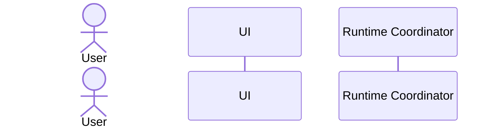
```mermaid
sequenceDiagram
  actor U as User
  participant UI
  participant RC as Runtime Coordinator
```

- `actor` pour User
- `participant` pour systèmes
- Alias courts (RC, SE, PE) dans diagrammes complexes

### 3.2 Messages

| Type | Syntaxe | Usage |
|---|---|---|
| Synchrone | `A->>B: message` | RPC, commande |
| Retour | `B-->>A: response` | Résultat |
| Async event | `B-->>C: DomainEvent:X` | Bus / outbox |
| Erreur | `B--xA: error` | Échec (notation textuelle si non supporté) |

### 3.3 Structures

```
alt condition / else / end
opt condition / end
loop every 10s / end
par / and / end
Note over A,B: texte
```

### 3.4 Nommage messages

Format : `[Sync] Action` ou `[Event] EventName` ou `[State] Idle→Playing`

### 3.5 Index officiel SEQ-XXX

Chaque scénario possède un identifiant **SEQ-XXX** stable pour ADR, code (`// SEQ-001`), rapports et probes certification. Alias historique **DXX** conservé en annexe.

| SEQ-ID | Alias | Section | Titre | Objectif |
|---|---|---|---|---|
| **SEQ-001** | D01 | §4 | Lecture normale (Play) | Happy path complet Idle→Playing + session Active |
| **SEQ-002** | D02 | §5 | Pause | Suspendre heartbeats ; Session Suspended |
| **SEQ-003** | D03 | §6 | Resume | Reprendre lecture ; réactiver heartbeats |
| **SEQ-004** | D04 | §7 | Seek | Repositionnement + validation Anti-Fraud |
| **SEQ-005** | D05 | §8.1 | Buffering entrée | Stall réseau → état Buffering |
| **SEQ-006** | D06 | §8.2 | Buffering sortie | canplay → Playing ou Ready |
| **SEQ-007** | D07 | §8.3 | Buffer timeout | Timeout 15 s → Error recoverable |
| **SEQ-008** | D08 | §9 | Heartbeat | Boucle 10 s + Anti-Fraud + Analytics |
| **SEQ-009** | D09 | §10 | Fin normale (Completed) | Track end → StreamValidated → Ledger |
| **SEQ-010** | D10 | §11.1 | Perte réseau | Reconnecting + session watch |
| **SEQ-011** | D11 | §11.3 | Fermeture navigateur | Cancel / Expired |
| **SEQ-012** | D12 | §11.4 | Réouverture navigateur | Session recovery |
| **SEQ-013** | D13 | §11.6 | Mobile foreground | Reprise app mobile |
| **SEQ-014** | D14 | §12.1 | Erreur codec | PlaybackFailed |
| **SEQ-015** | D15 | §12.2 | URL expirée | Renouvellement signed URL |
| **SEQ-016** | D16 | §12.4 | Session invalide | 403 complete / heartbeat |
| **SEQ-017** | D17 | §12.5 | Track introuvable | 404 publication |
| **SEQ-018** | D18 | §12.6 | Edge 503 | Retry backoff |
| **SEQ-019** | D19 | §13.1 | Double lecture | Fermeture sessions concurrentes |
| **SEQ-020** | D20 | §13.2 | Heartbeat anormal | Fraude vitesse > 1,5× |
| **SEQ-021** | — | §13.3 | Écoute trop courte | < 90 % → StreamRejected |
| **SEQ-022** | D21 | §13.5 | Multi-appareils | Fraude concurrent devices |
| **SEQ-023** | D22 | §13.6 | Décision fraude | FraudConfirmed → ⊘ ledger |
| **SEQ-024** | D23 | §14.1 | Ledger write | StreamValidated → LedgerRecorded |
| **SEQ-025** | D24 | §14.2 | Ledger reject | Fraude / invalid → ⊘ ledger |
| **SEQ-026** | D25 | §15 | Analytics pipeline | Projections AnalyticsUpdated |

### 3.6 Bloc Cross-References (template)

Chaque section §4–§15 inclut un bloc **Cross-References** :

| Champ | Contenu |
|---|---|
| **SEQ-ID** | Identifiant officiel |
| **STATE_MACHINE** | États traversés (IDs S-Pxx / S-Sxx) |
| **DOMAIN_EVENTS** | Événements produits |
| **Feature Flags** | Flags impactant le scénario |
| **Documents** | Sections liées dans les 3 specs |

---

## 4. Lecture normale (Play) — SEQ-001

### 4.0 Cross-References

| Champ | Référence |
|---|---|
| **SEQ-ID** | SEQ-001 (alias D01) |
| **Objectif** | Happy path Play — ouverture session, URL signée, démarrage lecture |
| **STATE_MACHINE** | S-P01→S-P06 (`Idle`→`Playing`) · S-S02→S-S03 (`Authenticated`→`Active`) — §3, §4, §22.1 |
| **DOMAIN_EVENTS** | `PlaybackRequested`, `SessionAuthenticated`, `SessionCreated`, `SignedUrlIssued`, `PlaybackBuffering`, `PlaybackStarted`, `SessionActivated`, `AnalyticsUpdated` — §6.1–6.2, §18.1 |
| **Feature Flags** | `streaming_runtime_coordinator_enabled`, `streaming_session_engine_enabled` — §4.7, §16 |
| **Documents** | `STATE_MACHINE.md` §5 T01–T11 · `DOMAIN_EVENTS.md` §7.1 |

### 4.1 Description fonctionnelle

L'utilisateur lance une lecture. Le Runtime valide auth et permissions, ouvre une session serveur, obtient une URL signée, charge le buffer, démarre la lecture et active les heartbeats.

### 4.2 Diagramme

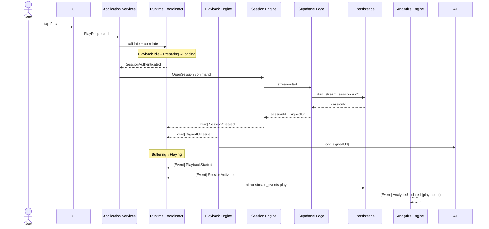
```mermaid
sequenceDiagram
  actor U as User
  participant UI
  participant SAS as Application Services
  participant RC as Runtime Coordinator
  participant PE as Playback Engine
  participant SE as Session Engine
  participant SB as Supabase Edge
  participant P as Persistence
  participant AE as Analytics Engine

  U->>UI: tap Play
  UI->>SAS: PlayRequested
  SAS->>RC: validate + correlate
  Note over RC: Playback Idle→Preparing→Loading
  RC-->>SAS: SessionAuthenticated
  SAS->>SE: OpenSession command
  SE->>SB: stream-start
  SB->>P: start_stream_session RPC
  P-->>SB: sessionId
  SB-->>SE: sessionId + signedUrl
  SE-->>RC: [Event] SessionCreated
  PE-->>RC: [Event] SignedUrlIssued
  PE->>AP: load(signedUrl)
  Note over RC: Buffering→Playing
  PE-->>RC: [Event] PlaybackStarted
  SE-->>RC: [Event] SessionActivated
  RC->>P: mirror stream_events play
  AE-->>AE: [Event] AnalyticsUpdated (play count)
```

### 4.3 États traversés

| Couche | Séquence |
|---|---|
| Playback | `Idle` → `Preparing` → `Loading` → `Buffering` → `Playing` |
| Session | `Authenticated` → `Created` → `Active` |

### 4.4 Domain Events

`PlaybackRequested` → `SessionAuthenticated` → `SessionCreated` → `SignedUrlIssued` → `PlaybackBuffering` → `PlaybackStarted` → `SessionActivated` → `AnalyticsUpdated`

### 4.5 Impacts métier

| Moteur | Impact |
|---|---|
| Analytics | ● play count +1 |
| Anti-Fraud | ○ session ouverte — watch |
| Ledger | — |
| Royalties | — |

### 4.6 Rollback / reprise

| Point | Rollback | Reprise |
|---|---|---|
| Échec avant `SessionCreated` | Aucune session ; → `Error` | `RetryRequested` |
| Échec après `SessionCreated` | Marquer `Expired` si abandon | Nouveau Play |

### 4.7 Feature Flags

| Mode | Comportement |
|---|---|
| OFF | Legacy : UI → `StreamingService` → edge direct (séquence équivalente sans RC) |
| DRY RUN | RC log transitions ; legacy persist |
| PARTIAL | SE nouveau ; PE legacy possible |
| FULL | Séquence complète ci-dessus |

---

## 5. Pause — SEQ-002

### 5.0 Cross-References

| Champ | Référence |
|---|---|
| **SEQ-ID** | SEQ-002 (alias D02) |
| **STATE_MACHINE** | S-P06→S-P07 · S-S03→S-S05 |
| **DOMAIN_EVENTS** | `PlaybackPaused`, `SessionSuspended`, `AnalyticsUpdated` |
| **Feature Flags** | `streaming_runtime_coordinator_enabled` |
| **Documents** | `STATE_MACHINE.md` §5 T11–T12 · `DOMAIN_EVENTS.md` §7.2 |

### 5.1 Description

L'utilisateur met en pause. Heartbeats suspendus. Session passe en `Suspended`.

### 5.2 Diagramme

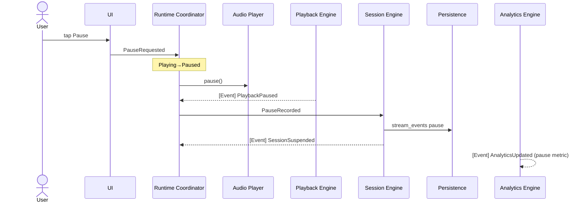
```mermaid
sequenceDiagram
  actor U as User
  participant UI
  participant RC as Runtime Coordinator
  participant AP as Audio Player
  participant PE as Playback Engine
  participant SE as Session Engine
  participant P as Persistence
  participant AE as Analytics Engine

  U->>UI: tap Pause
  UI->>RC: PauseRequested
  Note over RC: Playing→Paused
  RC->>AP: pause()
  PE-->>RC: [Event] PlaybackPaused
  RC->>SE: PauseRecorded
  SE->>P: stream_events pause
  SE-->>RC: [Event] SessionSuspended
  AE-->>AE: [Event] AnalyticsUpdated (pause metric)
```

### 5.3 États

Playback : `Playing` → `Paused` · Session : `Active` → `Suspended`

### 5.4 Events

`PlaybackPaused`, `SessionSuspended`, `AnalyticsUpdated`

### 5.5 Rollback

Aucun — pause est réversible via Resume §6.

---

## 6. Resume — SEQ-003

### 6.0 Cross-References

| SEQ-ID | STATE_MACHINE | DOMAIN_EVENTS | Feature Flags |
|---|---|---|---|
| SEQ-003 (D03) | S-P07→S-P06 · S-S05→S-S03 | `PlaybackResumed`, `SessionActivated`, `AnalyticsUpdated` | `streaming_runtime_coordinator_enabled` |

### 6.1 Diagramme

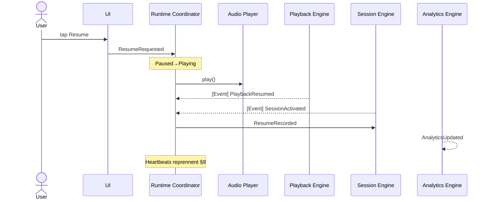
```mermaid
sequenceDiagram
  actor U as User
  participant UI
  participant RC as Runtime Coordinator
  participant AP as Audio Player
  participant PE as Playback Engine
  participant SE as Session Engine
  participant AE as Analytics Engine

  U->>UI: tap Resume
  UI->>RC: ResumeRequested
  Note over RC: Paused→Playing
  RC->>AP: play()
  PE-->>RC: [Event] PlaybackResumed
  SE-->>RC: [Event] SessionActivated
  RC->>SE: ResumeRecorded
  AE-->>AE: AnalyticsUpdated
  Note over RC: Heartbeats reprennent §9
```

### 6.2 Précondition

Session non `Expired` (< 5 min depuis dernier heartbeat en pause prolongée — voir §11).

---

## 7. Seek — SEQ-004

### 7.0 Cross-References

| SEQ-ID | STATE_MACHINE | DOMAIN_EVENTS | Feature Flags |
|---|---|---|---|
| SEQ-004 (D04) | S-P06→S-P08→S-P06 | `PlaybackSeeked`, `FraudSuspected` (opt) | `streaming_antifraud_engine_enabled` |

### 7.1 Description

Repositionnement **programmatique** uniquement (MVP : barre non cliquable CDC). Heartbeat post-seek ; Anti-Fraud analyse le saut.

### 7.2 Diagramme

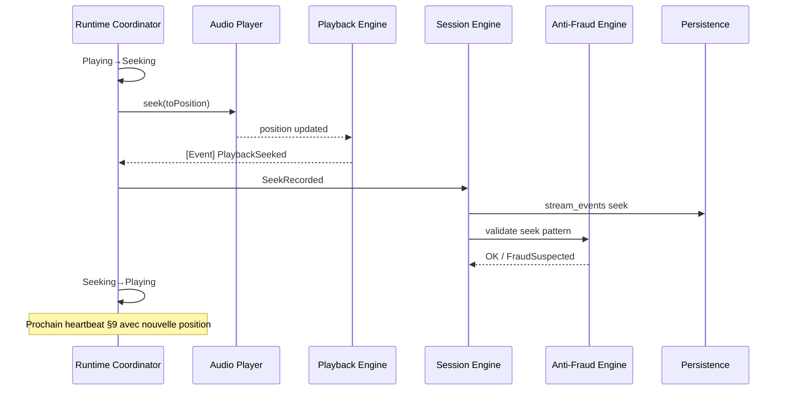
```mermaid
sequenceDiagram
  participant RC as Runtime Coordinator
  participant AP as Audio Player
  participant PE as Playback Engine
  participant SE as Session Engine
  participant AF as Anti-Fraud Engine
  participant P as Persistence

  RC->>RC: Playing→Seeking
  RC->>AP: seek(toPosition)
  AP-->>PE: position updated
  PE-->>RC: [Event] PlaybackSeeked
  RC->>SE: SeekRecorded
  SE->>P: stream_events seek
  SE->>AF: validate seek pattern
  AF-->>SE: OK / FraudSuspected
  RC->>RC: Seeking→Playing
  Note over RC: Prochain heartbeat §9 avec nouvelle position
```

### 7.3 Timeout seek

Si seek > 5 s → `Seeking` → `Playing` (position antérieure) — `STATE_MACHINE.md` §9.

---

## 8. Buffering — SEQ-005 / SEQ-006 / SEQ-007

### 8.0 Cross-References

| SEQ-ID | Section | STATE_MACHINE | DOMAIN_EVENTS |
|---|---|---|---|
| SEQ-005 (D05) | §8.1 Entrée | → S-P04 `Buffering` | `PlaybackBuffering` |
| SEQ-006 (D06) | §8.2 Sortie | S-P04→S-P06 ou S-P05 | `PlaybackStarted`, `PlaybackReady` |
| SEQ-007 (D07) | §8.3 Timeout | S-P04→S-P12 `Error` | `PlaybackFailed` |

### 8.1 Entrée buffering

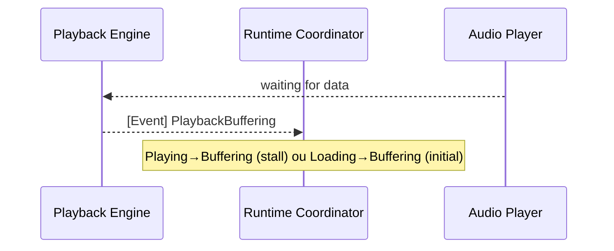
```mermaid
sequenceDiagram
  participant PE as Playback Engine
  participant RC as Runtime Coordinator
  participant AP as Audio Player

  AP-->>PE: waiting for data
  PE-->>RC: [Event] PlaybackBuffering
  Note over RC: Playing→Buffering (stall) ou Loading→Buffering (initial)
```

### 8.2 Sortie buffering

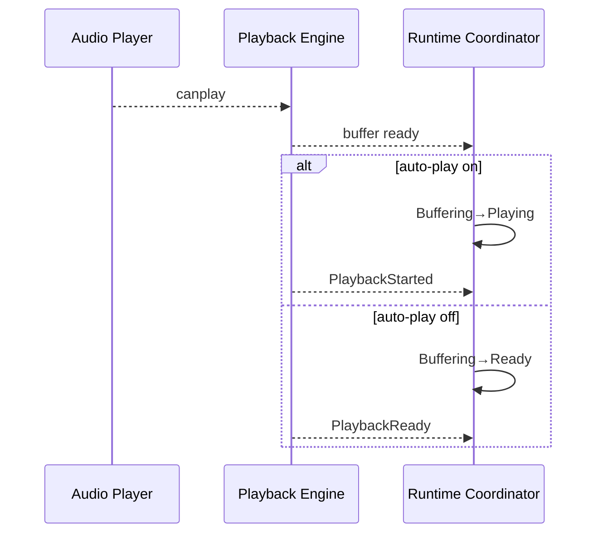
```mermaid
sequenceDiagram
  participant AP as Audio Player
  participant PE as Playback Engine
  participant RC as Runtime Coordinator

  AP-->>PE: canplay
  PE-->>RC: buffer ready
  alt auto-play on
    RC->>RC: Buffering→Playing
    PE-->>RC: PlaybackStarted
  else auto-play off
    RC->>RC: Buffering→Ready
    PE-->>RC: PlaybackReady
  end
```

### 8.3 Timeout buffering (15 s)

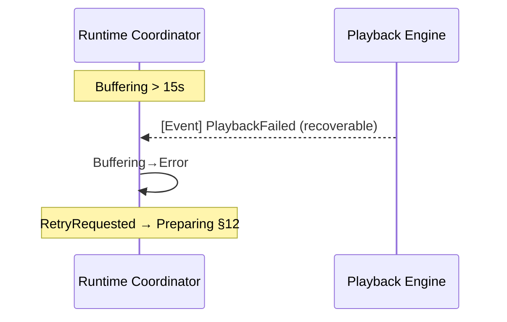
```mermaid
sequenceDiagram
  participant RC as Runtime Coordinator
  participant PE as Playback Engine

  Note over RC: Buffering > 15s
  PE-->>RC: [Event] PlaybackFailed (recoverable)
  RC->>RC: Buffering→Error
  Note over RC: RetryRequested → Preparing §12
```

---

## 9. Heartbeat — SEQ-008

### 9.0 Cross-References

| SEQ-ID | STATE_MACHINE | DOMAIN_EVENTS | Feature Flags |
|---|---|---|---|
| SEQ-008 (D08) | S-S03↔S-S04 `Active`/`Heartbeat` | `PlaybackHeartbeat`, `FraudSuspected`, `AnalyticsUpdated` | `streaming_session_engine_enabled`, `streaming_antifraud_engine_enabled` |

### 9.1 Description

Toutes les **10 s** en `Playing`. Validation Anti-Fraud avant persistance. Alimente Analytics.

### 9.2 Diagramme

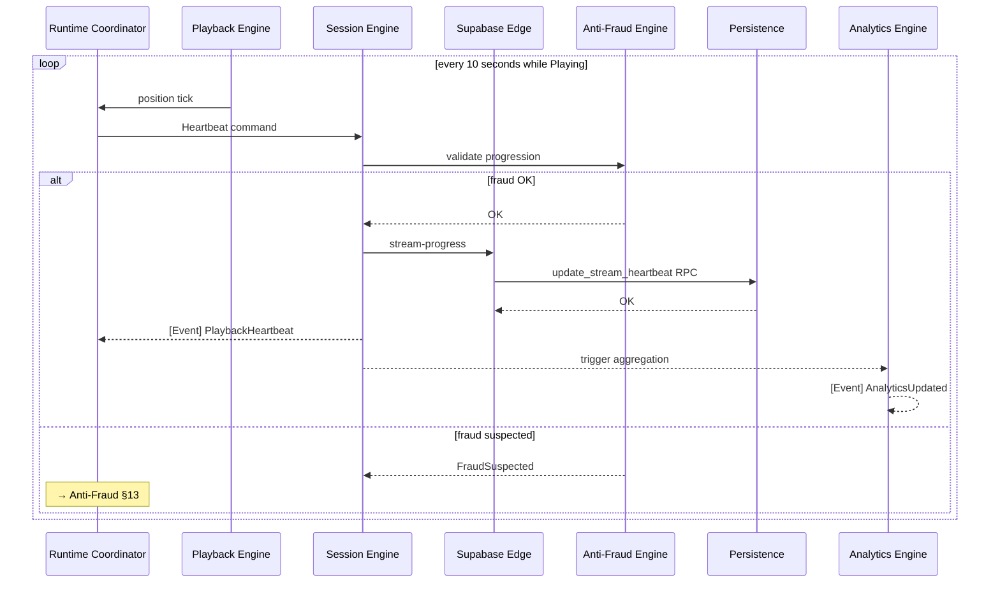
```mermaid
sequenceDiagram
  participant RC as Runtime Coordinator
  participant PE as Playback Engine
  participant SE as Session Engine
  participant SB as Supabase Edge
  participant AF as Anti-Fraud Engine
  participant P as Persistence
  participant AE as Analytics Engine

  loop every 10 seconds while Playing
    PE->>RC: position tick
    RC->>SE: Heartbeat command
    SE->>AF: validate progression
    alt fraud OK
      AF-->>SE: OK
      SE->>SB: stream-progress
      SB->>P: update_stream_heartbeat RPC
      P-->>SB: OK
      SE-->>RC: [Event] PlaybackHeartbeat
      SE-->>AE: trigger aggregation
      AE-->>AE: [Event] AnalyticsUpdated
    else fraud suspected
      AF-->>SE: FraudSuspected
      Note over RC: → Anti-Fraud §13
    end
  end
```

### 9.3 Paramètres

| Paramètre | Valeur |
|---|---|
| Intervalle | 10 s |
| Grace | 3 beats (30 s) → Reconnecting |
| Orphan | 5 min → SessionExpired |

---

## 10. Fin normale (Completed) — SEQ-009

### 10.0 Cross-References

| SEQ-ID | STATE_MACHINE | DOMAIN_EVENTS | Feature Flags |
|---|---|---|---|
| SEQ-009 (D09) | S-P10 `Completed` · S-S08 `Closed` Valid | `PlaybackCompleted`, `StreamValidated`, `SessionClosed`, `LedgerCandidateCreated`, `LedgerRecorded`, `RoyaltyEligible`, `AnalyticsUpdated` | `stream_ledger_enabled` |

**Documents :** `STATE_MACHINE.md` §5 T13, §12 · `DOMAIN_EVENTS.md` §7.1, §7.5

### 10.1 Description

Fin naturelle du morceau. Complete serveur. Real Listen ≥ 90 % → `StreamValidated` → Ledger (si flag) → signal `RoyaltyEligible` ⊘ consommateur MVP.

### 10.2 Diagramme

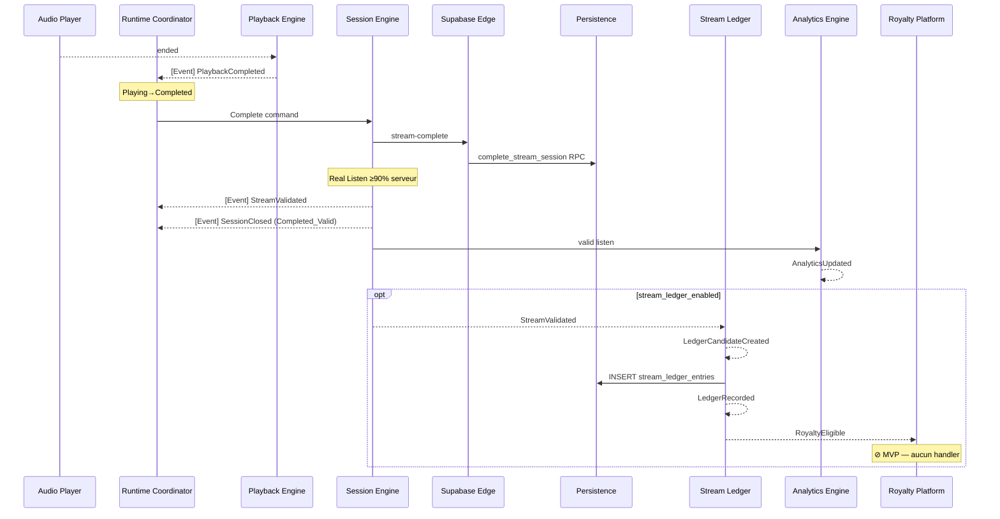
```mermaid
sequenceDiagram
  participant AP as Audio Player
  participant RC as Runtime Coordinator
  participant PE as Playback Engine
  participant SE as Session Engine
  participant SB as Supabase Edge
  participant P as Persistence
  participant SL as Stream Ledger
  participant AE as Analytics Engine
  participant RP as Royalty Platform

  AP-->>PE: ended
  PE-->>RC: [Event] PlaybackCompleted
  Note over RC: Playing→Completed
  RC->>SE: Complete command
  SE->>SB: stream-complete
  SB->>P: complete_stream_session RPC
  Note over SE: Real Listen ≥90% serveur
  SE-->>RC: [Event] StreamValidated
  SE-->>RC: [Event] SessionClosed (Completed_Valid)
  SE->>AE: valid listen
  AE-->>AE: AnalyticsUpdated
  opt stream_ledger_enabled
    SE-->>SL: StreamValidated
    SL-->>SL: LedgerCandidateCreated
    SL->>P: INSERT stream_ledger_entries
    SL-->>SL: LedgerRecorded
    SL-->>RP: RoyaltyEligible
    Note over RP: ⊘ MVP — aucun handler
  end
```

### 10.3 États terminaux

Playback : `Completed` · Session : `Closed(Completed_Valid)`

### 10.4 Rollback

Complete idempotent — retry OK. **Jamais** rollback `StreamValidated` post-émission.

---

## 11. Recovery — SEQ-010 / SEQ-011 / SEQ-012 / SEQ-013

### 11.0 Cross-References

| SEQ-ID | Section | STATE_MACHINE | DOMAIN_EVENTS |
|---|---|---|---|
| SEQ-010 (D10) | §11.1 Perte réseau | S-P09 `Reconnecting` | `ConnectionLost`, `ConnectionRecovered`, `SessionRecovered` |
| SEQ-011 (D11) | §11.3 Fermeture navigateur | S-P11 / S-S07 | `PlaybackCancelled`, `SessionExpired` |
| SEQ-012 (D12) | §11.4 Réouverture | S-P09→S-P06 | `SessionRecovered`, `ConnectionRecovered` |
| SEQ-013 (D13) | §11.6 Mobile | S-P09→S-P06 | `ConnectionRecovered` |

### 11.1 Perte réseau

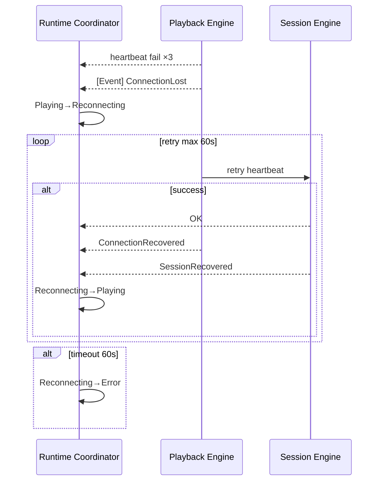
```mermaid
sequenceDiagram
  participant RC as Runtime Coordinator
  participant PE as Playback Engine
  participant SE as Session Engine

  PE-->>RC: heartbeat fail ×3
  PE-->>RC: [Event] ConnectionLost
  RC->>RC: Playing→Reconnecting
  loop retry max 60s
    PE->>SE: retry heartbeat
    alt success
      SE-->>RC: OK
      PE-->>RC: ConnectionRecovered
      SE-->>RC: SessionRecovered
      RC->>RC: Reconnecting→Playing
    end
  end
  alt timeout 60s
    RC->>RC: Reconnecting→Error
  end
```

### 11.2 Retour réseau (< 60 s)

Voir branche success ci-dessus. Session reste `Active` si < 5 min.

### 11.3 Fermeture navigateur

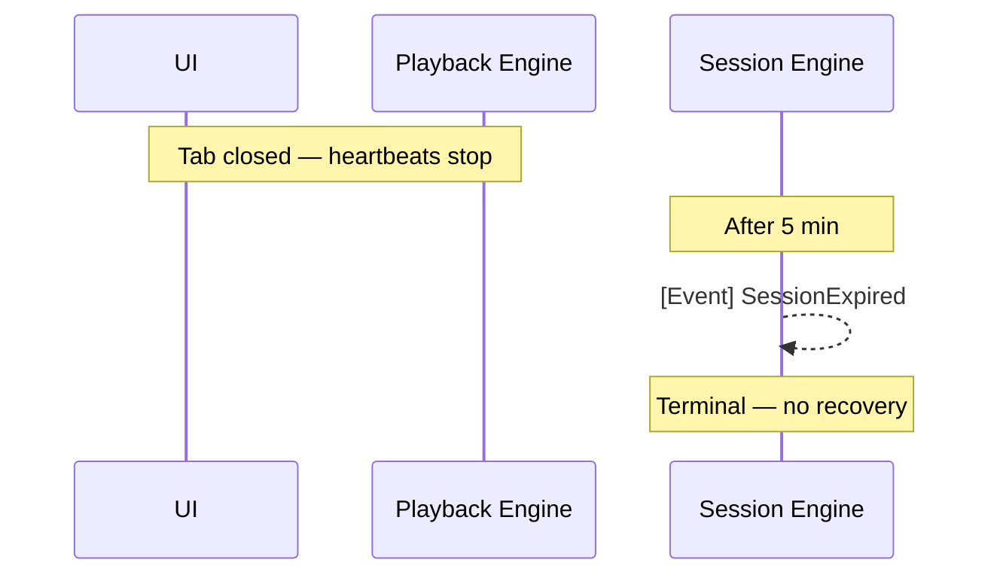
```mermaid
sequenceDiagram
  participant UI
  participant PE as Playback Engine
  participant SE as Session Engine

  Note over UI,PE: Tab closed — heartbeats stop
  Note over SE: After 5 min
  SE-->>SE: [Event] SessionExpired
  Note over SE: Terminal — no recovery
```

**Reprise :** nouvelle session au Play. `playback_positions` restaure position UI seulement.

### 11.4 Réouverture navigateur

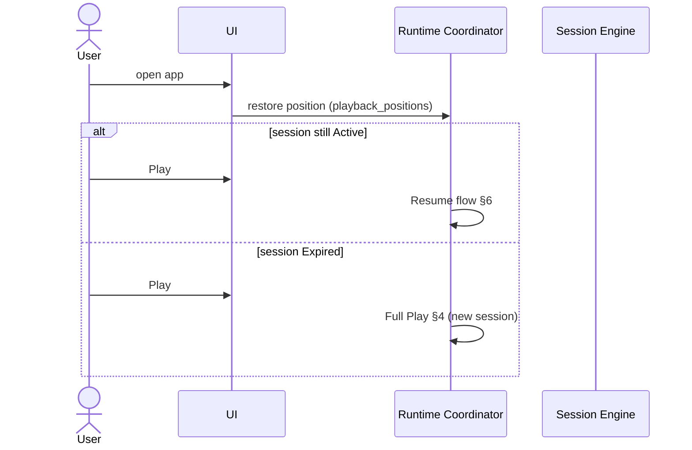
```mermaid
sequenceDiagram
  actor U as User
  participant UI
  participant RC as Runtime Coordinator
  participant SE as Session Engine

  U->>UI: open app
  UI->>RC: restore position (playback_positions)
  alt session still Active
    U->>UI: Play
    RC->>RC: Resume flow §6
  else session Expired
    U->>UI: Play
    RC->>RC: Full Play §4 (new session)
  end
```

### 11.5 Changement réseau (Wi-Fi ↔ 4G)

Identique §11.1. Si signed URL expired → §12.2.

### 11.6 Reprise mobile

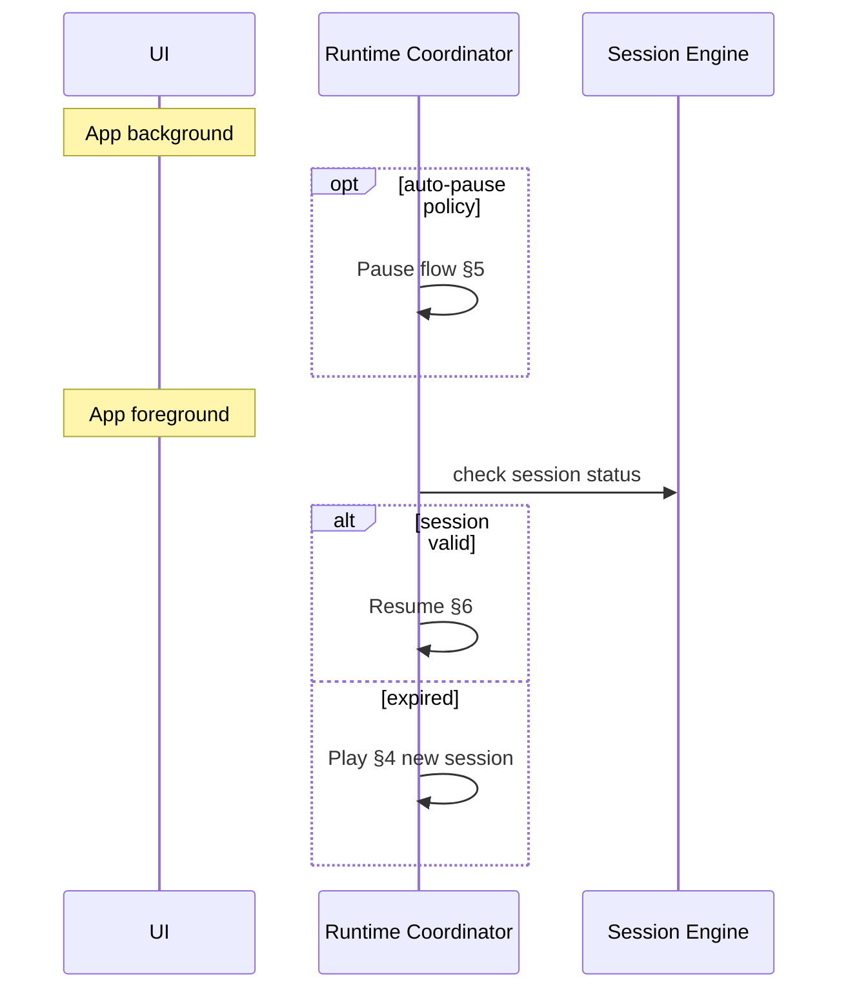
```mermaid
sequenceDiagram
  participant UI
  participant RC as Runtime Coordinator
  participant SE as Session Engine

  Note over UI: App background
  opt auto-pause policy
    RC->>RC: Pause flow §5
  end
  Note over UI: App foreground
  RC->>SE: check session status
  alt session valid
    RC->>RC: Resume §6
  else expired
    RC->>RC: Play §4 new session
  end
```

---

## 12. Erreurs — SEQ-014 / SEQ-015 / SEQ-016 / SEQ-017 / SEQ-018

### 12.0 Cross-References

| SEQ-ID | Section | STATE_MACHINE | DOMAIN_EVENTS |
|---|---|---|---|
| SEQ-014 (D14) | §12.1 Codec | S-P12 `Error` | `PlaybackFailed` |
| SEQ-015 (D15) | §12.2 URL expirée | S-P03→S-P02 `Loading`→`Preparing` | `SignedUrlIssued` |
| SEQ-016 (D16) | §12.4 Session invalide | S-S08 Invalid | `StreamRejected`, `SessionClosed` |
| SEQ-017 (D17) | §12.5 Track NF | S-P12 | `PlaybackFailed` |
| SEQ-018 (D18) | §12.6 Edge 503 | S-P09 | `ConnectionLost` (retry) |

### 12.1 Erreur audio (codec)

| Attribut | Valeur |
|---|---|
| **Séquence** | `AudioError(codec)` → `PlaybackFailed` → `Error` terminal |
| **Rollback** | Aucun |
| **Retry** | Non |
| **État final** | `Idle` après `DismissError` |

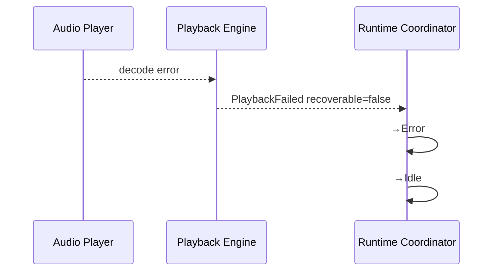
```mermaid
sequenceDiagram
  participant AP as Audio Player
  participant PE as Playback Engine
  participant RC as Runtime Coordinator

  AP-->>PE: decode error
  PE-->>RC: PlaybackFailed recoverable=false
  RC->>RC: →Error
  RC->>RC: →Idle
```

### 12.2 URL expirée

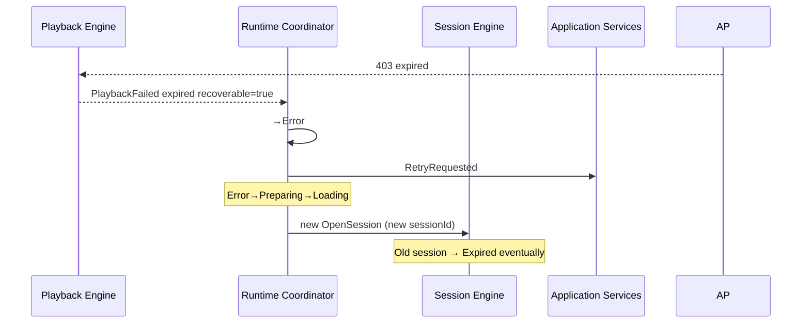
```mermaid
sequenceDiagram
  participant PE as Playback Engine
  participant RC as Runtime Coordinator
  participant SE as Session Engine
  participant SAS as Application Services

  AP-->>PE: 403 expired
  PE-->>RC: PlaybackFailed expired recoverable=true
  RC->>RC: →Error
  RC->>SAS: RetryRequested
  Note over RC: Error→Preparing→Loading
  RC->>SE: new OpenSession (new sessionId)
  Note over SE: Old session → Expired eventually
```

### 12.3 Timeout (buffer / complete / edge)

| Timeout | Comportement |
|---|---|
| Buffer 15 s | §8.3 → Error recoverable |
| Complete 10 s | Retry ×3 complete idempotent |
| Edge 503 | Reconnecting §11.1 |

### 12.4 Session invalide

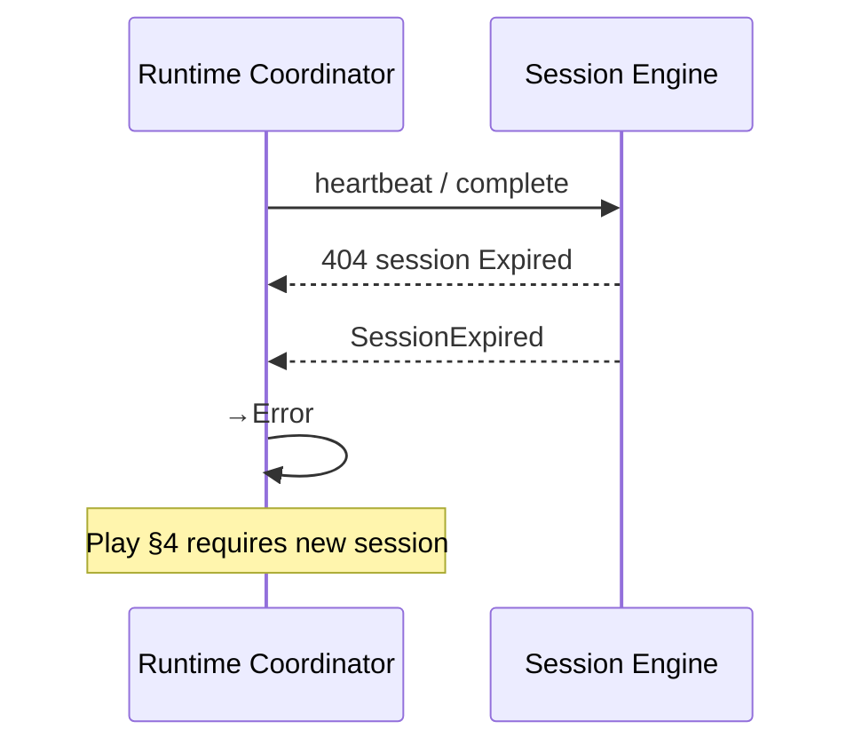
```mermaid
sequenceDiagram
  participant RC as Runtime Coordinator
  participant SE as Session Engine

  RC->>SE: heartbeat / complete
  SE-->>RC: 404 session Expired
  SE-->>RC: SessionExpired
  RC->>RC: →Error
  Note over RC: Play §4 requires new session
```

### 12.5 Fichier / track introuvable

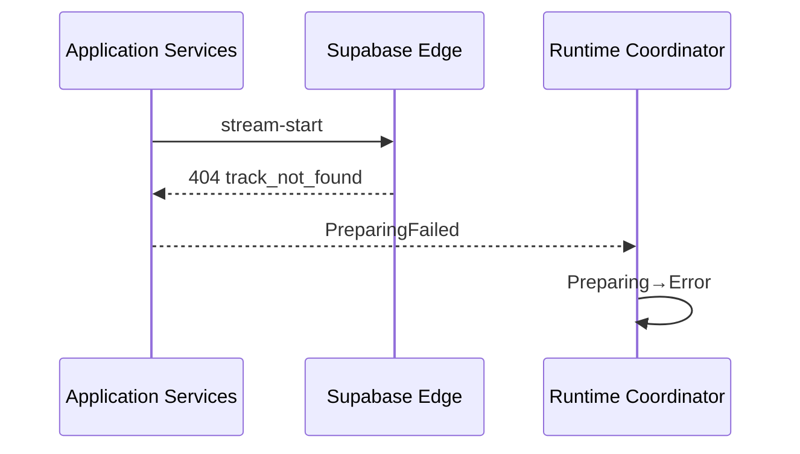
```mermaid
sequenceDiagram
  participant SAS as Application Services
  participant SB as Supabase Edge
  participant RC as Runtime Coordinator

  SAS->>SB: stream-start
  SB-->>SAS: 404 track_not_found
  SAS-->>RC: PreparingFailed
  RC->>RC: Preparing→Error
```

### 12.6 Edge Function indisponible

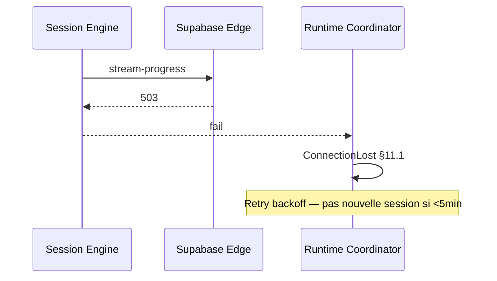
```mermaid
sequenceDiagram
  participant SE as Session Engine
  participant SB as Supabase Edge
  participant RC as Runtime Coordinator

  SE->>SB: stream-progress
  SB-->>SE: 503
  SE-->>RC: fail
  RC->>RC: ConnectionLost §11.1
  Note over RC: Retry backoff — pas nouvelle session si <5min
```

---

## 13. Anti-Fraud — SEQ-019 / SEQ-020 / SEQ-021 / SEQ-022 / SEQ-023

### 13.0 Cross-References

| SEQ-ID | Section | STATE_MACHINE | DOMAIN_EVENTS |
|---|---|---|---|
| SEQ-019 (D19) | §13.1 Double lecture | S-S08 (ancienne) | — (fermeture RPC) |
| SEQ-020 (D20) | §13.2 Heartbeat anormal | S-S06→S-S08 | `FraudSuspected`, `FraudConfirmed`, `RoyaltyRejected` |
| SEQ-021 | §13.3 Écoute courte | S-S08 Invalid | `StreamRejected`, `SessionClosed`, `RoyaltyRejected` |
| SEQ-022 (D21) | §13.5 Multi-appareils | S-S06 | `FraudSuspected`, `FraudConfirmed` |
| SEQ-023 (D22) | §13.6 Décision fraude | S-S08 Invalidated | `FraudConfirmed`, `RoyaltyRejected` |

**Documents :** `STATE_MACHINE.md` §4 S-S06 · `DOMAIN_EVENTS.md` §7.4

### 13.1 Double lecture (sessions concurrentes)

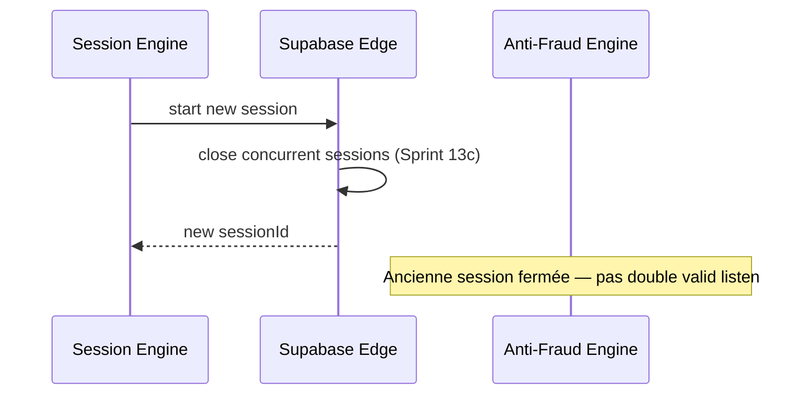
```mermaid
sequenceDiagram
  participant SE as Session Engine
  participant SB as Supabase Edge
  participant AF as Anti-Fraud Engine

  SE->>SB: start new session
  SB->>SB: close concurrent sessions (Sprint 13c)
  SB-->>SE: new sessionId
  Note over AF: Ancienne session fermée — pas double valid listen
```

### 13.2 Heartbeat anormal (vitesse > 1.5×)

```mermaid
sequenceDiagram
  participant SE as Session Engine
  participant AF as Anti-Fraud Engine
  participant RC as Runtime Coordinator

  SE->>AF: heartbeat position delta
  AF-->>SE: FraudSuspected speed_rule
  AF-->>SE: FraudConfirmed
  SE-->>RC: SessionClosed Invalidated
  RC-->>RC: PlaybackFailed
  RC->>RC: →Error
```

### 13.3 Écoute trop courte (< 90 %)

```mermaid
sequenceDiagram
  participant SE as Session Engine
  participant RC as Runtime Coordinator
  participant SL as Stream Ledger

  RC->>SE: complete
  SE-->>RC: StreamRejected below_threshold
  SE-->>RC: SessionClosed Completed_Invalid
  Note over SL: ⊘ no ledger
```

### 13.4 Bot détecté

Identique §13.2 avec `ruleId: bot_pattern`. `RoyaltyRejected` émis.

### 13.5 Multi-appareils

```mermaid
sequenceDiagram
  participant AF as Anti-Fraud Engine
  participant SE as Session Engine

  AF->>AF: same user concurrent Active sessions
  AF-->>SE: FraudSuspected multi_device
  alt confirm
    AF-->>SE: FraudConfirmed
    SE-->>SE: close younger session
  end
```

### 13.6 Décision finale fraude

```mermaid
sequenceDiagram
  participant AF as Anti-Fraud Engine
  participant SE as Session Engine
  participant SL as Stream Ledger
  participant RP as Royalty Platform

  AF-->>SE: FraudConfirmed
  SE-->>SE: SessionClosed Invalidated
  SE-->>RP: RoyaltyRejected
  Note over SL: ⊘ Ledger blocked
```

---

## 14. Ledger — SEQ-024 / SEQ-025

### 14.0 Cross-References

| SEQ-ID | Section | DOMAIN_EVENTS | Feature Flags |
|---|---|---|---|
| SEQ-024 (D23) | §14.1 Write | `StreamValidated` → `LedgerCandidateCreated` → `LedgerRecorded` → `RoyaltyEligible` | `stream_ledger_enabled` |
| SEQ-025 (D24) | §14.2 Reject | `RoyaltyRejected` — ⊘ `LedgerRecorded` | `stream_ledger_enabled` |

**Documents :** `DOMAIN_EVENTS.md` §6.6–6.7 · ADR-002

### 14.1 Création candidat → écriture

```mermaid
sequenceDiagram
  participant SE as Session Engine
  participant SL as Stream Ledger
  participant P as Persistence
  participant RP as Royalty Platform

  SE-->>SL: StreamValidated
  SL-->>SL: LedgerCandidateCreated
  SL->>P: INSERT idempotency check
  alt new entry
    P-->>SL: OK
    SL-->>SL: LedgerRecorded
    SL-->>RP: RoyaltyEligible
    Note over RP: ⊘ signal only — no royalty calculation
  else duplicate
    P-->>SL: conflict
    SL-->>SL: no-op success
  end
```

### 14.2 Rejet ledger

```mermaid
sequenceDiagram
  participant SE as Session Engine
  participant SL as Stream Ledger

  SE-->>SL: StreamRejected
  Note over SL: ⊘ no candidate
```

**Règle programme :** aucun calcul royalty dans SPRING 2 — uniquement signaux et écriture ledger.

---

## 15. Analytics — SEQ-026

### 15.0 Cross-References

| SEQ-ID | DOMAIN_EVENTS | Consommeurs | Feature Flags |
|---|---|---|---|
| SEQ-026 (D25) | `AnalyticsUpdated` | Dashboard, Monitoring | `streaming_analytics_engine_enabled` |

**Documents :** `DOMAIN_EVENTS.md` §6.4 · `STATE_MACHINE.md` §14

### 15.1 Collecte → agrégation

```mermaid
sequenceDiagram
  participant SE as Session Engine
  participant AE as Analytics Engine
  participant P as Persistence
  participant UI as Creator Dashboard

  SE-->>AE: PlaybackStarted / Heartbeat / StreamValidated
  AE->>AE: increment projections
  AE-->>AE: AnalyticsUpdated
  AE->>P: upsert read model
  Note over UI: ⊘ MVP dashboard unchanged — same RPC path until flag
  UI->>P: read stats (legacy or new per flag)
```

### 15.2 Consommation future

Post `streaming_analytics_engine_enabled` FULL : dashboard lit projections alimentées par Domain Events uniquement.

---

## 16. Feature Flags

### 16.1 Matrice scénario × mode

| Scénario | OFF | DRY RUN | PARTIAL | FULL |
|---|---|---|---|---|
| Play §4 | Legacy edge | Log + legacy | SE+legacy PE | Complet |
| Heartbeat §9 | Legacy | Log | SE validate | SE+AF |
| Complete §10 | Legacy | Log | SE | SE+SL+signal |
| Ledger §14 | ⊘ | ⊘ | ⊘ | `stream_ledger_enabled` |
| Anti-Fraud §13 | Basic edge | Log | AF light | AF full |
| Analytics §15 | Legacy RPC | ⊘ | Mixed | AE engine |

### 16.2 Règle rollback flags

Tout mode → **OFF** en < 1 min : séquences redeviennent legacy edge direct.

---

## 17. State Machine Mapping

### 17.1 Table scénario → états playback

| Scénario | États playback traversés |
|---|---|
| Play §4 | Idle → Preparing → Loading → Buffering → Playing |
| Pause §5 | Playing → Paused |
| Resume §6 | Paused → Playing |
| Seek §7 | Playing → Seeking → Playing |
| Buffer stall §8 | Playing → Buffering → Playing |
| Heartbeat §9 | Playing (maintien) |
| Complete §10 | Playing → Completed |
| Network loss §11 | Playing → Reconnecting → Playing/Error |
| Error §12 | * → Error → Idle/Preparing |

### 17.2 Table scénario → états session

| Scénario | États session |
|---|---|
| Play §4 | Authenticated → Created → Active |
| Pause §5 | Active → Suspended |
| Resume §6 | Suspended → Active |
| Heartbeat §9 | Active / Heartbeat phase |
| Complete valid §10 | Active → Closed(Valid) |
| Complete invalid §13.3 | Active → Closed(Invalid) |
| Fraud §13 | Active → FraudReview → Closed(Invalidated) |
| Expired §11.3 | Active → Expired |

### 17.3 Transitions clés

Référence complète : `STATE_MACHINE.md` §5 matrices T01–T32 et S01–S19.

---

## 18. Domain Events Mapping

### 18.1 Table scénario → événements émis (ordre)

| Scénario | Événements (ordre) |
|---|---|
| Play §4 | PlaybackRequested → SessionAuthenticated → SessionCreated → SignedUrlIssued → PlaybackStarted → SessionActivated |
| Pause §5 | PlaybackPaused → SessionSuspended |
| Resume §6 | PlaybackResumed → SessionActivated |
| Seek §7 | PlaybackSeeked |
| Heartbeat §9 | PlaybackHeartbeat → AnalyticsUpdated |
| Complete §10 | PlaybackCompleted → StreamValidated → LedgerCandidateCreated → LedgerRecorded → AnalyticsUpdated → RoyaltyEligible → SessionClosed |
| Reject §13.3 | PlaybackCompleted → StreamRejected → RoyaltyRejected → SessionClosed |
| Fraud §13 | FraudSuspected → FraudConfirmed → RoyaltyRejected → SessionClosed |
| Expired §11 | SessionExpired → RoyaltyRejected |
| Recovery §11 | ConnectionLost → ConnectionRecovered → SessionRecovered |

### 18.2 Producteurs par scénario

Voir `DOMAIN_EVENTS.md` §9 ownership — inchangé.

---

## 19. Observability

### 19.1 Par séquence — champs obligatoires

| Champ | Scénarios |
|---|---|
| `correlationId` | Tous — constant cycle Play→Complete |
| `sessionId` | Post §4 Loading |
| `trackId` | Post PlaybackRequested |
| `actorId` | Tous |
| `sequenceNumber` | §9 Heartbeat |

### 19.2 Logs par scénario

| Scénario | Niveau | Message type |
|---|---|---|
| Play success | INFO | `playback.transition` |
| Heartbeat | DEBUG | `session.heartbeat` |
| StreamValidated | INFO | `stream.validated` |
| FraudConfirmed | ERROR | `fraud.confirmed` |
| LedgerRecorded | INFO | `ledger.recorded` |
| Transition rejected | WARN | `runtime.transition_rejected` |

### 19.3 Traces

Span root : `streaming.playback.{correlationId}`  
Enfants : `session.{op}`, `playback.{op}`, `ledger.{op}`

### 19.4 Métriques

`streaming_sequence_duration_ms{scenario}` · `heartbeat_latency_p95` · `recovery_success_total`

### 19.5 Audit

`StreamValidated`, `LedgerRecorded`, `FraudConfirmed` → `AuditStreamValidated` / `AuditLedgerRecorded` (futur).

---

## 20. Performance

### 20.1 Objectifs par scénario

| Scénario | Latence p95 max | Appels réseau |
|---|---|---|
| Play §4 | 800 ms (start→Playing) | 1× start + buffer local |
| Heartbeat §9 | 300 ms | 1× progress / 10 s |
| Pause/Resume §5-6 | 100 ms | 1× event persist |
| Complete §10 | 500 ms | 1× complete |
| Seek §7 | 200 ms | 1× seek event |
| Recovery §11 | reprise < 3 s | 1–5 retries |
| Ledger §14 | 200 ms | 1× INSERT |

### 20.2 Charge cible

| Métrique | MVP | Design |
|---|---|---|
| Heartbeats / user / hour | ~360 max | ~360 |
| Sessions / jour | 100k | 1M |
| Concurrent sessions | 10k | 100k+ |

### 20.3 Limites

- 1 heartbeat = 1 RPC — pas de batching
- 1 session Active max par user+track (orphelines fermées)

---

## 21. Sécurité

### 21.1 Par séquence

| Contrôle | Application |
|---|---|
| Auth | JWT avant §4 `SessionAuthenticated` |
| Permission | `has_streaming_permission` Preparing |
| Ownership | Toute opération SE vérifie `user_id` |
| Track published | stream-start 404 sinon |
| Anti-replay complete | Idempotent §10 |
| Anti-double ledger | `idempotency_key` §14 |
| Anti-injection events | Bus interne Runtime only |
| Fraud | AF avant persist heartbeat §9 |

---

## 22. Compatibilité MVP

| Contrainte | Engagement |
|---|---|
| UI | Inchangée — séquences invisibles utilisateur |
| Lecteur WebPlayer | Même comportement perçu |
| Metadata / ISRC | Aucune séquence metadata |
| Wallet | ⊘ séquences WalletCreditPrepared non exécutées |
| Royalties | Engine SQL inchangé ; `RoyaltyEligible` ⊘ |
| Legacy OFF | Séquences §4–10 équivalentes edge actuel |

**Document purement architectural** — implémentation progressive SPRING 2.1→2.8.

---

## 23. Glossaire

| Terme | Définition |
|---|---|
| **Séquence** | Ordre temporel messages et événements |
| **Scénario** | Cas d'usage documenté §4–15 |
| **Sync** | Appel bloquant await |
| **Signal dormant** | Event émis sans consommateur MVP |
| **Recovery** | Reprise même sessionId |
| **Nouvelle session** | OpenSession après terminal |
| **Mirror** | Écriture parallèle `stream_events` legacy |
| **correlationId** | ID trace bout-en-bout |

---

## 24. Annexes

### 24.1 Index officiel des séquences (SEQ-XXX)

Index canonique — **26 scénarios**, **26 diagrammes**. Alias **DXX** = version 1.0.0 (rétrocompatibilité).

| SEQ-ID | Alias | Section | Titre | Objectif | STATE_MACHINE | Events clés |
|---|---|---|---|---|---|---|
| SEQ-001 | D01 | §4 | Lecture normale Play | Happy path complet | S-P01→S-P06, S-S02→S-S03 | `PlaybackStarted`, `SessionActivated` |
| SEQ-002 | D02 | §5 | Pause | Suspendre heartbeats | S-P06→S-P07, S-S03→S-S05 | `PlaybackPaused`, `SessionSuspended` |
| SEQ-003 | D03 | §6 | Resume | Reprendre lecture | S-P07→S-P06, S-S05→S-S03 | `PlaybackResumed`, `SessionActivated` |
| SEQ-004 | D04 | §7 | Seek | Repositionnement | S-P06→S-P08→S-P06 | `PlaybackSeeked` |
| SEQ-005 | D05 | §8.1 | Buffering entrée | Stall → Buffering | → S-P04 | `PlaybackBuffering` |
| SEQ-006 | D06 | §8.2 | Buffering sortie | canplay → Playing | S-P04→S-P06/S-P05 | `PlaybackStarted`, `PlaybackReady` |
| SEQ-007 | D07 | §8.3 | Buffer timeout | Timeout 15 s | S-P04→S-P12 | `PlaybackFailed` |
| SEQ-008 | D08 | §9 | Heartbeat loop | Real Listen 10 s | S-S03↔S-S04 | `PlaybackHeartbeat` |
| SEQ-009 | D09 | §10 | Fin normale Completed | Valid listen ≥90 % | S-P10, S-S08 Valid | `StreamValidated`, `LedgerRecorded` |
| SEQ-010 | D10 | §11.1 | Perte réseau | Reconnecting | S-P09 | `ConnectionLost`, `ConnectionRecovered` |
| SEQ-011 | D11 | §11.3 | Fermeture navigateur | Abandon session | S-P11 / S-S07 | `SessionExpired` |
| SEQ-012 | D12 | §11.4 | Réouverture | Recovery | S-P09→S-P06 | `SessionRecovered` |
| SEQ-013 | D13 | §11.6 | Mobile foreground | App resume | S-P09→S-P06 | `ConnectionRecovered` |
| SEQ-014 | D14 | §12.1 | Erreur codec | Fatal audio | S-P12 | `PlaybackFailed` |
| SEQ-015 | D15 | §12.2 | URL expirée | Renouvellement URL | S-P03→S-P02 | `SignedUrlIssued` |
| SEQ-016 | D16 | §12.4 | Session invalide | 403 | S-S08 | `StreamRejected` |
| SEQ-017 | D17 | §12.5 | Track introuvable | 404 | S-P12 | `PlaybackFailed` |
| SEQ-018 | D18 | §12.6 | Edge 503 | Retry backoff | S-P09 | — |
| SEQ-019 | D19 | §13.1 | Double lecture | Close concurrent | S-S08 | — |
| SEQ-020 | D20 | §13.2 | Heartbeat anormal | Fraude vitesse | S-S06→S-S08 | `FraudConfirmed` |
| SEQ-021 | — | §13.3 | Écoute trop courte | < 90 % | S-S08 Invalid | `StreamRejected` |
| SEQ-022 | D21 | §13.5 | Multi-appareils | Device fraud | S-S06 | `FraudSuspected` |
| SEQ-023 | D22 | §13.6 | Décision fraude | Block ledger | S-S08 Invalidated | `FraudConfirmed`, `RoyaltyRejected` |
| SEQ-024 | D23 | §14.1 | Ledger write | Financial truth | — | `LedgerRecorded` |
| SEQ-025 | D24 | §14.2 | Ledger reject | No candidate | — | `RoyaltyRejected` |
| SEQ-026 | D25 | §15 | Analytics pipeline | Projections | — | `AnalyticsUpdated` |

### 24.2 Références croisées STATE_MACHINE.md

| SEQ-ID | États | Transitions | STATE_MACHINE § |
|---|---|---|---|
| SEQ-001 | S-P01→S-P06, S-S01→S-S03 | T01–T11, S01–S02 | §3, §4, §5, §22 |
| SEQ-002–003 | S-P06↔S-P07, S-S03↔S-S05 | T11–T18, S04–S05 | §5, §22 |
| SEQ-009 | S-P10, S-S08 Valid | T13, S06 | §5, §12, §22 |
| SEQ-010–013 | S-P09 | T15–T26 | §9, §22 |
| SEQ-020–023 | S-S06→S-S08 | S10–S11 | §4, §20 |
| SEQ-024–025 | S-S08 | S06 | §12, §21 |

### 24.3 Références croisées DOMAIN_EVENTS.md

| SEQ-ID | Events | DOMAIN_EVENTS § |
|---|---|---|
| SEQ-001 | Playback*, Session* (happy path) | §6.1–6.2, §18.1 |
| SEQ-008 | `PlaybackHeartbeat` | §6.1, §18.1 |
| SEQ-009 | `StreamValidated` → `LedgerRecorded` → `RoyaltyEligible` | §6.3, §6.6–6.7, §7.1 |
| SEQ-021 | `StreamRejected`, `RoyaltyRejected` | §6.3, §7.3 |
| SEQ-023 | `FraudConfirmed`, `RoyaltyRejected` | §6.5, §7.4 |
| SEQ-026 | `AnalyticsUpdated` | §6.4, §18.3 |

### 24.4 Historique versions

| Version | Date | Changements |
|---|---|---|
| **1.0.0** | 2026-06-25 | Création — 25 diagrammes D01–D25, 24 sections |
| **1.1.0** | 2026-06-25 | Hardening Sprint 2.1 — SEQ-001→SEQ-026 index officiel · Cross-References §4–§15 · SEQ-021 §13.3 ajouté |

### 24.5 Maintenance

Toute nouvelle séquence → attribuer **SEQ-XXX** suivant · bump version · sync `STATE_MACHINE.md` + `DOMAIN_EVENTS.md` · probe certification.

---

## Certification document

| Critère | Statut |
|---|---|
| Scénarios critiques documentés | ✅ §4–15 |
| Diagramme Mermaid par scénario | ✅ 26 diagrammes |
| Identifiants SEQ-XXX officiels | ✅ SEQ-001→SEQ-026 §3.5, §24.1 |
| Cross-References par scénario | ✅ §4.0–§15.0 |
| Cohérence STATE_MACHINE.md v2.1.0 | ✅ §17, §24.2 |
| Cohérence DOMAIN_EVENTS.md v2.1.0 | ✅ §18, §24.3 |
| Rollback et reprise documentés | ✅ par section |
| Feature flags par scénario | ✅ §16 |
| Ambiguïté implémentation éliminée | ✅ |

---

# DÉCISION FINALE

✅ **SEQUENCE_DIAGRAMS.md CERTIFIÉ**
