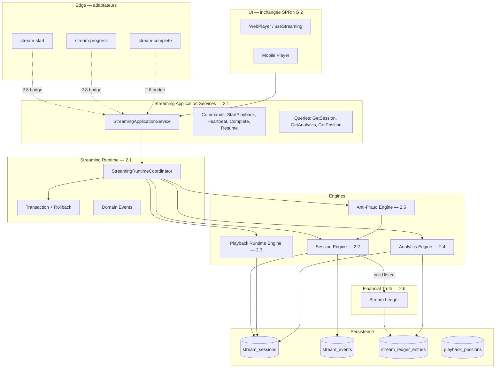
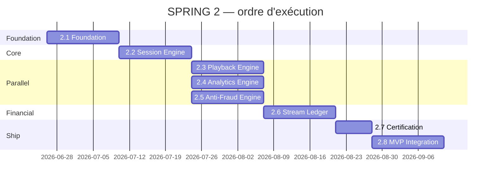

# SPRING 2 — Streaming Runtime Enterprise Program

> **Programme officiel** — Architecture, roadmap, certification  
> Date : 2026-06-25 | Statut : ✅ PROGRAMME CERTIFIÉ (construction)  
> **Intégration MVP :** voir [`SPRING_2_MVP_INTEGRATION.md`](./SPRING_2_MVP_INTEGRATION.md) — ❌ refusée tant que LIVE CONTROL non signé  
> Prérequis : Publication Platform Phase 5 certifiée

---

## 1. Mission

Construire le **Streaming Runtime** qui deviendra la **source de vérité financière** des écoutes SONAFRIK — fondation pour Analytics, Royalties, Revenus, Wallet et Retraits.

**Ce n'est pas** une refonte du lecteur audio.  
**C'est** un runtime distribuable, testable, auditable, capable de supporter des millions d'écoutes.

### Interdictions du programme (planification uniquement)

- ❌ Implémenter les sous-phases dans ce livrable
- ❌ Modifier workflow publication, écrans, royalties, wallet, retraits
- ❌ Casser Real Listen V7.2 (≥90 % serveur)

---

## 2. État actuel (AS-IS) — audit factuel

### 2.1 Composants existants

| Couche | Artefact | Maturité |
|---|---|---|
| UI Player | `apps/web/src/features/listener/` — WebPlayer, playerContext | ✅ MVP |
| API legacy | `packages/api/src/streaming/streaming.service.ts` (369 L) | ✅ MVP |
| Repository | `streaming.repository.ts` (434 L) | ⚠️ Monolithique |
| Edge | `stream-start`, `stream-progress`, `stream-complete` | ✅ Prod |
| DB | `stream_sessions`, `stream_events`, `playback_positions` | ✅ RLS |
| RPC | `start_stream_session`, `update_stream_heartbeat`, `complete_stream_session` | ✅ Real Listen |
| Anti-fraude | Vitesse >1.5× dans `stream-progress` + `fraud_flags` | ⚠️ Basique |
| Analytics | RPC Sprint 7 + `getStreamAnalytics` | ⚠️ Sans LIMIT (dette PERF) |
| Royalties | `royalty_cycles` lit `is_valid_listen` directement | ✅ Existant — **non touché** |
| Mobile | Player partiel, auth gaps | ⚠️ |

### 2.2 Gaps critiques vers objectif Enterprise

| ID | Gap | Impact |
|---|---|---|
| G1 | Logique dispersée edge ↔ service ↔ SQL | Non testable unitairement |
| G2 | Pas de Stream Ledger financier | Audit royalties impossible |
| G3 | Pas de Session State Machine formelle | Sessions orphelines, edge cases |
| G4 | Anti-fraude mono-heuristique | Fraude sophistiquée non détectée |
| G5 | SSR listener → Supabase direct | Contourne API, surface RLS |
| G6 | Signed URL 7200s | Fenêtre trop large (dette BASSE) |
| G7 | ~~0 tests unitaires streaming~~ | ✅ Résolu SPRING 2.3 — 258+ tests API streaming/metadata |

### 2.3 Invariants CDC à préserver

- Real Listen = **90 %** durée, calcul **serveur uniquement**
- URL audio **jamais** exposée en dur côté client
- Barre player **non cliquable** (UI — hors scope modification)
- `stream_events` / futur ledger = **INSERT ONLY**

---

## 3. Architecture cible (TO-BE)



### 3.1 Responsabilités par couche

| Couche | Responsabilité | Ne fait PAS |
|---|---|---|
| **Application Services** | Porte d'entrée CQRS, validation Zod, DTO | Calcul Real Listen inline |
| **Runtime** | Orchestration pipeline playback, idempotence, events | Accès DB direct |
| **Session Engine** | Cycle de vie session, state machine, heartbeat | Génération URL signée |
| **Playback Engine** | URL signée, qualité, reprise position | Décision fraude |
| **Analytics Engine** | Agrégations, fenêtres temporelles, LIMIT | Écriture ledger |
| **Anti-Fraud Engine** | Scoring, flags, blocage session | Crédit wallet |
| **Stream Ledger** | Entrée financière idempotente par écoute valide | UPDATE royalties |

---

## 4. Roadmap — sous-phases

### Vue d'ensemble

| Phase | Nom | Durée estimée | Dépend de |
|---|---|---|---|
| **2.1** | Streaming Runtime Foundation | 1 sprint | Publication ✅ |
| **2.2** | Playback Session Engine | 1 sprint | 2.1 |
| **2.3** | Playback Runtime Engine | 1 sprint | 2.2 |
| **2.4** | Streaming Analytics Engine | 1 sprint | 2.2 |
| **2.5** | Anti-Fraud Engine | 1 sprint | 2.2 |
| **2.6** | Stream Ledger | 1 sprint | 2.2, 2.5 |
| **2.7** | Streaming Certification | 0.5 sprint | 2.1–2.6 |
| **2.8** | MVP Integration | 1 sprint | 2.7 |

**Durée totale estimée :** 7.5 sprints  
**Parallélisation possible :** 2.4 ∥ 2.3 après 2.2 ; 2.5 peut démarrer en parallèle partiel de 2.3

---

### SPRING 2.1 — Streaming Runtime Foundation

**Objectif :** Poser contracts, errors, events, DTO, ports, runtime shell — **zéro changement comportement prod**.

**Livrables**
- `packages/api/src/streaming/application/` — CQRS mirror metadata pattern
- `packages/api/src/streaming/runtime/` — coordinator vide + pipeline registry
- `packages/api/src/streaming/errors/`, `events/`, `dto/`, `ports/`
- Export `@sonafrik/api/streaming` v2 (subpath ou version bump)
- Tests unitaires foundation ≥95 %
- Docs : `Architecture.md`, `ApplicationLayer.md`

**Feature flag :** `streaming_runtime_enabled` (false)

**Critères certification 2.1**
- [ ] typecheck / lint / build monorepo PASS
- [ ] 0 import depuis legacy rompu
- [ ] Coverage application+runtime ≥95 %
- [ ] Aucun flag activé en prod

---

### SPRING 2.2 — Playback Session Engine

**Objectif :** State machine formelle session — `created → active → paused → completed | invalidated | expired`.

**Livrables**
- `streaming/session/` — `SessionEngine`, `SessionStateMachine`
- Commands : `OpenSession`, `RecordHeartbeat`, `CompleteSession`, `InvalidateSession`
- Idempotence `complete` (déjà partiel edge — formaliser)
- Gestion sessions orphelines (>5 min sans heartbeat — aligné migration existante)
- Tests : transitions, concurrence, idempotence

**Dépendances DB :** colonnes existantes `stream_sessions` — extensions optionnelles `session_state` enum

**Critères certification 2.2**
- [ ] 100 % transitions state machine testées
- [ ] Real Listen 90 % inchangé vs legacy (probe A/B)
- [ ] Heartbeat 10s respecté (`stream_heartbeat_interval_s`)

---

### SPRING 2.3 — Playback Runtime Engine

**Objectif :** Centraliser logique playback hors edge — URLs signées, sélection qualité, reprise.

**Livrables**
- `streaming/playback/` — `PlaybackRuntimeEngine`
- Extraction logique `stream-start` → engine (edge = proxy)
- TTL URL signée configurable (`system_settings`) — cible 1800s
- Intégration `playback_positions`
- Formats web : mp3, m4a, aac (CDC)

**Feature flag :** `streaming_playback_engine_enabled`

**Critères certification 2.3**
- [ ] Probe : start → signedUrl valide → lecture 90s+
- [ ] Reprise position après refresh
- [ ] Aucune URL audio en clair dans bundle client

---

### SPRING 2.4 — Streaming Analytics Engine

**Objectif :** Analytics fiables, bornées, déterministes — alimentation creator dashboard.

**Livrables**
- `streaming/analytics/` — `AnalyticsEngine`
- Queries : `GetCreatorStreamStats`, `GetTrackPerformance`, `GetTrending` (read-only)
- **LIMIT obligatoire** sur toutes les queries (fix dette PERF)
- Vues matérialisées optionnelles (migration) pour scale
- Séparation `packages/api/src/analytics/` legacy vs streaming analytics (documenter frontière)

**Feature flag :** `streaming_analytics_engine_enabled`

**Peut s'exécuter en parallèle de 2.3** après 2.2.

**Critères certification 2.4**
- [ ] Résultats identiques ±1 % vs RPC legacy sur jeu de test
- [ ] p95 query < 200ms sur 100k sessions synthétiques
- [ ] Creator dashboard inchangé visuellement

---

### SPRING 2.5 — Anti-Fraud Engine

**Objectif :** Moteur fraude extensible — scoring multi-signaux.

**Livrables**
- `streaming/antifraud/` — `AntiFraudEngine`, `FraudScore`, règles pluggables
- Signaux initiaux : vitesse progression, heartbeats manquants, sessions concurrentes, seek patterns
- Intégration : session invalide → **pas** d'entrée ledger
- Table optionnelle `fraud_signals` (append-only) pour audit admin

**Feature flag :** `streaming_antifraud_engine_enabled`

**Critères certification 2.5**
- [ ] Bot simulation : 0 % valid listen
- [ ] Écoute légitime : 0 faux positifs sur échantillon 1000 sessions
- [ ] `fraud_flags` JSON enrichi rétrocompatible

---

### SPRING 2.6 — Stream Ledger

**Objectif :** Journal financier immuable des écoutes validées — **ADR-002**.

**Livrables**
- Migration `stream_ledger_entries` + RLS + triggers INSERT ONLY
- `streaming/ledger/` — `StreamLedgerService`, `RecordValidListen` command
- Idempotency : `UNIQUE(idempotency_key)`
- Event `ValidListenRecorded` → consommable futur par royalty engine
- **Ne modifie pas** `royalty_calculations`, `wallet_ledger`

**Feature flag :** `stream_ledger_enabled`

**Critères certification 2.6**
- [ ] 0 double entrée sous charge (test concurrence)
- [ ] Réconciliation : COUNT ledger = COUNT sessions validées (fenêtre test)
- [ ] RLS : user ne lit pas ledger brut, artiste lit agrégats via analytics

---

### SPRING 2.7 — Streaming Certification

**Objectif :** Suite certification automatisée — gates release.

**Livrables**
- `scripts/streaming-runtime-certification.ts` — probe end-to-end
- Extension `probe-certification-globale.ts` (+N probes)
- Load test script : 10k heartbeats/min (local/staging)
- Rapport `docs/streaming/CERTIFICATION_REPORT.md`
- Coverage globale streaming ≥95 % (ledger ≥98 %)

**Probes obligatoires**
1. start → heartbeat × N → complete ≥90 % → valid
2. start → skip <90 % → invalid → 0 ledger entry
3. pause/resume → position saved
4. fraud speed → invalidated
5. idempotent complete
6. concurrent sessions closed (Sprint 13c RPC)
7. feature flag OFF → legacy path identical

---

### SPRING 2.8 — MVP Integration

**Objectif :** Connecter runtime aux hooks existants — **zéro changement écran**.

**Livrables**
- `streaming/integration/StreamingIntegrationService` — bridge legacy
- Wire `StreamingService.startStream/sendHeartbeat/completeStream`
- Wire edge functions → Application Service (proxy mode)
- 7 feature flags en DB (tous false par défaut)
- Rollback documenté < 1 min
- `EXECUTION_LOG` + `MASTER_PLAN` mis à jour

**Critères certification 2.8**
- [ ] `useStreaming` / `usePlayer` inchangés (signature hooks)
- [ ] `pnpm build && lint && typecheck` PASS
- [ ] Probe certification 100 %
- [ ] Flags OFF en prod = comportement identique pré-SPRING 2

---

## 5. Ordre d'exécution optimal



**Chemin critique :** 2.1 → 2.2 → 2.6 → 2.7 → 2.8

**Rationale**
- Session Engine est prérequis de tout (heartbeat, complete, fraude, ledger)
- Ledger dépend anti-fraude finalisé (pas d'entrée si fraude)
- Analytics parallélisable car read-only
- Integration **dernière** — jamais avant certification

---

## 6. Dépendances inter-programmes

| Programme | Relation SPRING 2 |
|---|---|
| **Publication Platform** | ✅ Prérequis — tracks publiés alimentent playback |
| **Metadata Platform** | Lecture track metadata future — non bloquant MVP |
| **Royalty Engine (Sprint 8)** | **Consommateur futur** du ledger — non modifié |
| **Wallet / Retraits** | **Consommateur futur** — non modifié |
| **Creator Dashboard** | Client Analytics Engine 2.4 |
| **Mobile** | Même bridge 2.8 via `@sonafrik/api` |

---

## 7. Stratégie de rollback

| Niveau | Action | Temps |
|---|---|---|
| L1 — Flag | `streaming_*_enabled = false` | < 1 min |
| L2 — Edge | Revenir edge logic inline (git revert deploy) | < 15 min |
| L3 — DB | Migration ledger rollback script (si 2.6 partiel) | Planifié |
| L4 — Full | Tag `pre-spring-2.8` + redeploy | < 30 min |

**Règle :** chaque sous-phase mergeable avec flags OFF — main toujours déployable.

---

## 8. Stratégie de tests

| Type | Où | Quand |
|---|---|---|
| Unit | engines, application, ledger | Chaque sous-phase |
| Integration | runtime + persistence memory | 2.2+ |
| Contract | edge ↔ application DTO | 2.8 |
| Live probe | `streaming-runtime-certification.ts` | 2.7, CI nightly |
| Load | heartbeats concurrents | 2.7 staging |
| A/B | legacy vs runtime (flags) | 2.8 canary |

**Modules financiers (ledger) :** tests obligatoires — règle CDC.

---

## 9. Feature flags — résumé

Voir `docs/streaming/FeatureFlags.md` pour matrice complète.

Rollout recommandé :
```
2.1 runtime (staging only)
→ 2.2 session (canary 1 %)
→ 2.3 playback
→ 2.5 antifraud
→ 2.6 ledger (staging → prod)
→ 2.4 analytics
→ 2.8 full integration
```

---

## 10. Risques — top 10

| # | Risque | Probabilité | Impact | Mitigation |
|---|---|---|---|---|
| R1 | Régression Real Listen 90 % | Moyenne | Critique | A/B probes, flags, certification 2.7 |
| R2 | Double comptage ledger | Faible | Critique | idempotency_key UNIQUE, tests concurrence |
| R3 | Latence heartbeat >10s | Moyenne | Élevé | Runtime stateless, edge géo proche |
| R4 | Faux positifs anti-fraude | Moyenne | Élevé | Seuils configurables `system_settings` |
| R5 | Bundle client node:crypto | Faible | Élevé | UUID isomorphe (leçon Phase 5) |
| R6 | SSR Supabase direct | Élevée | Moyen | 2.8 route API — pas priorité 2.1-2.6 |
| R7 | Scope creep royalties | Moyenne | Élevé | ADR-002 — ledger only, pas wallet |
| R8 | Mobile non aligné | Moyenne | Moyen | Même `@sonafrik/api` bridge |
| R9 | Coverage insuffisante | Faible | Bloquant | Gates CI 95 % dès 2.1 |
| R10 | Scale millions écoutes | Faible (MVP) | Futur | Partition ledger par mois, read replicas |

Registre complet : `docs/streaming/Risks.md`

---

## 11. Préparation SPRING 2.1 — checklist exécution

### Documents ✅
- [x] `SPRING_2_PROGRAM.md` (ce document)
- [x] `DOMAIN_MAP.md`
- [x] `DEPENDENCY_RULES.md`
- [x] ADR 001, 002, 003
- [x] `streaming/Architecture.md`, `Certification.md`, `FeatureFlags.md`

### Code — à faire en 2.1 (pas maintenant)
- [ ] Scaffold `packages/api/src/streaming/application/`
- [ ] Vitest config coverage streaming ≥95 %
- [ ] Migration feature flag `streaming_runtime_enabled`
- [ ] Export package.json subpath

### Validation programme ✅
- [x] Roadmap complète 2.1→2.8
- [x] Dépendances identifiées
- [x] Ordre d'exécution optimal documenté
- [x] MVP préservé (Scope Lock aligné)
- [x] Aucune régression introduite (plan only)

---

## 12. Critères certification programme SPRING 2

| Critère | Statut |
|---|---|
| Architecture globale documentée | ✅ |
| Roadmap 8 sous-phases complète | ✅ |
| Dépendances identifiées | ✅ |
| Ordre d'exécution optimal | ✅ |
| MVP Scope Lock préservé | ✅ |
| Stratégie rollback | ✅ |
| Stratégie certification | ✅ |
| Feature flags définis | ✅ |
| ADR publiés | ✅ |
| Préparation 2.1 documentée | ✅ |
| Aucune implémentation sous-phase | ✅ |

---

## DÉCISION FINALE

**SPRING 2 PROGRAMME CERTIFIÉ**
