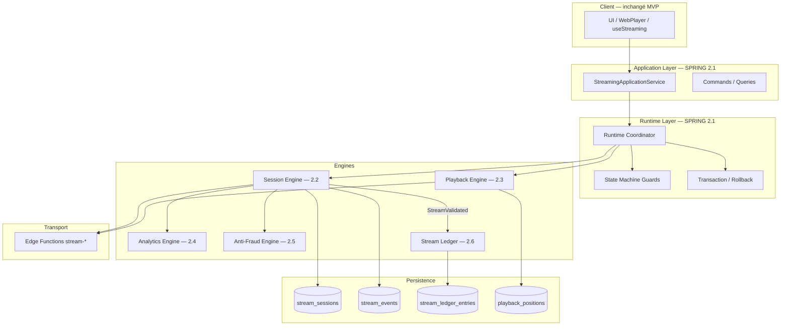
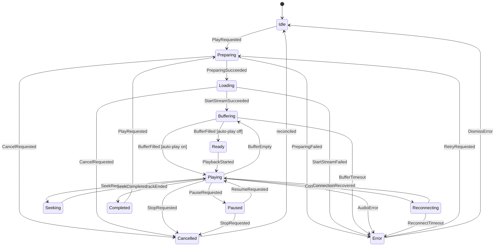
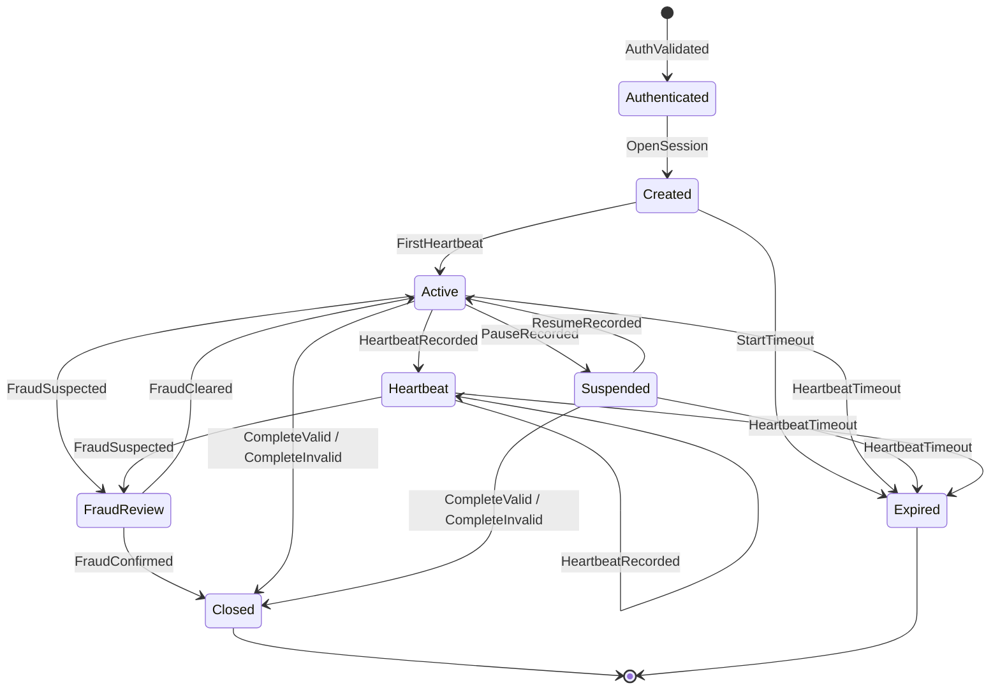
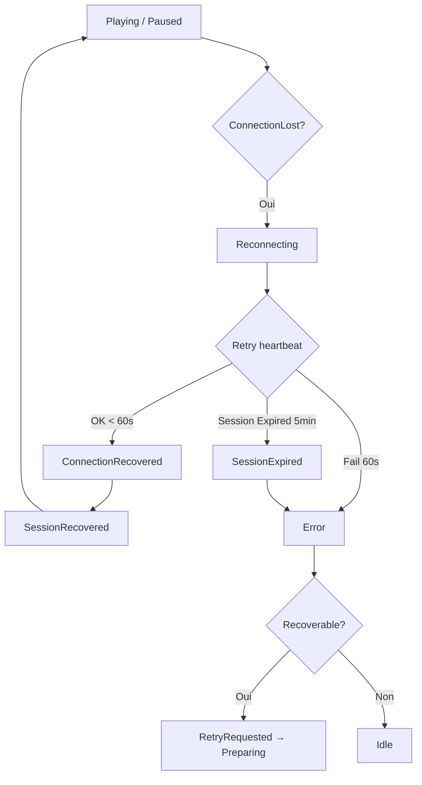
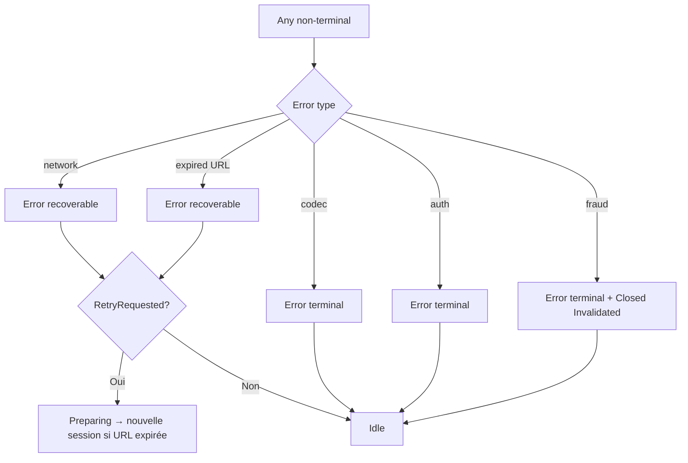

# STATE_MACHINE — Streaming Runtime SONAFRIK

> **Enterprise Streaming Runtime Specification**  
> Runtime Behavior · State Machine · Session Lifecycle · Enterprise Documentation  
> **Version :** 2.1.0  
> **Date :** 2026-06-25  
> **Statut :** Officiel — SPRING 2  
> **Périmètre :** Documentation uniquement — aucun code, aucune modification applicative

**Référence unique** du comportement du Streaming Runtime. Toute implémentation SPRING 2.1+ **doit** s'y conformer.

**Documents liés :** `SPRING_2_PROGRAM.md` · `DOMAIN_EVENTS.md` · `Architecture.md` · `FeatureFlags.md` · `Certification.md` · `DOMAIN_MAP.md` · `DEPENDENCY_RULES.md` · ADR-001 · ADR-002 · ADR-003

---

## Table des matières

1. [Présentation](#1-présentation)
2. [Architecture Runtime](#2-architecture-runtime)
3. [Playback State Machine](#3-playback-state-machine)
4. [Streaming Session State Machine](#4-streaming-session-state-machine)
5. [Matrice des transitions](#5-matrice-des-transitions)
6. [Diagrammes Mermaid](#6-diagrammes-mermaid)
7. [Événements déclencheurs](#7-événements-déclencheurs)
8. [Recovery Policy](#8-recovery-policy)
9. [Timeout Policy](#9-timeout-policy)
10. [Error Management](#10-error-management)
11. [State Invariants](#11-state-invariants)
12. [Impact métier](#12-impact-métier)
13. [Feature Flags](#13-feature-flags)
14. [Observability](#14-observability)
15. [Performance](#15-performance)
16. [Sécurité](#16-sécurité)
17. [Compatibilité MVP](#17-compatibilité-mvp)
18. [Glossaire](#18-glossaire)
19. [Annexes](#19-annexes)
20. [State Ownership](#20-state-ownership)
21. [State Persistence Policy](#21-state-persistence-policy)
22. [Cross-References documentaires](#22-cross-references-documentaires)

---

## 1. Présentation

### 1.1 Objectif

Définir de manière **non ambiguë** le comportement du **Streaming Runtime Enterprise** : états, transitions, événements, politiques de reprise, timeouts, erreurs, invariants et impacts métier.

Ce document permet à une IA ou à un développeur senior d'implémenter le Runtime **sans interprétation libre**.

### 1.2 Périmètre

| IN | OUT |
|---|---|
| Machines à états Playback + Session | Rendu UI WebPlayer |
| Cycle heartbeat / Real Listen ≥ 90 % | Calcul royalties, wallet, retraits |
| Recovery, timeouts, erreurs | Metadata, ISRC, publication |
| Impacts Analytics, Anti-Fraud, Ledger | Transcodage HLS post-MVP |
| Feature flags modes | Beat Store, Marketplace |

### 1.3 Responsabilités

| Composant | Responsabilité |
|---|---|
| **UI / hooks** | Émet intentions (`*Requested`) ; affiche état dérivé ; **ne calcule jamais** `is_valid_listen` |
| **Streaming Application Services** | Porte d'entrée CQRS ; validation Zod ; orchestration commandes |
| **Runtime Coordinator** | Valide transitions ; synchronise playback ↔ session ; émet Domain Events |
| **Playback Engine** | États locaux audio ; buffer ; signed URL |
| **Session Engine** | Persistance `stream_sessions` ; heartbeats ; complete |
| **Anti-Fraud Engine** | Scoring ; `FraudReview` ; invalidation |
| **Analytics Engine** | Projections lecture ; **lecture seule** sur sessions |
| **Stream Ledger** | Écriture financière post-`StreamValidated` uniquement |
| **Persistence** | Supabase RLS ; `stream_events` INSERT ONLY |

### 1.4 Principes d'architecture

1. **Deux machines couplées** — Playback (local) + Session (serveur = vérité financière)
2. **États terminaux immutables** — aucune transition sortante
3. **Real Listen serveur** — seuil 90 % (CDC V7.2)
4. **Event-first** — toute transition valide produit ≥1 Domain Event (`DOMAIN_EVENTS.md`)
5. **Idempotence financière** — complete, ledger, royalty signals
6. **MVP preservation** — legacy path intact si flags OFF
7. **Fail-safe** — en cas de doute, **ne pas** créditer (pas de ledger)

### 1.5 Vocabulaire officiel

| Terme | Définition |
|---|---|
| **Intention** | Commande UI (`PlayRequested`) — pas un Domain Event |
| **Domain Event** | Fait métier immuable (`PlaybackStarted`) |
| **Session** | Enregistrement `stream_sessions` identifié par `sessionId` |
| **Playback instance** | État local Runtime pour une lecture en cours |
| **Real Listen** | Écoute valide si `listen_percentage ≥ 90 %` calculé **serveur** |
| **Terminal** | État sans transition sortante |
| **Recovery** | Reprise sans nouvelle session (même `sessionId`) |
| **Nouvelle session** | `OpenSession` après terminal ou expiration |

---

## 2. Architecture Runtime

### 2.1 Vue d'ensemble



### 2.2 Flux de responsabilité

| Couche | Question à laquelle elle répond |
|---|---|
| UI | « L'utilisateur veut-il écouter ? » |
| Application Services | « La commande est-elle valide ? » |
| Runtime Coordinator | « La transition est-elle légale ? » |
| Playback Engine | « L'audio peut-il jouer ? » |
| Session Engine | « La session est-elle cohérente et persistée ? » |
| Anti-Fraud Engine | « La progression est-elle crédible ? » |
| Stream Ledger | « L'écoute validée doit-elle être enregistrée financièrement ? » |

### 2.3 Règle de priorité

En cas de divergence Playback ↔ Session : **Session serveur prévaut** pour toute décision Analytics, Anti-Fraud, Ledger, Royalties.

---

## 3. Playback State Machine

États **mutuellement exclusifs** par instance playback. Notation : `S-Pxx`.

### 3.1 `Idle` (S-P01)

| Attribut | Valeur |
|---|---|
| **Définition** | Aucune lecture active ; `sessionId = null` |
| **Responsabilités** | Attendre intention ; maintenir queue orthogonale |
| **Préconditions** | Terminal précédent réconcilié ou démarrage froid |
| **Postconditions** | Prêt à accepter `PlayRequested` |
| **Autorisé** | `PlayRequested` ; `SetQueue` |
| **Interdit** | Heartbeat ; Complete ; Seek ; Pause |

### 3.2 `Preparing` (S-P02)

| Attribut | Valeur |
|---|---|
| **Définition** | Validation pré-flight : auth JWT, permissions streaming, résolution track |
| **Responsabilités** | Vérifier track publié ; fermer sessions orphelines concurrentes |
| **Préconditions** | `PlayRequested` depuis `Idle`, `Completed`, `Cancelled`, ou `Error` récupérable |
| **Postconditions** | Piste éligible ; prêt pour `startStream` |
| **Autorisé** | `CancelRequested` |
| **Interdit** | Heartbeat ; audio play() |

### 3.3 `Loading` (S-P03)

| Attribut | Valeur |
|---|---|
| **Définition** | Appel réseau `startStream` / `OpenSession` en cours |
| **Responsabilités** | Obtenir `sessionId`, `signedUrl`, `durationSeconds` |
| **Préconditions** | `Preparing` réussi |
| **Postconditions** | `SessionCreated` émis ; credentials playback disponibles |
| **Autorisé** | `CancelRequested` |
| **Interdit** | Double start concurrent ; Seek |

### 3.4 `Buffering` (S-P04)

| Attribut | Valeur |
|---|---|
| **Définition** | Média charge premières frames ou stall mid-stream |
| **Responsabilités** | Attendre `canplay` / buffer suffisant |
| **Préconditions** | `signedUrl` valide ; élément audio initialisé |
| **Postconditions** | Prêt pour `Ready` ou `Playing` |
| **Autorisé** | `CancelRequested` |
| **Interdit** | Complete |

### 3.5 `Ready` (S-P05)

| Attribut | Valeur |
|---|---|
| **Définition** | Audio chargé ; lecture non démarrée (auto-play off) |
| **Responsabilités** | Exposer durée ; attendre `PlaybackStarted` |
| **Préconditions** | `BufferFilled` |
| **Postconditions** | Session `Active` côté serveur |
| **Autorisé** | `PlaybackStarted` ; `CancelRequested` |
| **Interdit** | Heartbeat (pas encore Playing) |

### 3.6 `Playing` (S-P06)

| Attribut | Valeur |
|---|---|
| **Définition** | Lecture audible ; heartbeats actifs (10 s) |
| **Responsabilités** | Progression position ; émission heartbeats ; accumulation serveur |
| **Préconditions** | `PlaybackStarted` ; `sessionId ≠ null` |
| **Postconditions** | `total_listened_seconds` serveur à jour |
| **Autorisé** | Pause ; Seek programmatique ; Stop ; fin track |
| **Interdit** | Nouveau Play même track sans Stop ; calcul client valid listen |

### 3.7 `Paused` (S-P07)

| Attribut | Valeur |
|---|---|
| **Définition** | Lecture suspendue ; position figée |
| **Responsabilités** | Session `Suspended` ; heartbeats suspendus |
| **Préconditions** | `PauseRequested` depuis `Playing` |
| **Postconditions** | Événement `pause` persisté |
| **Autorisé** | Resume ; Stop |
| **Interdit** | Heartbeat rafale ; Complete |

### 3.8 `Seeking` (S-P08)

| Attribut | Valeur |
|---|---|
| **Définition** | Saut position transitoire (max 5 s) |
| **Responsabilités** | Appliquer seek ; enregistrer `seek` serveur |
| **Préconditions** | `Playing` ; seek programmatique (MVP : **pas** barre cliquable CDC) |
| **Postconditions** | Retour `Playing` position cible |
| **Autorisé** | — (attente) |
| **Interdit** | Pause ; Complete ; seek imbriqué |

### 3.9 `Reconnecting` (S-P09)

| Attribut | Valeur |
|---|---|
| **Définition** | Perte réseau ; retry heartbeat / fetch |
| **Responsabilités** | Conserver `sessionId` ; backoff retry |
| **Préconditions** | `ConnectionLost` depuis `Playing` ou `Paused` |
| **Postconditions** | Retour état antérieur ou `Error` |
| **Autorisé** | Retry réseau |
| **Interdit** | Nouvelle session silencieuse |

### 3.10 `Completed` (S-P10)

| Attribut | Valeur |
|---|---|
| **Définition** | Fin track ; complete serveur exécuté ; résultat Real Listen reçu |
| **Responsabilités** | Clôture playback locale ; attendre queue suivante |
| **Préconditions** | `TrackEnded` ou complete explicite |
| **Postconditions** | Session `Closed` côté serveur ; **terminal playback** jusqu'à nouveau Play |
| **Autorisé** | `PlayRequested` (nouvelle session) |
| **Interdit** | Resume ; heartbeat ancienne session |

### 3.11 `Cancelled` (S-P11)

| Attribut | Valeur |
|---|---|
| **Définition** | Arrêt volontaire avant fin naturelle |
| **Responsabilités** | Libérer ressources ; clôturer ou laisser expire session |
| **Préconditions** | Stop / navigation / changement track |
| **Postconditions** | `sessionId` libéré ; → `Idle` |
| **Autorisé** | Nouveau Play |
| **Interdit** | Actions sur session clôturée |

### 3.12 `Error` (S-P12)

| Attribut | Valeur |
|---|---|
| **Définition** | Échec ; `audioError` typé (`network` \| `codec` \| `expired` \| `auth`) |
| **Responsabilités** | Exposer erreur récupérable ou terminal |
| **Préconditions** | Tout état non terminal avant échec |
| **Postconditions** | Si récupérable : retry possible ; sinon → `Idle` |
| **Autorisé** | `RetryRequested` ; `DismissError` ; Play autre track |
| **Interdit** | Heartbeat sans session valide |

**Note :** `Error` est **quasi-terminal** — sortie uniquement via recovery explicite (§8, §10).

---

## 4. Streaming Session State Machine

États **serveur** persistés ou dérivés. Notation : `S-Sxx`. Mapping legacy `stream_sessions` en §4.10.

### 4.1 `Created` (S-S01)

| Attribut | Valeur |
|---|---|
| **Définition** | Ligne `stream_sessions` insérée ; `sessionId` émis ; pas encore de heartbeat valide |
| **Cycle** | Phase initiale post `OpenSession` |
| **Expiration** | 30 s sans heartbeat → `Expired` |
| **Reprise** | N/A |
| **Fermeture** | → `Expired` ou → `Active` |

### 4.2 `Authenticated` (S-S02)

| Attribut | Valeur |
|---|---|
| **Définition** | JWT validé ; `user_id` identifié — **phase pré-session** (pas de row encore) |
| **Cycle** | Entre intention Play et `Created` |
| **Expiration** | 10 s — retour échec auth |
| **Reprise** | N/A |
| **Fermeture** | → `Created` ou échec |

### 4.3 `Active` (S-S03)

| Attribut | Valeur |
|---|---|
| **Définition** | Session en cours d'écoute ; accepte heartbeats |
| **Cycle** | Cœur du cycle de vie |
| **Expiration** | 5 min sans heartbeat → `Expired` |
| **Reprise** | Depuis `Suspended` via resume |
| **Fermeture** | → `Closed` ; → `FraudReview` ; → `Expired` |

### 4.4 `Heartbeat` (S-S04)

| Attribut | Valeur |
|---|---|
| **Définition** | **Phase opérationnelle** de `Active` — heartbeats reçus dans les délais (≤ 10 s + grace 30 s) |
| **Cycle** | Sous-état nominal de `Active` pendant `Playing` |
| **Expiration** | 3 beats manqués → sortie phase → risque `Expired` |
| **Reprise** | Automatique à chaque heartbeat valide |
| **Fermeture** | Pause → `Suspended` ; complete → `Closed` |

> **Implémentation :** `Heartbeat` n'est pas une colonne DB — c'est l'**indicateur runtime** `now() - last_heartbeat_at < interval`.

### 4.5 `Suspended` (S-S05)

| Attribut | Valeur |
|---|---|
| **Définition** | Pause serveur — mappe `Paused` playback et legacy `pause` event |
| **Cycle** | Interruption volontaire |
| **Expiration** | 5 min sans resume ni heartbeat → `Expired` |
| **Reprise** | `ResumeRecorded` → `Active` |
| **Fermeture** | Complete ou Expired |

### 4.6 `FraudReview` (S-S06)

| Attribut | Valeur |
|---|---|
| **Définition** | Signaux `FraudSuspected` ; validation Anti-Fraud en cours |
| **Cycle** | Transitoire — max 60 s |
| **Expiration** | Timeout review → `FraudConfirmed` → `Closed` |
| **Reprise** | `FraudCleared` (rare, admin) → `Active` |
| **Fermeture** | → `Closed` (invalidated) |

### 4.7 `Expired` (S-S07)

| Attribut | Valeur |
|---|---|
| **Définition** | Orpheline / timeout — **terminal immutable** |
| **Cycle** | Fin abnormal |
| **Expiration** | N/A — déjà terminal |
| **Reprise** | **Impossible** — nouvelle session requise |
| **Fermeture** | Terminal |

### 4.8 `Closed` (S-S08)

| Attribut | Valeur |
|---|---|
| **Définition** | Session terminée normalement ou avec verdict — **terminal immutable** |
| **Sous-types** | `Completed_Valid` · `Completed_Invalid` · `Skipped` · `Invalidated` · `Cancelled` |
| **Cycle** | Fin cycle |
| **Expiration** | N/A |
| **Reprise** | **Impossible** |
| **Fermeture** | Terminal |

### 4.9 Cycle de vie session — résumé

```
Authenticated → Created → Active ↔ Suspended
                    ↓         ↓ (Heartbeat phase)
                 Expired   FraudReview → Closed
                              ↓
                           Expired / Closed
```

### 4.10 Mapping persistence legacy

| État Runtime | `stream_sessions` (champs) |
|---|---|
| `Created` | row existe ; peu de heartbeats |
| `Active` / `Heartbeat` | `completed_at IS NULL` ; heartbeat récent |
| `Suspended` | équivalent pause ; heartbeat suspendu |
| `FraudReview` | `fraud_flags` non vide ; pas completed |
| `Expired` | orpheline / timeout RPC |
| `Closed` · Valid | `completed_at SET` ; `is_valid_listen = true` |
| `Closed` · Invalid | `completed_at SET` ; `is_valid_listen = false` |
| `Closed` · Invalidated | `fraud_flags` + invalid |

---

## 5. Matrice des transitions

### 5.1 Playback — matrice complète

| État actuel | Événement | État suivant | Autorisé | Conditions | Action déclenchée |
|---|---|---|---|---|---|
| Idle | PlayRequested | Preparing | ✅ | trackId valide ; user auth | — |
| Preparing | PreparingSucceeded | Loading | ✅ | permissions OK | CloseOrphanSessions |
| Preparing | PreparingFailed | Error | ✅ | track unpublished | — |
| Preparing | CancelRequested | Cancelled | ✅ | — | — |
| Loading | StartStreamSucceeded | Buffering | ✅ | sessionId reçu | SessionCreated |
| Loading | StartStreamFailed | Error | ✅ | — | — |
| Loading | CancelRequested | Cancelled | ✅ | — | — |
| Buffering | BufferFilled | Ready | ✅ | auto-play off | PlaybackBuffering |
| Buffering | BufferFilled | Playing | ✅ | auto-play on | PlaybackStarted |
| Buffering | BufferTimeout | Error | ✅ | ≥15 s | — |
| Buffering | CancelRequested | Cancelled | ✅ | — | — |
| Ready | PlaybackStarted | Playing | ✅ | — | play event |
| Ready | CancelRequested | Cancelled | ✅ | — | — |
| Playing | PauseRequested | Paused | ✅ | — | PlaybackPaused |
| Playing | SeekRequested | Seeking | ✅ | programmatique only | — |
| Playing | BufferEmpty | Buffering | ✅ | — | — |
| Playing | ConnectionLost | Reconnecting | ✅ | 3 beats missed | ConnectionLost |
| Playing | TrackEnded | Completed | ✅ | — | PlaybackCompleted → complete |
| Playing | AudioError | Error | ✅ | — | PlaybackFailed |
| Playing | StopRequested | Cancelled | ✅ | — | — |
| Paused | ResumeRequested | Playing | ✅ | buffer OK | PlaybackResumed |
| Paused | StopRequested | Cancelled | ✅ | — | — |
| Paused | SessionExpired | Error | ✅ | >5 min | SessionExpired |
| Seeking | SeekCompleted | Playing | ✅ | — | PlaybackSeeked |
| Seeking | SeekTimeout | Playing | ✅ | ≤5 s | restore position |
| Seeking | SeekFailed | Error | ✅ | — | — |
| Reconnecting | ConnectionRecovered | Playing | ✅ | was Playing | SessionRecovered |
| Reconnecting | ConnectionRecovered | Paused | ✅ | was Paused | — |
| Reconnecting | ReconnectTimeout | Error | ✅ | ≥60 s | — |
| Reconnecting | SessionExpired | Error | ✅ | — | — |
| Completed | PlayRequested | Preparing | ✅ | nouvelle session | — |
| Cancelled | — | Idle | ✅ | réconciliation | SessionClosed |
| Error | RetryRequested | Preparing | ✅ | recoverable | — |
| Error | DismissError | Idle | ✅ | — | — |
| Error | PlayRequested | Preparing | ✅ | — | — |
| * | FraudDetected | Error | ✅ | — | FraudConfirmed |

### 5.2 Session — matrice complète

| État actuel | Événement | État suivant | Autorisé | Conditions | Action déclenchée |
|---|---|---|---|---|---|
| — | AuthValidated | Authenticated | ✅ | JWT OK | — |
| Authenticated | OpenSession | Created | ✅ | — | INSERT session |
| Authenticated | AuthFailed | — | ✅ | — | reject |
| Created | FirstHeartbeat | Active | ✅ | position ≥0 | — |
| Created | StartTimeout | Expired | ✅ | 30 s | SessionExpired |
| Active | HeartbeatRecorded | Heartbeat | ✅ | in Playing | PlaybackHeartbeat |
| Heartbeat | HeartbeatRecorded | Heartbeat | ✅ | cadence 10s | update listened |
| Active | PauseRecorded | Suspended | ✅ | — | — |
| Suspended | ResumeRecorded | Active | ✅ | — | — |
| Active | CompleteValid | Closed | ✅ | ≥90 % | StreamValidated |
| Active | CompleteInvalid | Closed | ✅ | <90 % | StreamRejected |
| Suspended | CompleteValid | Closed | ✅ | ≥90 % | StreamValidated |
| Suspended | CompleteInvalid | Closed | ✅ | <90 % | StreamRejected |
| Active | FraudSuspected | FraudReview | ✅ | score > seuil | — |
| Heartbeat | FraudSuspected | FraudReview | ✅ | — | — |
| FraudReview | FraudConfirmed | Closed | ✅ | — | RoyaltyRejected |
| FraudReview | FraudCleared | Active | ✅ | admin | rare |
| Active | HeartbeatTimeout | Expired | ✅ | 5 min | SessionExpired |
| Suspended | HeartbeatTimeout | Expired | ✅ | 5 min | SessionExpired |
| Heartbeat | HeartbeatTimeout | Expired | ✅ | 5 min | — |
| Closed | * | — | ❌ | terminal | — |
| Expired | * | — | ❌ | terminal | — |

---

## 6. Diagrammes Mermaid

### 6.1 Playback Lifecycle



### 6.2 Session Lifecycle



### 6.3 Recovery Flow



### 6.4 Error Flow



---

## 7. Événements déclencheurs

### 7.1 Intentions UI (non Domain Events)

`PlayRequested` · `PauseRequested` · `ResumeRequested` · `StopRequested` · `CancelRequested` · `SeekRequested` · `RetryRequested` · `DismissError`

### 7.2 Événements playback runtime

`PreparingSucceeded` · `PreparingFailed` · `StartStreamSucceeded` · `StartStreamFailed` · `BufferFilled` · `BufferEmpty` · `BufferTimeout` · `PlaybackStarted` · `TrackEnded` · `SeekCompleted` · `SeekFailed` · `SeekTimeout` · `AudioError`

### 7.3 Événements réseau

`ConnectionLost` · `ConnectionRecovered` · `ReconnectTimeout`

### 7.4 Événements session

`AuthValidated` · `AuthFailed` · `OpenSession` · `FirstHeartbeat` · `HeartbeatRecorded` · `PauseRecorded` · `ResumeRecorded` · `CompleteValid` · `CompleteInvalid` · `StartTimeout` · `HeartbeatTimeout` · `SessionExpired` · `SessionRecovered` · `SessionClosed`

### 7.5 Événements anti-fraude

`FraudSuspected` · `FraudConfirmed` · `FraudCleared` · `FraudDetected`

### 7.6 Domain Events (référence croisée)

Catalogue complet : **`DOMAIN_EVENTS.md`** — 28 événements métier (`PlaybackStarted`, `StreamValidated`, `LedgerRecorded`, etc.).

**Règle :** chaque transition §5 autorisée produit ≥1 intention, événement technique, ou Domain Event.

---

## 8. Recovery Policy

### 8.1 Perte réseau

| Étape | Comportement |
|---|---|
| 1 | 3 heartbeats manqués (30 s) → `ConnectionLost` → `Reconnecting` |
| 2 | Conserver `sessionId` ; retry avec backoff 1s, 2s, 4s, 8s, max 60s |
| 3 | Succès → `ConnectionRecovered` + `SessionRecovered` |
| 4 | Échec 60 s → `Error` recoverable |
| 5 | Si serveur `Expired` entre-temps → `Error` + nouvelle session au Play |

### 8.2 Changement réseau (Wi-Fi ↔ mobile)

- Traité comme §8.1
- Signed URL reste valide si TTL non dépassé
- Si `expired` mid-stream → `AudioError(expired)` → `Preparing` avec **nouvelle** session

### 8.3 Fermeture navigateur / onglet

- Heartbeats cessent
- Session → `Expired` après 5 min
- `playback_positions` restaure position UI au retour
- **Nouvelle session** au Play — Real Listen recommence à 0 %

### 8.4 Retour navigateur (back-forward cache)

- Si session encore `Active` (< 5 min) → reprise automatique heartbeats
- Sinon → position UI seulement ; Play = nouvelle session

### 8.5 Mobile (Expo)

| Scénario | Politique |
|---|---|
| App background | `PauseRequested` auto (recommandé) ou heartbeats suspendus |
| App foreground < 5 min | `ResumeRequested` si session valide |
| App foreground > 5 min | `PlayRequested` → nouvelle session |
| OS kill | Même que fermeture navigateur |

### 8.6 Reprise automatique vs manuelle

| Type | Déclencheur | Condition |
|---|---|---|
| **Automatique** | `ConnectionRecovered` | session non terminal ; < 5 min |
| **Automatique** | `ResumeRequested` | `Paused` + session valide |
| **Manuelle** | `PlayRequested` | post `Expired` / `Error` terminal |
| **Manuelle** | `RetryRequested` | `Error` recoverable |

---

## 9. Timeout Policy

| Timeout | Valeur | Scope | Comportement |
|---|---|---|---|
| **Auth** | 10 s | `Authenticated` | Échec → pas de session |
| **Start** | 30 s | `Created` | → `Expired` |
| **Buffer** | 15 s | `Buffering` | → `Error` recoverable |
| **Heartbeat interval** | 10 s | `Playing` | Émission obligatoire |
| **Heartbeat grace** | 30 s (3×) | `Playing` | → `Reconnecting` |
| **Session orphan** | 5 min | `Active`/`Suspended`/`Heartbeat` | → `Expired` |
| **Reconnect** | 60 s | `Reconnecting` | → `Error` |
| **Seek** | 5 s | `Seeking` | → `Playing` position antérieure |
| **Complete RPC** | 10 s | complete | Retry ×3 |
| **Fraud review** | 60 s | `FraudReview` | → `FraudConfirmed` |
| **Signed URL TTL** | 7200 s MVP → 1800 s cible | Playback | → `expired` error |
| **Download stall** | 15 s | `Buffering` | = buffer timeout |

---

## 10. Error Management

### 10.1 Classification

| Classe | Exemples | Retry | Terminal playback |
|---|---|---|---|
| **Récupérable temporaire** | network blip, 503 edge | Oui | Non |
| **Récupérable session** | URL expired | Nouveau start | Non |
| **Critique non récupérable** | codec, auth 401 | Non | Oui → Idle |
| **Terminal fraude** | FraudConfirmed | Non | Oui |
| **Terminal session** | Expired, Closed | Non | Oui |

### 10.2 Actions par classe

| Classe | Rollback | Retry | Arrêt | Reprise |
|---|---|---|---|---|
| Récupérable temporaire | Non | Backoff | — | Auto reconnect |
| URL expired | Non | Nouveau Loading | — | Manuel Play |
| Auth | Non | Login UI | Idle | Post-auth Play |
| Fraude | Session Closed | Non | Error | Nouvelle session |
| Expired | Non | Non | Error | Nouvelle session |

### 10.3 Rollback coordination

- Transition illégale → **rejeter** ; rester état courant ; log `runtime_transition_rejected`
- Complete échoué → retry idempotent — **jamais** double `is_valid_listen`
- Ledger write échoué → retry `LedgerRecorded` — **jamais** rollback `Closed` Valid

---

## 11. State Invariants

### 11.1 Playback

| ID | Invariant |
|---|---|
| INV-P01 | Un seul état playback à un instant T |
| INV-P02 | `Playing` ⟹ `sessionId ≠ null` |
| INV-P03 | `Playing` ⊥ `Completed` (mutuellement exclusifs) |
| INV-P04 | `Completed` ↛ `Buffering` |
| INV-P05 | Heartbeat **uniquement** en `Playing` |
| INV-P06 | `Seeking` durée ≤ 5 s |
| INV-P07 | `Error` → sortie uniquement via recovery explicite |
| INV-P08 | Complete uniquement depuis `Playing` ou `TrackEnded` |

### 11.2 Session

| ID | Invariant |
|---|---|
| INV-S01 | `Closed` et `Expired` sont **immutables** |
| INV-S02 | `is_valid_listen = true` ⟺ `Closed` Valid (≥90 % serveur) |
| INV-S03 | Calcul Real Listen **jamais** côté client |
| INV-S04 | Session appartient à **un seul** `user_id` |
| INV-S05 | `Expired` ↛ `Active` |
| INV-S06 | Complete **idempotent** sur `Closed` Valid |
| INV-S07 | `stream_events` INSERT ONLY |
| INV-S08 | Temps `Suspended` n'incrémente pas `total_listened_seconds` |

### 11.3 Couplage & financier

| ID | Invariant |
|---|---|
| INV-C01 | Session prévaut sur playback pour décisions financières |
| INV-C02 | `FraudConfirmed` ⟹ pas de `StreamValidated` |
| INV-F01 | Ledger ⟹ `StreamValidated` préalable |
| INV-F02 | Pas de double entrée ledger (`idempotency_key`) |
| INV-F03 | Wallet / Royalties **non écrits** par Runtime SPRING 2 |

### 11.4 Sécurité CDC

| ID | Invariant |
|---|---|
| INV-X01 | URL audio jamais persistée en clair hors session |
| INV-X02 | Pas de seek utilisateur barre player (MVP) |
| INV-X03 | JWT requis toute opération session |

---

## 12. Impact métier

Légende : ● impact direct · ○ impact indirect · — aucun · ⊘ bloqué

### 12.1 Playback states

| État | Analytics | Anti-Fraud | Ledger | Royalty | Revenue | Wallet |
|---|---|---|---|---|---|---|
| Idle | — | — | — | — | — | — |
| Preparing | — | — | — | — | — | — |
| Loading | — | — | — | — | — | — |
| Buffering | — | — | — | — | — | — |
| Ready | — | — | — | — | — | — |
| Playing | ● play count | ● heartbeat analysis | — | — | — | — |
| Paused | ○ pause metric | ○ | — | — | — | — |
| Seeking | ○ seek event | ● pattern check | — | — | — | — |
| Reconnecting | — | ○ | — | — | — | — |
| Completed | ● listen result | ○ final | ○ candidate | ○ signal | — | — |
| Cancelled | ○ skip | — | ⊘ | ⊘ | — | — |
| Error | ○ failure | ○ | ⊘ | ⊘ | — | — |

### 12.2 Session states

| État | Analytics | Anti-Fraud | Ledger | Royalty | Revenue | Wallet |
|---|---|---|---|---|---|---|
| Created | — | ○ | — | — | — | — |
| Authenticated | — | — | — | — | — | — |
| Active / Heartbeat | ● time listened | ● scoring | — | — | — | — |
| Suspended | ○ | ○ | — | — | — | — |
| FraudReview | ○ | ● | ⊘ | ⊘ | — | — |
| Expired | ○ orphan | ○ | ⊘ | ⊘ | — | — |
| Closed Valid | ● valid stream | ○ archive | ● **LedgerRecorded** | ○ **RoyaltyEligible** | ○ futur | ⊘ MVP |
| Closed Invalid | ● invalid | ○ | ⊘ | ⊘ **RoyaltyRejected** | — | ⊘ |
| Closed Invalidated | ● fraud stat | ● | ⊘ | ⊘ **RoyaltyRejected** | — | ⊘ |

**MVP :** `RoyaltyEligible` et crédits Wallet = **signaux émis mais non consommés** jusqu'à post-SPRING 2.8.

---

## 13. Feature Flags

Modes globaux (composition de flags individuels — voir `FeatureFlags.md`) :

| Mode | Flags | Comportement Runtime |
|---|---|---|
| **OFF** | tous `false` | Legacy 100 % — edge + `StreamingService` — **état nominal MVP actuel** |
| **DRY RUN** | `streaming_runtime_enabled` only | Coordinator valide transitions + log ; **pas** de changement persistance |
| **PARTIAL** | runtime + session (+ playback optionnel) | Session Engine actif ; ledger OFF ; analytics legacy |
| **FULL** | tous ON + `streaming_mvp_integration_enabled` | Runtime complet ; ledger écrit ; analytics engine |

### 13.1 Impact par mode sur state machine

| Mode | Playback SM | Session SM | Domain Events |
|---|---|---|---|
| OFF | Legacy implicite | RPC direct | Non émis |
| DRY RUN | Guards actifs | Validation only | Log stdout |
| PARTIAL | Hybride | Persisté nouveau | Partiel |
| FULL | Complet | Complet | Complet |

**Rollback :** tout mode → **OFF** en < 1 min via SQL flags.

---

## 14. Observability

### 14.1 Identifiants de corrélation

| ID | Portée | Usage |
|---|---|---|
| `correlationId` | Un cycle Play→Complete | Trace bout-en-bout |
| `sessionId` | Session serveur | Agrégation heartbeats |
| `eventId` | Domain Event | Dedup |
| `actorId` | Utilisateur | Audit |
| `traceId` | OpenTelemetry (futur) | Distribué |

### 14.2 Logs (niveaux)

| Niveau | Exemples |
|---|---|
| INFO | Transition autorisée ; SessionCreated ; StreamValidated |
| WARN | FraudSuspected ; Reconnecting ; BufferTimeout |
| ERROR | FraudConfirmed ; transition rejected ; complete failed |
| DEBUG | Heartbeat payload (sans PII) — staging only |

### 14.3 Métriques

`streaming_playback_state_gauge` · `streaming_session_active_total` · `streaming_heartbeat_latency_p95` · `streaming_valid_listen_ratio` · `streaming_fraud_invalidations_total` · `streaming_recovery_success_total` · `streaming_transition_rejected_total`

### 14.4 Traces

Spans : `playback.transition` · `session.heartbeat` · `complete.real_listen` · `ledger.record` · `antifraud.score`

### 14.5 Audit

Événements critiques (`StreamValidated`, `LedgerRecorded`, `FraudConfirmed`) → `audit_logs` via service admin (futur).

---

## 15. Performance

### 15.1 Objectifs MVP (< 10k utilisateurs concurrents)

| Métrique | Cible |
|---|---|
| Latence `startStream` p95 | < 800 ms |
| Latence heartbeat p95 | < 300 ms |
| Latence complete p95 | < 500 ms |
| Mémoire runtime instance | < 5 MB par session active |
| Heartbeat fréquence | 10 s ± 1 s |
| Reprise après coupure | < 3 s (réseau OK) |
| Capacité cible design | 1M écoutes / jour (architecture) |
| Capacité MVP validée | 100k sessions / jour |

### 15.2 Règles performance

- Heartbeat batching **interdit** — 1 heartbeat = 1 RPC
- Pas plus de **1** session `Active` par user+track (fermer orphelines)
- Analytics incrémental — pas de full scan `stream_sessions` par heartbeat

---

## 16. Sécurité

### 16.1 Permissions

- `has_streaming_permission` RPC avant `OpenSession`
- Track `publication_status = published` uniquement
- RLS : user ne lit que ses sessions

### 16.2 Ownership

- Toute opération session vérifie `session.user_id = auth.uid()`
- Complete / heartbeat sur session d'autrui → 403

### 16.3 Validation session

- `sessionId` UUID v4
- Session terminal → toute mutation refusée
- Progression > durée + 2s marge → fraude

### 16.4 Anti-rejeu

- Complete idempotent — replay même payload → 200 même résultat
- Ledger `idempotency_key` unique
- Signed URL non réutilisable cross-user

### 16.5 Anti double lecture

- Une session `Closed` Valid par cycle complete
- Pas de second `StreamValidated` même session
- Concurrent sessions même user → fermeture ancienne (Sprint 13c)

### 16.6 Anti-fraude

- Vitesse progression > 1,5× temps réel → `FraudReview`
- Heartbeats position décroissante (hors seek) → signal
- Patterns seek abusifs → `FraudConfirmed`

---

## 17. Compatibilité MVP

| Contrainte | Engagement |
|---|---|
| **UI** | Aucun changement écran, composant, interaction |
| **Lecteur** | WebPlayer / playerContext — comportement perçu identique |
| **Wallet** | Aucune écriture ; aucun handler activé |
| **Royalties** | Engine SQL inchangé ; pas de consommation `RoyaltyEligible` |
| **Metadata** | Aucune dépendance ; pas d'ISRC |
| **Legacy path** | Flags OFF = byte-compatible comportement actuel |
| **Real Listen** | 90 % serveur — inchangé |

**Document purement architectural** — implémentation progressive SPRING 2.1→2.8.

---

## 18. Glossaire

| Terme | Définition |
|---|---|
| **Active** | Session serveur acceptant heartbeats |
| **Authenticated** | Phase JWT validé pré-session |
| **Buffering** | Chargement média audio |
| **Closed** | Session terminale serveur |
| **Complete** | RPC fin session + calcul Real Listen |
| **Correlation ID** | Identifiant trace cycle playback |
| **Domain Event** | Fait métier immuable — `DOMAIN_EVENTS.md` |
| **Heartbeat** | Progress signal 10 s ; phase Active |
| **Idle** | Playback au repos |
| **Intent** | Commande UI `*Requested` |
| **Ledger** | Journal financier append-only |
| **Orphan session** | Session sans heartbeat > 5 min |
| **Preparing** | Pre-flight avant startStream |
| **Real Listen** | Écoute valide ≥ 90 % durée, calcul serveur |
| **Recoverable error** | Permet RetryRequested |
| **Session** | Enregistrement `stream_sessions` |
| **Signed URL** | URL audio éphémère serveur |
| **Suspended** | Pause serveur (= Paused playback) |
| **Terminal** | État sans transition sortante |
| **Valid listen** | `is_valid_listen = true` |

---

## 19. Annexes

### 19.1 Références croisées

| Sujet | Document |
|---|---|
| Domain Events catalogue | `DOMAIN_EVENTS.md` |
| Programme SPRING 2 | `SPRING_2_PROGRAM.md` |
| Feature flags SQL | `FeatureFlags.md` |
| Probes certification | `Certification.md` |
| Isolation domaines | `DOMAIN_MAP.md` |
| Couplage interdit | `DEPENDENCY_RULES.md` |
| Ledger ADR | `ADR/002-stream-ledger-as-financial-source-of-truth.md` |

### 19.2 Tableau transitions interdites (playback)

| De | Vers | Raison |
|---|---|---|
| Completed | Playing | INV-P03 |
| Completed | Buffering | INV-P04 |
| Cancelled | Playing (même session) | INV-P05 |
| Idle | Playing | Doit passer Preparing→Loading |
| Loading | Playing | Doit passer Buffering |
| Seeking | Completed | INV-P08 |
| Closed (session) | Active | INV-S05 |

### 19.3 Checklist certification implémentation

- [ ] Toute transition code ⊆ matrice §5
- [ ] Tout état terminal respecte INV-S01
- [ ] Heartbeat 10 s en Playing uniquement
- [ ] Real Listen jamais calculé client
- [ ] Flags OFF = legacy identique
- [ ] Domain Events alignés `DOMAIN_EVENTS.md`
- [ ] Probes Certification.md 10/10

### 19.4 Historique des versions

| Version | Date | Changements |
|---|---|---|
| 1.0.0 | 2026-06-25 | Version initiale deux machines |
| **2.0.0** | 2026-06-25 | Spécification Enterprise — 19 sections ; `Preparing` ; session `Authenticated`/`Heartbeat`/`FraudReview` ; impact métier ; flags modes ; observability ; performance ; sécurité |
| **2.1.0** | 2026-06-25 | Hardening Sprint 2.1 — §20 State Ownership · §21 State Persistence Policy · §22 Cross-References |

### 19.5 Maintenance

Toute modification d'état ou transition requiert : bump version · entrée `EXECUTION_LOG.md` · sync `DOMAIN_EVENTS.md` · sync `SEQUENCE_DIAGRAMS.md` · mise à jour probes.

---

## 20. State Ownership

**Règle absolue :** un seul **Owner** par état. Seul l'Owner peut **écrire** (muter) l'état. Les moteurs listés en **Read** peuvent consulter en lecture seule. Toute écriture par un moteur non autorisé est **interdite** et doit être rejetée (`MonitoringTransitionRejected`).

### 20.1 Machine Playback (12 états)

| State | ID | Owner | Engine responsable | Read (autorisés) | Write (interdits) | Transfert de responsabilité |
|---|---|---|---|---|---|---|
| `Idle` | S-P01 | **Playback Engine** | Playback Engine | Runtime Coordinator, Application Service, Analytics | Session Engine, Anti-Fraud, Ledger | → `Preparing` : délégation RC sur commande `Play` ; retour Owner Playback après `Cancel` |
| `Preparing` | S-P02 | **Playback Engine** | Playback Engine | Runtime Coordinator, Session Engine (auth status) | Analytics, Anti-Fraud, Ledger | → `Loading` après `SessionAuthenticated` (SE émet, PE applique) |
| `Loading` | S-P03 | **Playback Engine** | Playback Engine | Runtime Coordinator, Session Engine | Analytics write, Ledger | → `Buffering` sur `SignedUrlReady` ; → `Error` si échec URL |
| `Buffering` | S-P04 | **Playback Engine** | Playback Engine | Runtime Coordinator, Analytics (latence) | Session Engine (sauf suspend signal), Ledger | → `Playing`/`Ready` sur `canplay` ; → `Error` timeout §8.3 |
| `Ready` | S-P05 | **Playback Engine** | Playback Engine | Runtime Coordinator | Session Engine, Ledger | → `Playing` sur `play()` user ou auto-start |
| `Playing` | S-P06 | **Playback Engine** | Playback Engine | Session Engine (position mirror), Anti-Fraud (signaux), Analytics | Ledger direct write | → `Paused`/`Seeking`/`Buffering`/`Completed`/`Error` ; heartbeat délégué à SE |
| `Paused` | S-P07 | **Playback Engine** | Playback Engine | Session Engine, Analytics | Anti-Fraud write, Ledger | → `Playing` sur `Resume` ; → `Cancelled` sur navigation |
| `Seeking` | S-P08 | **Playback Engine** | Playback Engine | Session Engine, Anti-Fraud | Ledger | → `Playing`/`Paused` post-seek ; max 500 ms (INV-P07) |
| `Reconnecting` | S-P09 | **Playback Engine** | Playback Engine | Runtime Coordinator, Session Engine | Analytics write, Ledger | → `Loading`/`Playing`/`Error` selon résultat reconnexion |
| `Completed` | S-P10 | **Playback Engine** | Playback Engine | Session Engine, Analytics, Ledger (via event) | **Tous** (terminal INV-P03) | Terminal — aucun transfert sortant |
| `Cancelled` | S-P11 | **Playback Engine** | Playback Engine | Session Engine, Analytics | **Tous** (terminal INV-P05) | Terminal — SE peut fermer session associée |
| `Error` | S-P12 | **Playback Engine** | Playback Engine | Runtime Coordinator, Monitoring | Session Engine direct mutation playback | → `Idle`/`Preparing` sur recovery user ; SE ferme session en parallèle |

### 20.2 Machine Session (8 états)

| State | ID | Owner | Engine responsable | Read (autorisés) | Write (interdits) | Transfert de responsabilité |
|---|---|---|---|---|---|---|
| `Created` | S-S01 | **Session Engine** | Session Engine | Playback Engine, Runtime Coordinator | Analytics, Anti-Fraud, Ledger | → `Authenticated` après validation auth+permission |
| `Authenticated` | S-S02 | **Session Engine** | Session Engine | Playback Engine, Anti-Fraud | Ledger, Analytics write | → `Active` sur premier heartbeat ou `PlaybackStarted` |
| `Active` | S-S03 | **Session Engine** | Session Engine | Playback Engine, Anti-Fraud, Analytics | Ledger direct | → `Heartbeat`/`Suspended`/`FraudReview`/`Expired`/`Closed` |
| `Heartbeat` | S-S04 | **Session Engine** | Session Engine | Anti-Fraud, Analytics | Playback Engine, Ledger | Sous-état transitoire — retour `Active` après RPC ack |
| `Suspended` | S-S05 | **Session Engine** | Session Engine | Playback Engine, Anti-Fraud | Ledger | → `Active` sur reprise ; → `Closed` si timeout pause |
| `FraudReview` | S-S06 | **Anti-Fraud Engine** | Anti-Fraud Engine (décision) · Session Engine (persistance) | Session Engine, Analytics, Monitoring | Playback Engine, Ledger | → `Active` (cleared) ou `Closed` Invalid (confirmed) — transfert Owner SE à la persistance finale |
| `Expired` | S-S07 | **Session Engine** | Session Engine | Analytics, Audit | **Tous** (terminal INV-S01) | Terminal — TTL session dépassé |
| `Closed` | S-S08 | **Session Engine** | Session Engine | Analytics, Ledger (lecture event), Audit | **Tous** (terminal INV-S01) | Terminal — sous-statut `Valid`/`Invalid`/`Fraud` immuable |

### 20.3 Règles de transfert inter-machines

| Déclencheur | État Playback | État Session | Owner actif | Note |
|---|---|---|---|---|
| `Play` user | Idle → Preparing | — | Playback Engine | SE pas encore impliqué |
| `OpenSession` OK | Preparing → Loading | Created → Authenticated | Session Engine (session) · PE (playback) | Dual ownership coordonné par RC |
| Premier heartbeat | Playing | Authenticated → Active | Session Engine | SE devient source vérité financière |
| `PlaybackCompleted` | Playing → Completed | Active → Closed (pending) | Session Engine | Complete RPC obligatoire avant `Closed Valid` |
| Fraude confirmée | Error ou Completed | Active → FraudReview → Closed | Anti-Fraud → Session Engine | Décision AF ; persistance SE |

### 20.4 Violations et réponses

| Violation | Réponse |
|---|---|
| Ledger écrit état session | Rejet + alerte sécurité |
| Playback mute `Closed` session | Ignoré — SE seul writer |
| Analytics écrit playback state | Rejet — lecture seule |
| Double Owner simultané | Runtime Coordinator arbitre — file priorité SE > PE |

---

## 21. State Persistence Policy

Politique de persistance par état. **Raison** : garantir cohérence financière (session serveur > playback local) et performance (playback en mémoire client).

### 21.1 Machine Playback

| State | ID | Mémoire | Cache | SQL | Append-only | TTL | Archivage | Raison |
|---|---|---|---|---|---|---|---|---|
| `Idle` | S-P01 | ✅ Client | — | — | — | Session UI | — | État UI éphémère ; pas de valeur métier persistée |
| `Preparing` | S-P02 | ✅ Client | — | — | — | 30 s | — | Transitoire pré-auth ; perte acceptable → retry Play |
| `Loading` | S-P03 | ✅ Client | — | — | — | 60 s | — | Attente URL signée ; timeout → Error |
| `Buffering` | S-P04 | ✅ Client | — | — | — | 120 s | — | Métrique latence optionnelle Analytics (agrégat) |
| `Ready` | S-P05 | ✅ Client | — | — | — | 30 s | — | État court avant Playing |
| `Playing` | S-P06 | ✅ Client | — | — | — | — | — | Position miroir en SE via heartbeat — pas de row playback |
| `Paused` | S-P07 | ✅ Client | — | — | — | — | — | SE `Suspended` si pause > seuil (optionnel Sprint 2.1) |
| `Seeking` | S-P08 | ✅ Client | — | — | — | 500 ms | — | INV-P07 — jamais persisté |
| `Reconnecting` | S-P09 | ✅ Client | — | — | — | 180 s | — | Reprise réseau ; session SE reste Active |
| `Completed` | S-P10 | ✅ Client | — | — | — | — | — | Signal vers SE ; pas de table playback |
| `Cancelled` | S-P11 | ✅ Client | — | — | — | — | — | Idem — événement `PlaybackCancelled` si émis |
| `Error` | S-P12 | ✅ Client | — | — | — | — | — | Log Monitoring 30 j ; SE ferme session |

### 21.2 Machine Session

| State | ID | Mémoire | Cache | SQL | Append-only | TTL | Archivage | Raison |
|---|---|---|---|---|---|---|---|---|
| `Created` | S-S01 | — | — | ✅ `stream_sessions` | — | — | 24 mois | Row créée à OpenSession — audit trail |
| `Authenticated` | S-S02 | — | — | ✅ `stream_sessions.status` | — | — | 24 mois | Preuve permission validée |
| `Active` | S-S03 | — | Optionnel Redis post-scale | ✅ `stream_sessions` | — | — | 24 mois | Source vérité Real Listen |
| `Heartbeat` | S-S04 | — | — | ✅ `stream_events` | ✅ append | — | 90 j → cold | Chaque heartbeat = row append-only |
| `Suspended` | S-S05 | — | — | ✅ `stream_sessions.status` | — | — | 24 mois | Pause longue — évite faux Active |
| `FraudReview` | S-S06 | — | — | ✅ `stream_sessions` + flag | — | — | 24 mois | Décision fraude auditable |
| `Expired` | S-S07 | — | — | ✅ `stream_sessions` terminal | — | — | 24 mois | TTL serveur (défaut 4 h inactivité) |
| `Closed` | S-S08 | — | — | ✅ `stream_sessions` terminal | — | — | **Permanent** (métadonnées) | Alimente Ledger via `StreamValidated` — immuable INV-S01 |

### 21.3 Synthèse

| Couche | États concernés | Politique |
|---|---|---|
| Client mémoire | S-P01 → S-P12 | Aucune persistance SQL playback — rehydrate from SE on reload |
| SQL autoritaire | S-S01 → S-S08 | `stream_sessions` + `stream_events` — RLS user scope |
| Terminal immuable | S-P10, S-P11, S-S07, S-S08 | Pas d'UPDATE status après terminal |

---

## 22. Cross-References documentaires

Navigation officielle états ↔ événements ↔ séquences. Voir `DOMAIN_EVENTS.md` §18 et `SEQUENCE_DIAGRAMS.md` §24.

### 22.1 Playback — références

| State | ID | Domain Events associés | Séquences (SEQ-XXX) |
|---|---|---|---|
| `Idle` | S-P01 | `PlaybackRequested` | SEQ-001 |
| `Preparing` | S-P02 | `SessionAuthenticated`, `SessionCreated` | SEQ-001 |
| `Loading` | S-P03 | `SignedUrlReady`, `PlaybackStarted` | SEQ-001, SEQ-015 |
| `Buffering` | S-P04 | `PlaybackBuffering` | SEQ-001, SEQ-005, SEQ-006, SEQ-007 |
| `Ready` | S-P05 | — | SEQ-001 |
| `Playing` | S-P06 | `PlaybackStarted`, `PlaybackHeartbeat`, `PlaybackProgress` | SEQ-001, SEQ-004, SEQ-008 |
| `Paused` | S-P07 | `PlaybackPaused` | SEQ-002, SEQ-003 |
| `Seeking` | S-P08 | `PlaybackSeeked` | SEQ-004 |
| `Reconnecting` | S-P09 | `ConnectionLost`, `ConnectionRestored` | SEQ-010, SEQ-011, SEQ-012, SEQ-013 |
| `Completed` | S-P10 | `PlaybackCompleted` | SEQ-009 |
| `Cancelled` | S-P11 | `PlaybackCancelled` | SEQ-011 |
| `Error` | S-P12 | `PlaybackError`, `StreamError` | SEQ-014, SEQ-015, SEQ-016, SEQ-017, SEQ-018 |

### 22.2 Session — références

| State | ID | Domain Events associés | Séquences (SEQ-XXX) |
|---|---|---|---|
| `Created` | S-S01 | `SessionCreated` | SEQ-001 |
| `Authenticated` | S-S02 | `SessionAuthenticated` | SEQ-001 |
| `Active` | S-S03 | `SessionActivated`, `PlaybackHeartbeat` | SEQ-001, SEQ-008, SEQ-019, SEQ-020 |
| `Heartbeat` | S-S04 | `PlaybackHeartbeat`, `SessionHeartbeatAck` | SEQ-008 |
| `Suspended` | S-S05 | `SessionSuspended` | SEQ-002 |
| `FraudReview` | S-S06 | `FraudSuspected`, `FraudConfirmed`, `FraudCleared` | SEQ-020, SEQ-021, SEQ-022, SEQ-023 |
| `Expired` | S-S07 | `SessionExpired` | SEQ-011 |
| `Closed` | S-S08 | `SessionClosed`, `StreamValidated`, `StreamRejected` | SEQ-009, SEQ-021, SEQ-023, SEQ-024, SEQ-025 |

### 22.3 Documents liés

| Document | Sections complémentaires |
|---|---|
| `DOMAIN_EVENTS.md` | §9 Event Ownership · §10 Event Persistence · §18 Cross-References |
| `SEQUENCE_DIAGRAMS.md` | §3 Index SEQ-XXX · §24 Annexes |
| `SPRING_2_PROGRAM.md` | Moteurs Runtime · Feature flags |
| `FeatureFlags.md` | Modes legacy vs orchestré |

---

## Certification document

| Critère | Statut |
|---|---|
| Cycle de vie Runtime complet | ✅ |
| Toutes transitions documentées | ✅ |
| Toutes erreurs définies | ✅ |
| Politiques reprise documentées | ✅ |
| Diagrammes Mermaid complets | ✅ |
| Ambiguïté implémentation éliminée | ✅ |
| Alignement MVP Scope Lock | ✅ |
| Alignement DOMAIN_EVENTS.md | ✅ |
| State Ownership complet (20 états) | ✅ |
| State Persistence Policy documentée | ✅ |
| Cross-references SEQ / Events | ✅ |

---

# DÉCISION FINALE

✅ **STATE_MACHINE.md CERTIFIÉ**
